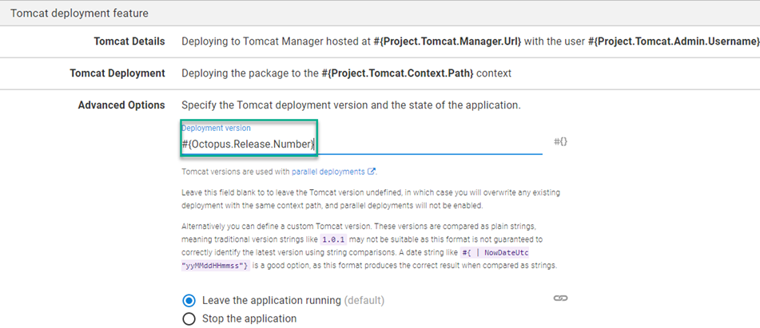
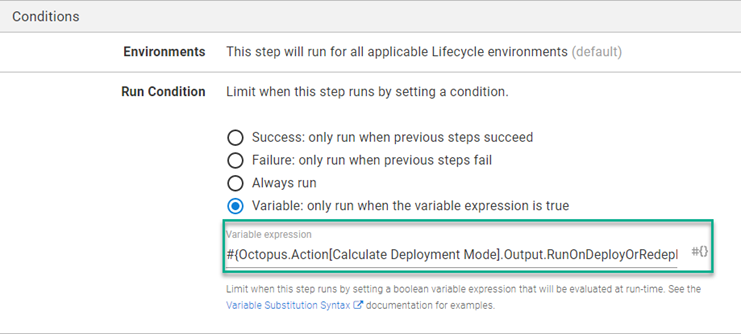
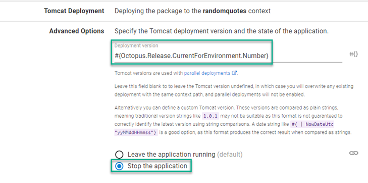

In Tomcat v7, Apache included the ability to do [parallel deployments](https://tomcat.apache.org/tomcat-9.0-doc/config/context.html#Parallel_deployment) which allows you to deploy multiple versions of the same application on a Tomcat server.  This feature will redirect new traffic to the new version of the application allowing existing sessions to expire and naturally flow to the new version.  This functionality is ideally suited for supporting rollback scenarios when deploying to Tomcat.

## Configuring an application rollback for Tomcat
The following guide will configure a code rollback for the Random Quotes application.  The deployment process will consist of the following steps:
- Calculate Deployment Mode
- Deploy Random Quotes to Tomcat
- Start App in Tomcat
- Stop App in Tomcat

### Calculate Deployment Mode
The first step in your process is going to be determining what scenario you're working with.  The [Calculate Deployment Mode](https://library.octopus.com/step-templates/d166457a-1421-4731-b143-dd6766fb95d5/actiontemplate-calculate-deployment-mode) Community Step Template has been expressly created for this purpose by the Octopus Solutions team.  This template produces a set of [Output Variables](https://octopus.com/docs/deployments/custom-scripts/output-variables) that tell you what scenario has been detected.  In addition, the template produced output variables in [Variable Run Condition](https://octopus.com/docs/projects/steps/conditions) syntax that can be applied to subsequent steps.
:::info
The Calculate Deployment Mode step template requires no configuration or parameters.
:::

### Deploy Random Quotes to Tomcat Via Manager
Octopus Deploy contains a built-in step to deploy to a Tomcat server using the Manager feature.  Under the `Advanced Options` section, you will find the place to specify the version number of the application as mentioned above.  When deployed, the step renames the the `.war` file to `<contextpath>##<version>.war` to allow multiple versions of the application.  In the following screenshot, you will see the Octpous variable of `#{Octopus.Release.Number}` being used for version number



The radio button at the bottom gives you the option to have this deployment be in a `Running` state or a `Stopped` state, the default is `Running`.

For this guide, we only want the Deploy step to occur on a Deployment or a Redeployment.  The Calculate Deployment Mode step provides us with an output variable called `RunOnDeployOrRedeploy` that contains the correct statement for a variable run condition for this step.  Add the following as the value for the Varibale Run Condition on this step
```
#{Octopus.Action[Calculate Deployment Mode].Output.RunOnDeployOrRedeploy}
```



### Start App in Tomcat
In addition to the deployment step, Octopus Deploy also has a `Start/Stop App in Tomcat` step.  With the exception of specifying a package, this step has nearly identical inputs to the deployment step, including the ability to specify the version number.

This step is only required during a rollback scenario so you'll need to add the following to the Variable Run Condition

```
#{Octopus.Action[Calculate Deployment Mode].Output.RunOnRollback}
```

Ensure that you've set the Depoloyment Versiuon to #{Octopus.Release.Number} to tell Tomcat to start the version that you're rolling back to.

### Stop App in Tomcat
The parallel deployment feature in Tomcat uses the following rules to determine where to send traffic
- If no session information is present in the request, use the latest version.
- If session information is present in the request, check the session manager of each version for a matching session and if one is found, use that version.
- If session information is present in the request but no matching session can be found, use the latest version.

Reactivating an older version in Tomcat would not result in diverting traffic away from the version we're attempting to rollback to.  In this case, we need to configure the Start/Stop App in Tomcat to stop the current version and start serving the rolled back one.  Similar to the Start App in Tomcat step, you only want this step to run during a rollback scenario so we'll need to set the Variable Run Condition to

```
#{Octopus.Action[Calculate Deployment Mode].Output.RunOnRollback}
```

Octopus Deploy has a [System Variable](https://octopus.com/docs/projects/variables/system-variables) that can be used to identify the version that needs to be stopeed, `#{Octopus.Release.CurrentForEnvironment.Number}`.  This variable can be used for the version number for the Start/Stop App in Tomcat

