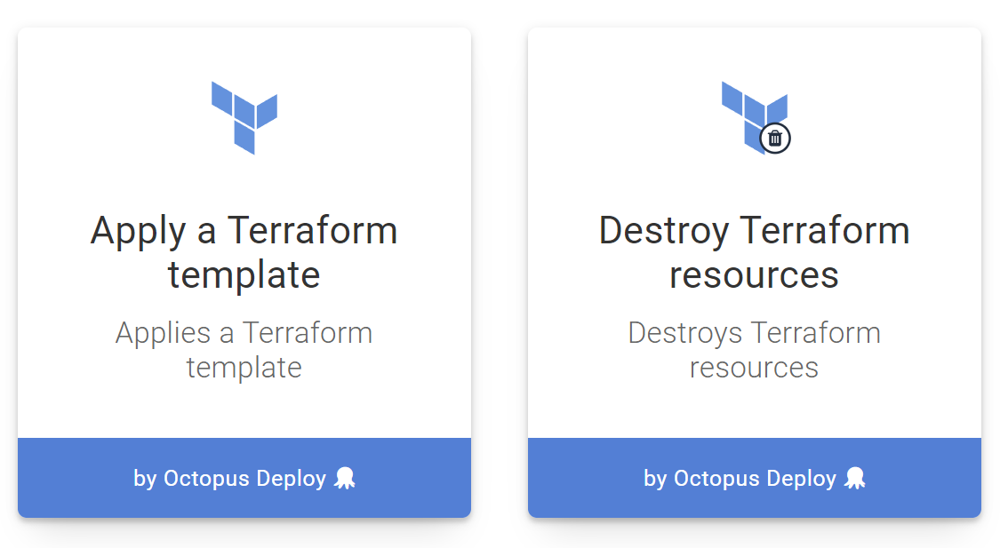

The [Terraform `apply` command](https://www.terraform.io/cli/commands/apply) is used to execute changes based on a [Terraform execution plan](/docs/deployments/terraform/plan-terraform/index.md).

Octopus has two steps that execute plan information: `Apply a Terraform template` and `Destroy Terraform resources`. As their names suggest, `Apply a Terraform template` will execute the additions indicated by the execution plan, while `Destroy Terraform resources` will destroy the resources marked for removal by the execution plan.

:::warning
The plan steps do not support saving the plan to a file and applying that file at a later date. This means the plan information only makes sense when the same values are used in the plan and apply/destroy steps. Configuring shared variables for the step fields ensures that the same values will be used.
:::

## Step options

The planning steps offer the [same base configuration as the other built-in Terraform steps](/docs/deployments/terraform/working-with-built-in-steps/index.md). You can refer to the documentation for those steps for more details on the options for the plan steps.

## Advanced options section

You can optionally control how Terraform downloads plugins and where the plugins will be located in the `Advanced Options` section.

The `Terraform workspace` field can optionally be set to the desired workspace. If the workspace does not exist it will be created and selected, and if it does it exist it will be selected.

The `Terraform plugin cache directory` can be optional set to a directory where Terraform will look for existing plugins, and optionally download new plugins into. By default this directory is not shared between targets, so additional plugins have to be downloaded by all targets. By setting this value to a shared location, the plugins can be downloaded once and shared amongst all targets.

The `Allow additional plugin downloads` option can be checked to allow Terraform to download missing plugins, and unchecked to prevent these downloads.

The `Custom terraform init parameters` option can be optionally set to include any parameters to pass to the `terraform init` action.

The `Custom terraform apply parameters` option can be optionally set to include any parameters to pass to the `terraform apply` action.

