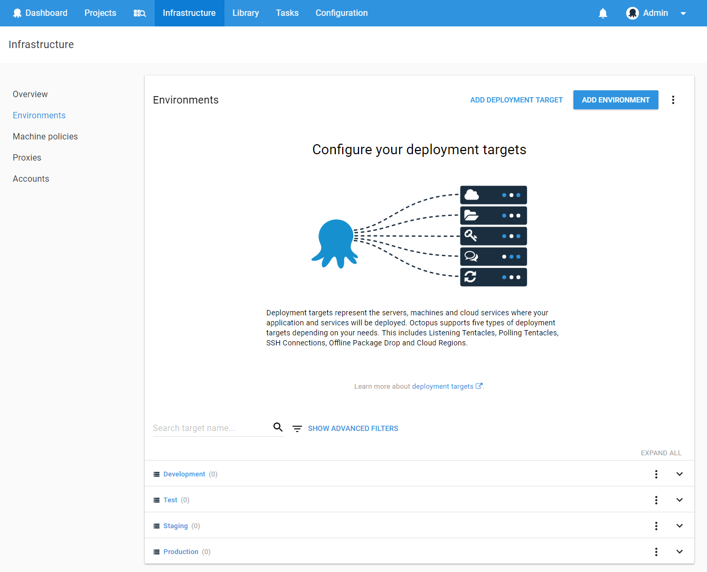
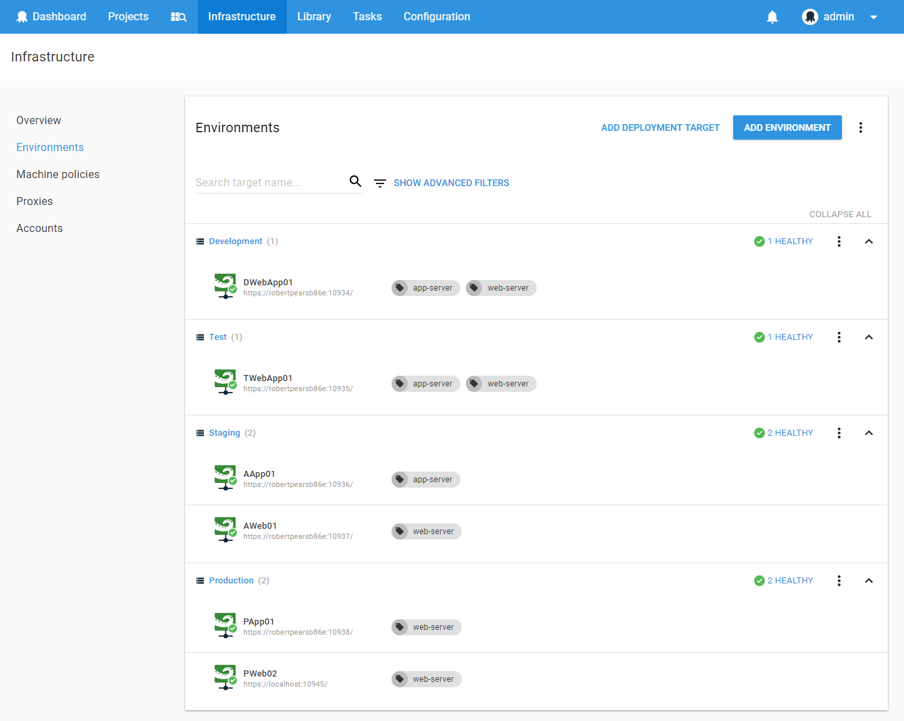
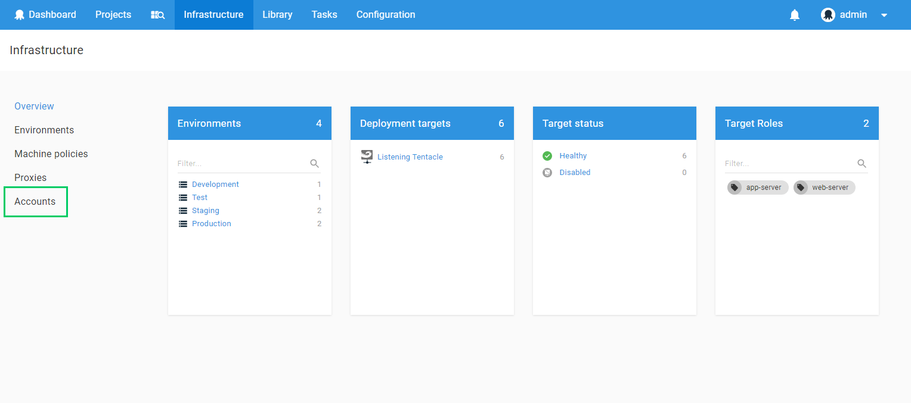
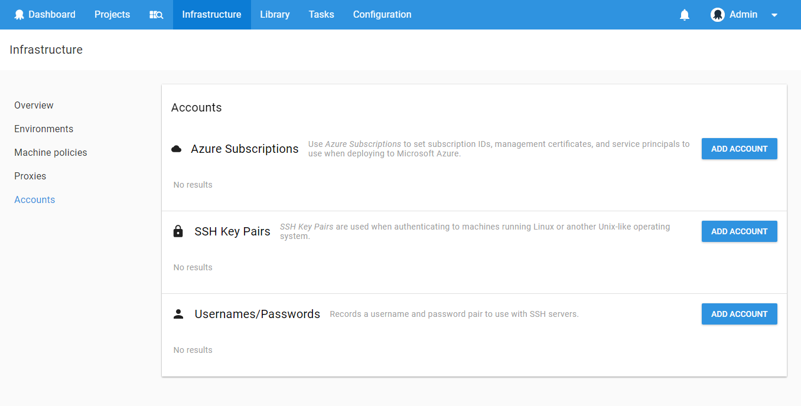
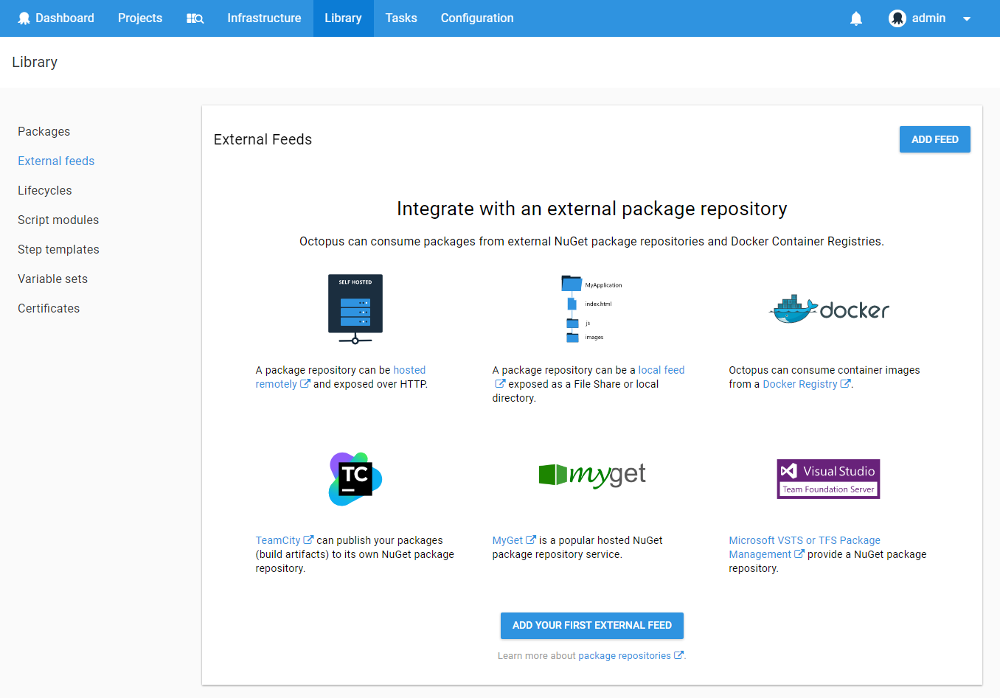
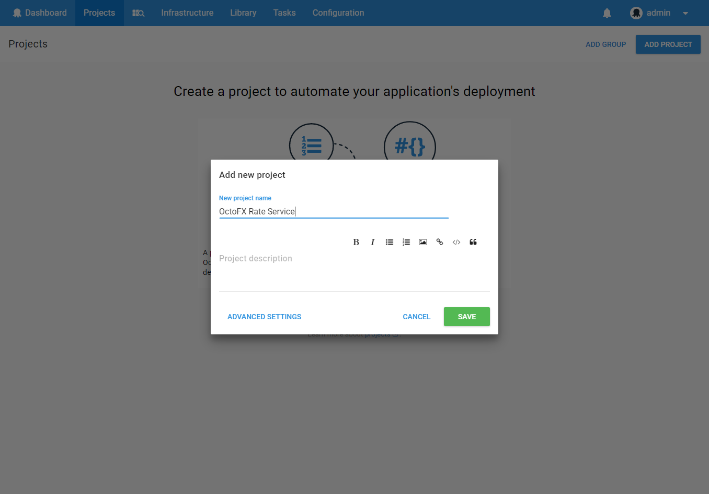
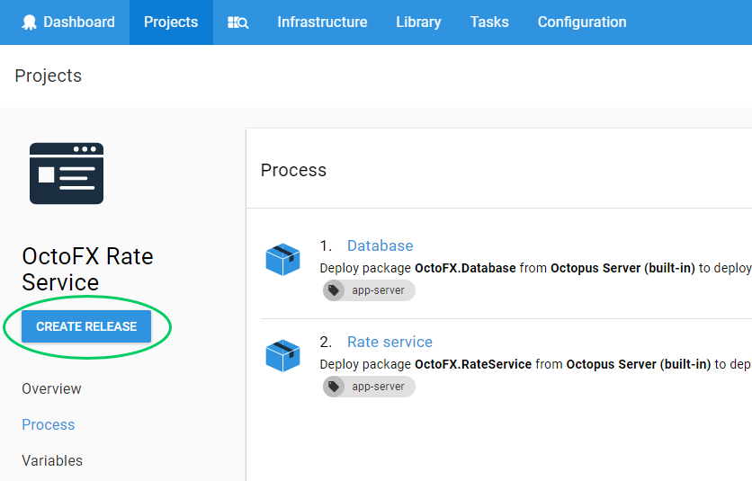
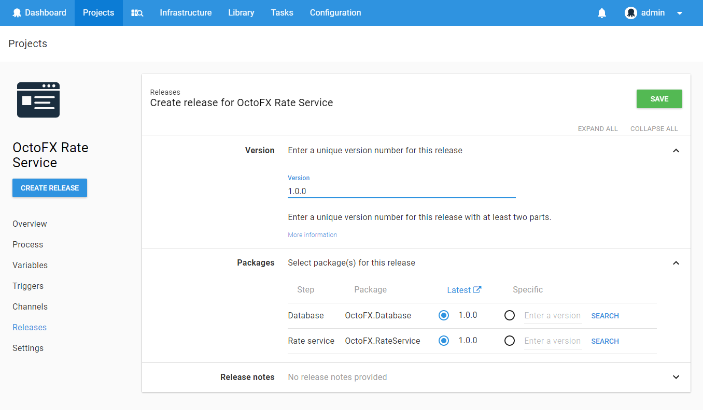
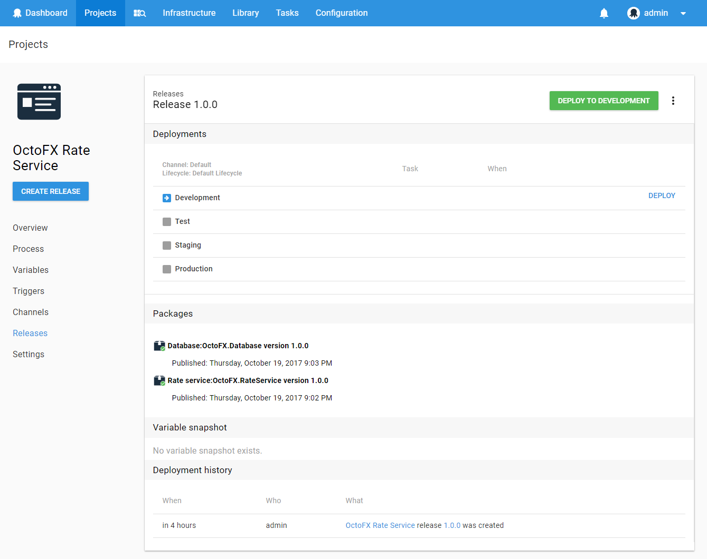
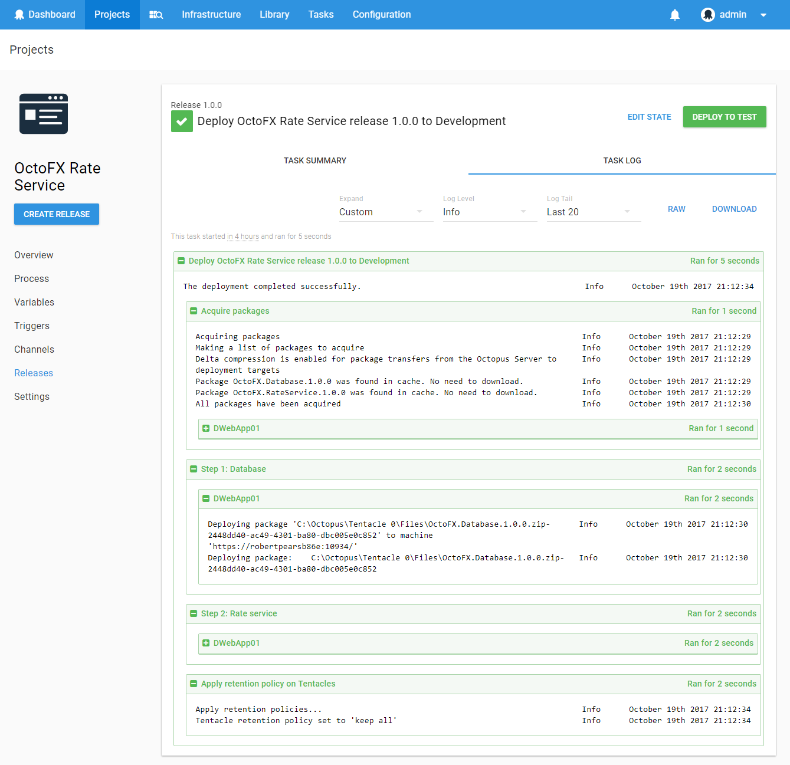

Welcome! This section provides a conceptual overview of Octopus Deploy and shows how Octopus Deploy fits into the delivery pipeline.

!toc

## Octopus in Your Delivery Process {#Gettingstarted-Octopusinyourdeliveryprocess}

Octopus Deploy is an automated deployment server that makes it easy to automate the deployment of ASP.NET web applications, Java applications, and Windows Services into development, test, and production environments.

The Octopus Deploy server works together with lightweight agent services, called Tentacles, that are installed on the machines you plan to deploy your web apps, applications, or services to. With Octopus and Tentacle, you can easily deploy to your own servers or cloud services from providers like Amazon Web Services or Microsoft Azure.

### The Delivery Pipeline

We designed Octopus to fit into teams that follow agile delivery practices. A typical workflow would be:

1. Commit Code to Your Existing Source Control System.

   You might be using Git, Team Foundation Server, Subversion, or Mercurial; the choice is yours.

1. Your CI/Build Server Compiles the Code and Runs Unit Tests.

   You might be using TeamCity, Jenkins, Bamboo, Team Foundation Server, or CruiseControl.NET, again, the choice is yours.

1. Package Your Application.

   When the build is ready, your CI/build server bundles all of the files (binaries, images, scripts, configuration files, and so on) needed to deploy your application into a [supported package](/docs/packaging-applications/supported-packages.md).

1. Octopus Deploy Pushes Your Packages.

   Octopus deploys the applications to the environments you've configured. These could be testing 

### Consistent Releases

As a release manager, you define the process for deploying the software. You can specify the environments the applications are deployed to, and who on your team can deploy to which environments; for instance, you might want testers to deploy to test environments, but not to production. Taking this approach, means that even if different members of the team are triggering deployments, the deployment process is still consistent.

The rest of this guide goes into more detail about working with  Octopus Deploy and links to the relevant sections of the documentation.

## 1. Install and set up Octopus server {#Gettingstarted-InstalltheOctopusserver}

Download the latest [Octopus Deploy MSI installer](https://octopus.com/downloads) from the Octopus Deploy website, and follow the instructions.

:::hint
Learn more about [Installing Octopus](/docs/installation/installing-octopus/index.md) including a video walkthrough.
:::

When the MSI installer completes, a wizard will take you through the process of configuring your Octopus Deploy server.

When your Octopus server is configured, the Octopus Manager UI will appear. This is an administrator-only interface designed for configuring your Octopus server.

Open the Octopus Web Portal in your browser and sign in, using the address and credentials you specified during the setup wizard.

## 2. Configure Infrastructure {#Gettingstarted-ConfigureInfrastructure}

### Create environments {#Gettingstarted-Createenvironments}

Next, you'll need to add environments to deploy to. Environments are really just groups of machines that you deploy to; for example, **Test**, **Staging** or **Production**.

Learn more about [Environments](/docs/key-concepts/environments/index.md).

### Add deployment targets {#Gettingstarted-Adddeploymenttargets}

Deployment targets represent the servers, machines and cloud services where your application and services will be deployed. 

On each of the servers, you'll need to install the lightweight Tentacle agent, and then register the targets in your environments. Depending on network/firewall configuration, Tentacles can be installed in [listening](/docs/installation/installing-tentacles/listening-tentacles.md) (Octopus calls Tentacle) or [polling](/docs/installation/installing-tentacles/polling-tentacles.md) (Tentacle polls Octopus) mode. If you have many machines to manage, you can [install Tentacles automatically](/docs/installation/installing-tentacles/automating-tentacle-installation.md). One Octopus server can control many Tentacles, potentially a lot more than 8! 

Learn more about the [deployment targets](/docs/deployment-targets/index.md).

### Add an account {#Gettingstarted-Addanaccount}

Accounts allow you to capture machine and subscription details used within your deployments. Add your Azure subscription to accounts and use one of the Azure built-in step templates to deploy to the cloud. Although Azure subscriptions are associated with deployment targets, they are not visible on the environments page with the other targets.

If you are deploying to a Linux target, SSH, username and passwords can be stored under accounts. 

To add an account, go to the environments page and click on the Accounts link. 

Learn more about [accounts](/docs/key-concepts/environments/accounts/index.md).

## 3. Application packaging

### Package and version applications for deployment {#Gettingstarted-Packageyourapplicationsfordeployment}

Whenever you want to deploy applications with Octopus, you'll need to package them into NuGet, zip, tar, tar gzip or tar bzip2 packages. A package contains an application’s executables, configuration files, scripts and any other files it needs to run. Once packaged, it will need to be versioned.

How you create the package depends on what app or service you are deploying:

- Use [OctoPack](/docs/packaging-applications/nuget-packages/using-octopack/index.md) to package ASP.NET apps or Windows Services applications.
- Use [dotnet pack](https://docs.microsoft.com/en-us/dotnet/articles/core/tools/dotnet-pack) to package .NET Core apps.
- To package a [java](/docs/guides/deploying-java-applications.md), nodejs or other applications and folders use [Octo.exe](/docs/packaging-applications/nuget-packages/using-octo.exe.md) or simply [zip](/docs/packaging-applications/supported-packages.md) up a folder.

Learn more about [versioning](/docs/packaging-applications/versioning-in-octopus-deploy.md) and [packaging](/docs/packaging-applications/index.md).

### Upload package {#Gettingstarted-Uploadpackage}

Your packages need to be placed into a package repository. You can either push packages to the built-in repository manually or integrate with your existing build tool.  We recommend configuring your existing tool chain to push packages automatically to the built-in repository. 

Use our [TeamCity](/docs/api-and-integration/teamcity.md), [VSTS](/ /docs/api-and-integration/tfs-vsts/using-octopus-extension/index.md) or [TFS](/docs/api-and-integration/tfs-vsts/index.md) extensions to integrate with the built-in repository or explore the [other options](/docs/packaging-applications/package-repositories/pushing-packages-to-the-built-in-repository.md) to push packages to it.

Learn more about our [api and integration](/docs/api-and-integration/index.md).

### Add an external feed {#Gettingstarted-Addanexternalfeed}

Octopus can consume packages from external NuGet package repositories and Docker Container Registries.

An external package repository would typically be:
- A [remote feed](https://docs.microsoft.com/en-us/nuget/hosting-packages/nuget-server) exposed over HTTP
- A [local feed](https://docs.microsoft.com/en-us/nuget/hosting-packages/local-feeds) exposed as a File Share or local directory
- A [Docker Registry](/docs/deploying-applications/docker-containers/registries/index.md)
- A [TeamCity](https://blog.jetbrains.com/dotnet/2011/08/24/native-nuget-support-in-teamcity/) server (version 7 and above)
- A [MyGet](http://www.myget.org/) server
- A [VSTS or TFS Package Management](https://www.visualstudio.com/en-us/docs/package/overview) feed

Learn more about [external feeds](/docs/packaging-applications/package-repositories/index.md#Packagerepositories-Usingexternalrepositories).

## 4. Create a project {#Gettingstarted-Createaproject}

### Create a project

Projects define a set of deployment steps that you want Octopus to perform, and their configuration variables.

Learn more about [projects](/docs/key-concepts/projects/index.md).

### Define your deployment process {#Gettingstarted-Defineyourdeploymentprocess}

The **Process** tab within your project defines how your project will be deployed. You can add different steps to the process depending on what you plan to deploy:

- To deploy changes to a SQL Server database, see [SQL Server databases](/docs/deploying-applications/sql-server-databases.md)
- To deploy an ASP.NET web site to an IIS server, see [IIS Websites and Application Pools](/docs/deploying-applications/iis-websites-and-application-pools.md)
- To install or configure a Windows Service, see [Windows Services](/docs/deploying-applications/windows-services.md)
- For custom or advanced installation actions, see [Custom scripts](/docs/deploying-applications/custom-scripts/index.md)
- To pause deployment for a human to approve or perform an action, see [Manual intervention and approvals](/docs/deploying-applications/manual-intervention-and-approvals.md)

Chances are, you'll need to configure your application differently depending on the what you are deploying to (for example, different connection strings in staging vs. production). Octopus has advanced support for managing these [variables](/docs/deploying-applications/variables/index.md) and scoping them, and can even manage passwords securely. Octopus can also take care of automatically [updating your .NET configuration files, and running configuration file transforms](/docs/deploying-applications/configuration-files/index.md).

## 5. You're ready to deploy

### Create release {#Gettingstarted-Createareleaseanddeployit}

Next, create a release. Click the **Create release** button on any page of your project.

Enter an overall release version number for the release, and select the NuGet package versions that you want to include in the release. You can also add release notes to tell your team what the release contains.

Now that you have a release, you can deploy and promote it between environments. On the release page, use the green **Deploy to *environment*** button to promote it.

### Deploy a release

The deployment page shows you a log of all the activity that happens during the deployment, on both the Octopus server and any Tentacles, including the output of any custom scripts.

## Next steps {#Gettingstarted-Nextsteps}

Congratulations, you've deployed a release! You might want to look at:

- Triggering deployments from [TeamCity](/docs/api-and-integration/teamcity.md) or [TFS](/docs/api-and-integration/tfs-vsts/index.md)
- [Inviting other users and adding them to teams](/docs/administration/managing-users-and-teams/index.md)
- The comprehensive [Octopus Deploy REST API](/docs/api-and-integration/octopus-rest-api.md) and C# client
