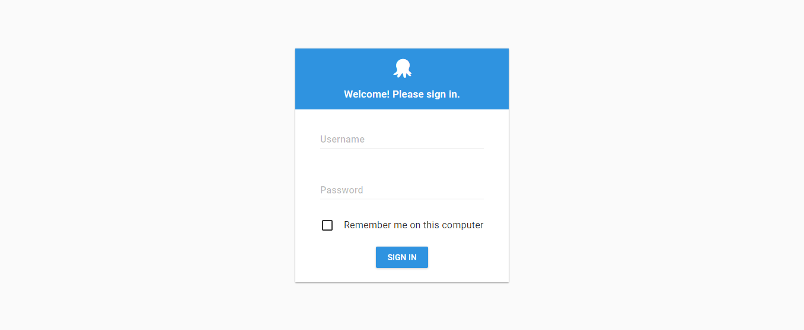
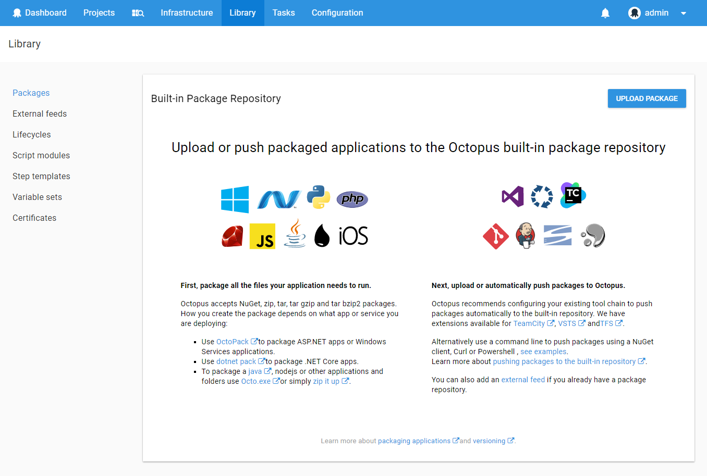
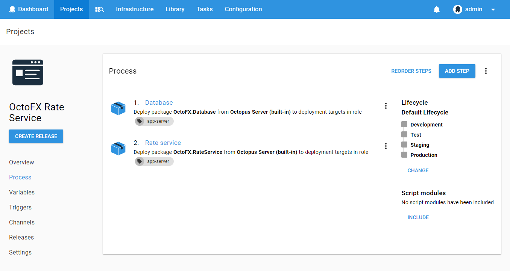

Welcome! This section provides a conceptual overview of Octopus Deploy and explains how Octopus Deploy fits into the delivery pipeline.

!toc

## Octopus in Your Delivery Process {#Gettingstarted-Octopusinyourdeliveryprocess}

Octopus Deploy is an automated deployment server that makes it easy to automate the deployment of ASP.NET web applications, Java applications, and Windows Services into development, test, and production environments.

The Octopus Deploy server works together with lightweight agent services, called Tentacles, that are installed on the machines you plan to deploy your web apps, applications, or services to. With Octopus and Tentacle, you can easily deploy to your own servers or cloud services from providers like Amazon Web Services or Microsoft Azure.

### The Delivery Pipeline

We designed Octopus to fit into teams that follow agile delivery practices. A typical workflow would be:

1. Commit Code to Your Existing Source Control System.

   You might be using Git, Team Foundation Server, Subversion, or Mercurial; the choice is yours.

1. Your CI/Build Server Compiles the Code and Runs Unit Tests.

   You might be using TeamCity, Jenkins, Bamboo, Team Foundation Server, or CruiseControl.NET, again, the choice is yours.

1. Package Your Application.

   When the build is ready, your CI/build server bundles all of the files (binaries, images, scripts, configuration files, and so on) needed to deploy your application into a [supported package](/docs/packaging-applications/supported-packages.md).

1. Octopus Deploy Pushes Your Packaged Application.

   Octopus deploys the applications to the environments you've configured. These could be testing, dev, or production environments. 

### Consistent Releases

As a release manager, you define the process for deploying the software. You can specify the environments the applications are deployed to and who on your team can deploy to which environments; for instance, you might want testers to deploy to test environments, but not to production. Taking this approach means that even if different members of the team are triggering deployments, the deployment process remains consistent.

The rest of this guide goes into more detail about working with  Octopus Deploy and links to the relevant sections of the documentation for more information.

## Install Octopus Deploy

Installing [Octopus Deploy](/docs/installation/index.md) sets up the central [Octopus Deploy Server](/docs/installation/installing-octopus/index.md) which runs as a Windows Service on one of your servers. Octopus stores its data in an [SQL Server Database](/docs/installation/installing-octopus/sql-server-datasbase-requirements.md) and includes an embedded HTTP server which serves the [Octopus REST API](/docs/api-and-integration/octopus-rest-api.md) and the **Octopus Web Portal**.

The [Installation documentation](/docs/installation/index.md) provides the instructions for installing and configuring your Octopus.

## Access the Octopus Web Portal

**To Do! - provide a very high level overview** 

## Configure Your Infrastructure

### Environments

Octopus groups your infrastructure into environments. Environments are groups of machines that you deploy to at the same time; for instance, you might have an environment of test servers that you deploy your apps to as part of your QA process, a UAT environment, and a production environment. Grouping machines in this way let's you define your deployment processes (no matter how many machines are involved) and have Octopus deploy the right versions of your apps to the right environments at the right time.

:::info
Throughout this guide we refer to both your servers and the cloud services you deploy your applications to as **machines**. 
:::

Learn how to add and manage environments in the [environments documentation](/docs/deployment-targets/environments/index.md).

### Machine Roles

Every machine in your environments is tagged with a set of roles. 


In production, your web sites and Windows Services might run on different physical servers; perhaps dozens of them. However, unless you are extremely lucky, it's unlikely that you have the budget to have an equal number of servers in any of your pre-production environments. When testing your software in a test environment, you might only have a single virtual machine which will run all of the web sites and services on the same machine.

Octopus handles these differences by applying roles to the machines within your environments. Instead of saying:

> The trading website ASP.NET application should be deployed to PWEB01, PWEB02, ...

We say:

> The trading website ASP.NET application should be deployed to machines that are tagged with the **web-server** role.

In production, perhaps you have 10 machines with the web-server role. In staging, perhaps you have only 4. In test, perhaps there is a single machine. Roles make defining your deployment process much easier.

You can define as many environments, machines, and roles as you need; it all depends on how your applications are deployed.

Learn more about [machine roles](/docs/deployment-targets/machine-roles/index.md)

### Deployment Targets

Deployment targets represent the servers, machines, and cloud services where your application and services will be deployed. 

You need to install Tentacles on all of your deployment targets and to register each Tentacle with an environment. 

Learn more about the [deployment targets](/docs/deployment-targets/index.md).

### Install Tentacles

The central Octopus Deploy Server works with Tentacles. Tentacle is a secure, lightweight agent service that Octopus uses to deploy software to your infrastructure. That infrastructure could be your own servers or cloud services from providers like Amazon Web Services or Microsoft Azure.

The [Installation documentation](/docs/installation/index.md) provides the instructions for installing Tentacles and configuring your deployment targets.

## Application Packages

### Packaging Applications

Before you can deploy applications with Octopus, you need to package all the files needed for the application into a supported package and version the package. Octopus supports the following package types:

* NuGet
* Tar
* Tar Gzip
* Tar bzip2
* Zip
* Docker Image

Learn more about [packaging applications](/docs/packaging-applications/index.md)

### Versioning Packages

Versioning is an important part of how Octopus Deploy automates application deployment. Octopus recommends using [Semantic Versioning](http://semver.org) for your applications. 

Learn more about [Versioning in Octopus Deploy](/docs/packaging-applications/versioning-in-octopus-deploy.md).

### Uploading Packages 

Octopus Deploy includes a built-in package repository. We recommend configuring your existing tool chain to push packages automatically to the built-in repository; however, you can push packages manually to the repository if you choose to.

Learn more about the [package repository](/docs/packaging-applications/package-repository/index.md) or how to automate your existing tool chain to push packages to your Octopus Deploy server with our [API and Integrations](/docs/api-and-integration/index.md).

## Projects

Projects are one of the most important concepts in Octopus. A project defines:

- A *[deployment process](/docs/deploying-applications/index.md)*, which specifies the steps that need to happen in a given order during the deployment
- *[Variables](/docs/deploying-applications/variables/index.md)*, which allow deployments to be parameterized across environments

A project in Octopus can consist of many deliverable components (e.g., web sites, Windows services). It's usually helpful to think of Octopus projects in terms of business projects: if you have 5 developers working together on the "HR Portal rewrite" project, than that's probably a single project in Octopus.

## Defining Your Deployment Process

Words like "release" and "deployment" are no doubt terms that you've used in your organization prior to using Octopus Deploy. Perhaps you use them interchangeably, or perhaps they have well defined meanings. As you begin to use and master Octopus, there's some potential for confusion - the concept of a Release as implemented in Octopus might be very different to the concept of a Release currently in use in your organization. This page provides a high-level overview of the various concepts that exist in Octopus, to help to eliminate that confusion.

The **Process** tab within your project defines how your project will be deployed. You can add different steps to the process depending on what you plan to deploy:

- To deploy changes to a SQL Server database, see [SQL Server databases](/docs/deploying-applications/sql-server-databases.md)
- To deploy an ASP.NET web site to an IIS server, see [IIS Websites and Application Pools](/docs/deploying-applications/iis-websites-and-application-pools.md)
- To install or configure a Windows Service, see [Windows Services](/docs/deploying-applications/windows-services.md)
- For custom or advanced installation actions, see [Custom scripts](/docs/deploying-applications/custom-scripts/index.md)
- To pause deployment for a human to approve or perform an action, see [Manual intervention and approvals](/docs/deploying-applications/manual-intervention-and-approvals.md)

### Variables

Chances are, you'll need to configure your application differently depending on the what you are deploying to (for example, different connection strings in staging vs. production). Octopus has advanced support for managing these variables and scoping them, and can even manage passwords securely. Octopus can also take care of automatically [updating your .NET configuration files, and running configuration file transforms](/docs/deploying-applications/configuration-files/index.md).

Learn more about [variables](/docs/deploying-applications/variables/index.md)

## Releases and deployments {#KeyConcepts-Releasesanddeployments}

The deployment process for a project specifies how the project will be deployed. But Octopus isn't designed to deploy something just once; it's designed to deploy the same project over, and over, and over, and over. It's designed for teams that follow agile software development methods, continuously deploying software to environments, getting feedback, making changes, and then deploying again.

We expect that beyond the initial setup and tweaking, your deployment process won't change between all of these deployments. But of course, the software that you are deploying will. You will make changes to code, commit them to source control, and have a [build server](/docs/api-and-integration/index.md) build them and run tests. Then the software will be [packaged](/docs/packaging-applications/index.md) and ready for deployment.

In Octopus, a release is a snapshot of the *deployment process* and *variables,* with a set of *packages* selected. That *release* is then *deployed* to multiple environments, typically to one, then promoted to the next environment if successful.

Each time you have a new candidate build that is ready to test, you'll create a *release*. When you apply a release to an environment, that is a *deployment*.

## Channels

When you start working with Octopus you will typically be creating releases from your main source code branch that are considered to be release candidates for your final production environment. Over time you may find you want to start working on an experimental branch of code, perhaps to introduce a new feature, or an entirely new version of your software. In this case you can either create an entirely new project, or clone the existing project, to manage deployments of this experimental software - but that leads to a lot of possible duplication and rework. In Octopus 3.2 we introduced the concept of [*channels* ](/docs/key-concepts/projects/channels.md)which let you modify the entire deployment process on a per-release basis, all within the same project. For example, you can promote releases created from your main code branch through to your production environment, but restrict releases created from your experimental feature branch to a special test environment perhaps with extra steps and variables.

## Tenants

Over time your software may become so successful that you on-sell it to some external customers, and due to the way the software is architected, you need to deploy a copy of the software once per customer. You could achieve this in Octopus by creating an environment-per-customer, or even a project-per-customer, but this leads to duplication and unnecessary complexity. In Octopus 3.4 we introduced the concept of [*tenants* ](/docs/key-concepts/tenants/index.md)that you can manage alongside your existing projects and environments.