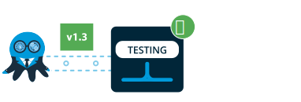
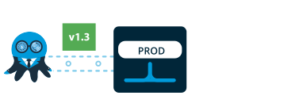

Welcome! This section will show how Octopus fits into the delivery pipeline and guide you through the process of setting up Octopus Deploy to complete your first deployment.

!toc

## Octopus in your delivery process {#Gettingstarted-Octopusinyourdeliveryprocess}

Octopus Deploy is an automated deployment server, which you install yourself, much like you would install SQL Server, Team Foundation Server or JetBrains TeamCity. Octopus makes it easy to automate deployment of ASP.NET web applications and Windows Services into development, test and production environments.

Along with the Octopus Deploy server, you'll also install a lightweight agent service on each of the machines that you plan to deploy to, for example your web and application servers. We call this the Tentacle agent; the idea being that one Octopus server controls many Tentacles, potentially a lot more than 8! With Octopus and Tentacle, you can easily deploy to your own servers, or cloud services from providers like Amazon Web Services or Microsoft Azure.

### The delivery pipeline

|                                          |                                          |
| ---------------------------------------- | ---------------------------------------- |
|  **1. Commit code** Developer commits code to a github repository. |  **2. Compile & test** A build server compiles the code and runs unit tests. |
|  3. Packaged & pushed The application is packaged and pushed to Octopus Deploy. |  4. Auto deploy to test The application can be automatically deployed to a test environment. A suite of automated web tests are run against the application. |
|  5. Deploy to UAT The application is deployed to a UAT environment, for stakeholders to see new changes. |  6. Promote to production When the various stakeholders are happy, the application is prompted to the production environment. |

We designed Octopus to fit into teams that follow agile delivery practices. Octopus compliments your existing delivery pipeline:

- **Developers commit their code into your existing source control system**  
  You might be using Git, Team Foundation Server, Subversion or Mercurial; the choice is up to you.
- **Your CI/build server compiles the code and runs unit tests**  
  Again, you might be using TeamCity, Jenkins, Bamboo, Team Foundation Server or CruiseControl.NET; the choice is up to you.
- **Your application is packaged into a NuGet package**  
  When the build is done, your CI/build server bundles all of the files – the binaries, images, scripts, configuration files and so on – needed to deploy your application into a NuGet package

The job of Octopus, then, is to take these packages and push them to the machines that they will be deployed to. As a release manager, you define the process for deploying the software, including any environment-specific configuration variables. The Octopus web based dashboard then allows other members of your team to queue deployments; for example, you might enable testers to deploy applications to a test environment, but not to production. This approach means that even if different people are triggering the deployments, the deployment process is still consistent.

## Install the Octopus server {#Gettingstarted-InstalltheOctopusserver}

Download the latest [Octopus Deploy MSI installer](https://octopus.com/downloads) from the Octopus Deploy website, and follow the instructions.

:::hint
For more information, including a video walkthrough, see the [Installing Octopus](/docs/installation/installing-octopus/index.md) section.
:::

When the MSI installer completes, a wizard will take you through the process of configuring your Octopus Deploy server.

When your Octopus server is configured, the Octopus Manager UI will appear. This is an administrator-only interface designed for configuring your Octopus server.

Open the Octopus Web Portal in your browser and sign in, using the address and credentials you specified during the setup wizard.

## Create environments {#Gettingstarted-Createenvironments}

Next, you'll need to add environments to deploy to. Environments are really just groups of machines that you deploy to; for example, **Test**, **Staging** or **Production**.

:::hint
Learn more on the [Environments](/docs/key-concepts/environments/index.md) page.
:::

## Add machines to your environments {#Gettingstarted-Addmachinestoyourenvironments}

On each of the web or application servers that you plan to deploy software to, you'll need to install the Tentacle agent, and then register the machines in your environments.

:::hint
See how on the [Installing Tentacles](/docs/installation/installing-tentacles/index.md) page. Depending on network/firewall configuration, Tentacles can be installed in [listening](/docs/installation/installing-tentacles/listening-tentacles.md) (Octopus calls Tentacle) or [polling](/docs/installation/installing-tentacles/polling-tentacles.md) (Tentacle polls Octopus) mode. If you have many machines to manage, you can [install Tentacles automatically](/docs/installation/installing-tentacles/automating-tentacle-installation.md).
:::

## Package your applications for deployment {#Gettingstarted-Packageyourapplicationsfordeployment}

Whenever you want to deploy applications with Octopus, you'll need to package them into NuGet packages. There are three ways to do this:

- Create packages [manually using NuGet Package Explorer](/docs/packaging-applications/nuget-packages/manually.md); or,
- Create packages [using OctoPack](/docs/packaging-applications/nuget-packages/using-octopack/index.md) via MSBuild; or,
- Create packages [from the command line using NuGet.exe](/docs/packaging-applications/nuget-packages/using-nuget.exe.md)

Your packages need to be placed into a package repository.

## Create a project {#Gettingstarted-Createaproject}

Projects define a set of deployment steps that you want Octopus to perform, and their configuration variables.

:::hint
Learn more about [creating projects](/docs/key-concepts/projects/index.md).
:::

## Define your deployment process {#Gettingstarted-Defineyourdeploymentprocess}

The **Process** tab within your project defines how your project will be deployed. You can add different steps to the process depending on what you plan to deploy:

- To deploy changes to a SQL Server database, see [SQL Server databases](/docs/deploying-applications/sql-server-databases.md)
- To deploy an ASP.NET web site to an IIS server, see [IIS Websites and Application Pools](/docs/deploying-applications/iis-websites-and-application-pools.md)
- To install or configure a Windows Service, see [Windows Services](/docs/deploying-applications/windows-services.md)
- For custom or advanced installation actions, see [Custom scripts](/docs/deploying-applications/custom-scripts/index.md)
- To pause deployment for a human to approve or perform an action, see [Manual intervention and approvals](/docs/deploying-applications/manual-intervention-and-approvals.md)

Chances are, you'll need to configure your application differently depending on the what you are deploying to (for example, different connection strings in staging vs. production). Octopus has advanced support for managing these [variables](/docs/deploying-applications/variables/index.md) and scoping them, and can even manage passwords securely. Octopus can also take care of automatically [updating your .NET configuration files, and running configuration file transforms](/docs/deploying-applications/configuration-files/index.md).

## Create a release and deploy it {#Gettingstarted-Createareleaseanddeployit}

Next, create a release. Click the **Create release** button on any page of your project.

Enter an overall release version number for the release, and select the NuGet package versions that you want to include in the release. You can also add release notes to tell your team what the release contains.

Now that you have a release, you can deploy and promote it between environments. On the release page, use the green **Deploy to *environment*** button to promote it.

The deployment page shows you a log of all the activity that happens during the deployment, on both the Octopus server and any Tentacles, including the output of any custom scripts.

## Next steps {#Gettingstarted-Nextsteps}

Congratulations, you've deployed a release! You might want to look at:

- Triggering deployments from [TeamCity](/docs/api-and-integration/teamcity.md) or [TFS](/docs/api-and-integration/team-foundation-server-tfs.md)
- [Inviting other users and adding them to teams](/docs/administration/managing-users-and-teams/index.md)
- The comprehensive [Octopus Deploy REST API](/docs/api-and-integration/octopus-rest-api.md) and C# client

