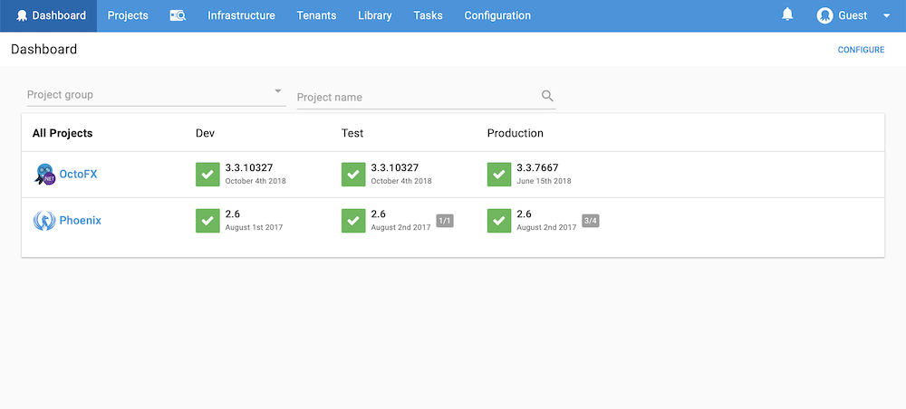

Welcome!

This section provides an overview of Octopus Deploy concepts and links to the relevant documentation, which explore the concepts further and guides you through implementing them with your own [self-hosted](/docs/getting-started.md#self-hosted-octopus) or [cloud-hosted](/docs/getting-started.md#octopus-cloud) Octopus server.

## Consistent Releases

As an Octopus user, you define the process for deploying your software. You specify the environments the applications are deployed to and who on your team can deploy to which environments. For instance, you might want QA to deploy to test environments, but not to production. Taking this approach means that even if different members of the team trigger deployments, the deployment process remains consistent. Once releases have been created, they can be deployed as many times as you need.

## Octopus Deploy Server

You can install your own [self-hosted](/docs/getting-started.md#self-hosted-octopus) instance of the Octopus Deploy Server or use [Octopus Cloud](/docs/getting-started.md#octopus-cloud).

## Self-Hosted Octopus

Installing the self-hosted [Octopus Deploy server](/docs/installation/index.md) sets up the [Octopus Web Portal](/docs/getting-started.md#the-octopus-web-portal) and the [Octopus REST API](/docs/api-and-integration/api/index.md).

The [installation documentation](/docs/installation/index.md) provides instructions for downloading, installing, and configuring your Octopus Deploy server.

## Octopus Cloud

**Octopus Cloud** is the hosted version of Octopus Deploy. We designed Octopus Cloud and self-hosted Octopus to provide the same functionality; however, there are some minor differences, for instance, with Octopus Cloud, we're [responsible](/docs/administration/security/index.md#responsibility) for taking backups, upgrading the service, and maintaining and monitoring the underlying systems.

Learn more about [Octopus Cloud](/docs/octopus-cloud/index.md).

## The Octopus Web Portal

Whether you're self-hosting the Octopus server, or using Octopus Cloud, the Octopus Web Portal is where you'll manage your infrastructure, projects, access the built-in repository, grant your team access to projects, and create your automated deployments.

## Infrastructure

Octopus Deploy organizes your deployment targets (the machines and services you deploy software to) into groups called environments. Typical environments are **Development**, **Test**, and **Production**.

With Octopus Deploy your deployment targets could be Windows servers, Linux servers, Microsoft Azure, AWS, Cloud Regions, or even an Offline Package Drop.

Organizing your infrastructure into environments lets you define your deployment processes (no matter how many steps or deployment targets are involved) and have Octopus deploy the right versions of your software, with the right configuration, to the right environments at the right time.

Learn more about managing your [infrastructure](/docs/infrastructure/index.md).

## Packaging Applications

Before you can deploy software with Octopus Deploy, you need to bundle all the files required for the software to run into a supported package. The package must be versioned and stored in a repository. Octopus Deploy includes a built-in repository. We recommend configuring your existing tool chain to push packages automatically to the built-in repository; however, you can push packages manually to the repository if you choose to.

Learn more about [packaging your applications](/docs/packaging-applications/index.md) or how to automate your existing tool chain to push packages to your Octopus Deploy server with our [API and Integrations](/docs/api-and-integration/index.md).

## Deploying Applications

Octopus Deploy is designed to work with teams following agile software development methodologies, that is, continuously deploying software, iterating, making changes, and redeploying.

The deployment process that Octopus executes is like a recipe for deploying your software. You define the recipe by adding steps and variables to a project. Octopus Deploy provides a range of built-in step templates that can be included in your deployment processes, you can also add steps from the community step template library, and even create your own custom steps. Each step contains a specific action (or set of actions) that is executed as part of the deployment process each time your software is deployed. After the initial setup, your deployment process shouldn't change between deployments even though the software being deployed will change as part of the development process.

Learn more about the [deployment process](/docs/deployment-process/index.md) and see some [deployment examples](/docs/deployment-examples/index.md).

### Variables

As you deploy your applications between different environments, you'll need to change their configuration files based on the scope of the deployment. Octopus has advance support for managing and scoping variables. For instance, you will use different databases in QA from the databases you use in Production. Variables let you scope your deployments to QA or Production and automatically reference the correct databases.

Learn more about [variables](/docs/deployment-process/variables/index.md) and advanced [configuration features](/docs/deployment-process/configuration-features/index.md).

### Projects

Octopus Deploy can manage the deployment of many applications across your organization. Projects within Octopus Deploy let you manage multiple software projects across different environments with different deployment processes (the specific deployment steps) defined per project.

A project in Octopus can consist of many deliverable components (e.g., web sites, micro services, and database scripts). It's usually helpful to think of Octopus projects in terms of business projects, for instance, if you have five developers working together on the "HR Portal rewrite" project, then that's probably a single project in Octopus.

Learn more about [projects](/docs/deployment-process/projects/index.md).

### Lifecycle

When you define a project, you also select a lifecycle. The lifecycle defines the rules around how releases of the project are deployed between environments, and which projects are deployed to which environments.

Lifecycles are defined by phases, each phase can have one or more environments, and each environment can be defined as an automatic deployment environment or a manual deployment environment. Each phase can have a set number of environments that must be released to before the next phase is available for deployment.

Learn more about [lifecycles](/docs/deployment-process/lifecycles/index.md).

### Releases and Deployments

A **release** in Octopus, is a snapshot of the packaged software, variables, and the deployment process as they exist at the time the release is created.

A **deployment** in Octopus is the execution of the deployment process with all the associated details, as they existed when the release was created.

A release is deployed to the environments defined in the deployment process. Typically, releases are deployed to one environment and then promoted to the next environment when they are successful. Releases can be deployed manually each time or configured to deploy automatically.

Learn more about [deploying releases](/docs/deployment-process/releases/index.md).

### Channels

When you start working with Octopus, you will typically create releases from your main source code branch and these releases will be considered release candidates for your final production environment. Over time you may find you want to start working on an experimental branch of code, perhaps to introduce a new feature or an entirely new version of your software. In this case, you can either create an entirely new project, or clone the existing project, to manage deployments of this experimental software, but that leads to a lot of duplication and rework.

[Channels](/docs/deployment-process/channels/index.md) lets you modify the entire deployment process on a per-release basis, all within the same project. For example, you can promote releases created from your main code branch through to your production environment, but restrict releases created from your experimental feature branch to a special test environment perhaps with extra steps and variables.

Learn more about [channels](/docs/deployment-process/channels/index.md).

## Tenants

Over time your software may become so successful that you on-sell it to some external customers, and due to the way the software is architected, you need to deploy slightly different versions of the software configured for each customer. For instance, you might deploy version 1.0.1 to Customer A with the software configured to display customer A's logo on their landing page, and version 1.1.0 to Customer B configured to display their logo on their landing page. The multi-tenant feature in Octopus Deploy helps you manage deploying different versions of the same software to multiple customers.

Learn more about tenants in our [Multi-tenant Deployments Guide](/docs/deployment-patterns/multi-tenant-deployments/index.md).

## Spaces

If you're a large organization with lots of teams working in Octopus, from **2019.1** you can use the [Spaces](/docs/administration/spaces/index.md) feature to provide each of your teams with a space for the projects, environments, and infrastructure they work with, while keeping other team's assets separate in their own spaces.

Learn more about [Spaces](/docs/administration/spaces/index.md).

## The Delivery Pipeline

We designed Octopus Deploy for teams that follow agile delivery practices. A typical workflow could be:

1. **Commit Code to Your Existing Source Control System.**

   You might be using Git, Team Foundation Server, Subversion, or Mercurial. The choice is yours.

1. **Your CI/Build Server Compiles the Code and Runs Unit Tests.**

   You might be using TeamCity, Jenkins, Bamboo, Team Foundation Server, or CruiseControl.NET. Again, the choice is yours.

1. **Package Your Application.**

   When the build is ready, your CI/build server takes all the files your software needs to run and bundles them up ready for deployment.

1. **Octopus Deploy Deploys Your Software to Your Infrastructure.**

   Octopus deploys your software to the infrastructure you've configured, whether this is on-premises servers or cloud services. Because you likely want to deploy your software into a testing environment before deploying into production, Octopus promotes releases of your software through your environments, for instance, to dev, testing, staging, and production, and because each environment has slightly different configurations, Octopus manages those for you too.
