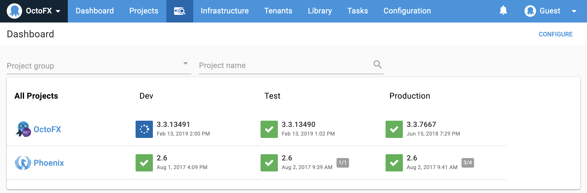

Welcome!

This section provides an overview of Octopus Deploy concepts and links to the relevant documentation, which explore the concepts further and guides you through implementing them with your own [self-hosted](/docs/getting-started.md#self-hosted-octopus) or [cloud-hosted](/docs/getting-started.md#octopus-cloud) Octopus server.

## Consistent Releases

As an Octopus user, you define the process for deploying your software. You specify the environments the applications are deployed to and who on your team can deploy to which environments. For instance, you might want QA to deploy to test environments, but not to production. Taking this approach means that even if different members of the team trigger deployments, the deployment process remains consistent. Once releases have been created, they can be deployed as many times as you need.

## Octopus Deploy Server

You can install your own [self-hosted](/docs/getting-started.md#self-hosted-octopus) instance of the Octopus Deploy Server or use [Octopus Cloud](/docs/getting-started.md#octopus-cloud).

## Self-Hosted Octopus

Installing the self-hosted [Octopus Deploy server](/docs/installation/index.md) sets up the [Octopus Web Portal](/docs/getting-started.md#the-octopus-web-portal) and the [Octopus REST API](/docs/octopus-rest-api/index.md).

The [installation documentation](/docs/installation/index.md) provides instructions for downloading, installing, and configuring your Octopus Deploy server.

## Octopus Cloud

**Octopus Cloud** is the hosted version of Octopus Deploy. We designed Octopus Cloud and self-hosted Octopus to provide the same functionality; however, there are some minor differences, for instance, with Octopus Cloud, we're [responsible](/docs/administration/security/index.md#responsibility) for taking backups, upgrading the service, and maintaining and monitoring the underlying systems.

Learn more about [Octopus Cloud](/docs/octopus-cloud/index.md).

## The Octopus Web Portal

Whether you're self-hosting the Octopus server, or using Octopus Cloud, the Octopus Web Portal is where you'll manage your infrastructure, projects, access the built-in repository, grant your team access to projects, and create your automated deployments.

## Infrastructure

Octopus Deploy organizes your deployment targets (the machines and services you deploy software to) into groups called environments. Typical environments are **Development**, **Test**, and **Production**.

With Octopus Deploy your deployment targets could be Windows servers, Linux servers, Microsoft Azure, AWS, Cloud Regions, or even an Offline Package Drop.

Organizing your infrastructure into environments lets you define your deployment processes (no matter how many steps or deployment targets are involved) and have Octopus deploy the right versions of your software, with the right configuration, to the right environments at the right time.

Learn more about managing your [infrastructure](/docs/infrastructure/index.md).

## Packaging Applications

Before you can deploy software with Octopus Deploy, you need to bundle all the files required for the software to run into a supported package. The package must be versioned and stored in a repository. Octopus Deploy includes a built-in repository. We recommend configuring your existing tool chain to push packages automatically to the built-in repository; however, you can push packages manually to the repository if you choose to.

Learn more about [packaging your applications](/docs/packaging-applications/index.md) or how to automate your existing tool chain to push packages to your Octopus Deploy server with our [REST API](/docs/octopus-rest-api/index.md).

## Deploying Applications

Octopus Deploy is designed to work with teams following agile software development methodologies, that is, continuously deploying software, iterating, making changes, and redeploying.

The deployment process that Octopus executes is like a recipe for deploying your software. You define the recipe by adding steps and variables to a project. Octopus Deploy provides a range of built-in step templates that can be included in your deployment processes, you can also add steps from the community step template library, and even create your own custom steps. Each step contains a specific action (or set of actions) that is executed as part of the deployment process each time your software is deployed. After the initial setup, your deployment process shouldn't change between deployments even though the software being deployed will change as part of the development process.

Learn more about the [deployment process](/docs/deployment-process/index.md), how you can set up [projects](/docs/deployment-process/projects/index.md), use [variables](/docs/deployment-process/variables/index.md) and [lifecycles](/docs/deployment-process/lifecycles/index.md) in your deployments, how you can [deploy releases](/docs/deployment-process/releases/index.md), or see some [deployment examples](/docs/deployment-examples/index.md).

## Spaces

If you're a large organization with lots of teams working in Octopus, from **2019.1** you can use the [Spaces](/docs/administration/spaces/index.md) feature to provide each of your teams with a space for the projects, environments, and infrastructure they work with, while keeping other team's assets separate in their own spaces.

Learn more about [Spaces](/docs/administration/spaces/index.md).

## The Delivery Pipeline

We designed Octopus Deploy for teams that follow agile delivery practices. A typical workflow could be:

1. **Commit Code to Your Existing Source Control System.**

   You might be using Git, Team Foundation Server, Subversion, or Mercurial. The choice is yours.

1. **Your CI/Build Server Compiles the Code and Runs Unit Tests.**

   You might be using TeamCity, Jenkins, Bamboo, Azure DevOps, Team Foundation Server (TFS), or CruiseControl.NET. Again, the choice is yours.

1. **Package Your Application.**

   When the build is ready, your CI/build server takes all the files your software needs to run and bundles them up ready for deployment.

1. **Octopus Deploy Deploys Your Software to Your Infrastructure.**

   Octopus deploys your software to the infrastructure you've configured, whether this is on-premises servers or cloud services. Because you likely want to deploy your software into a testing environment before deploying into production, Octopus promotes releases of your software through your environments, for instance, to dev, testing, staging, and production, and because each environment has slightly different configurations, Octopus manages those for you too.
