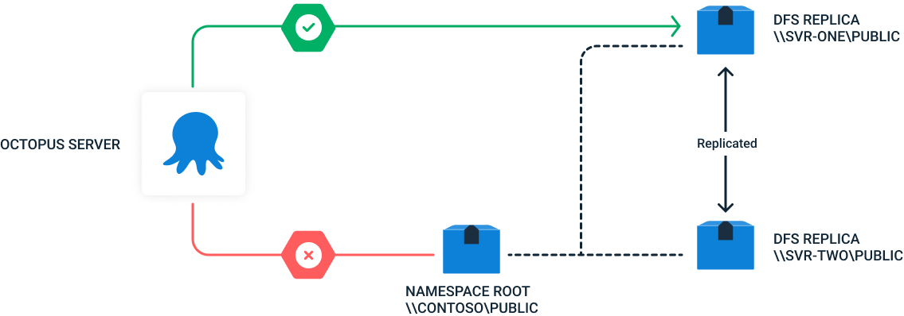
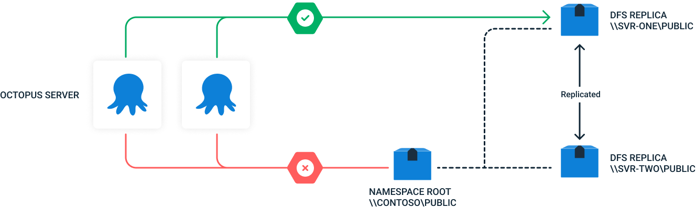
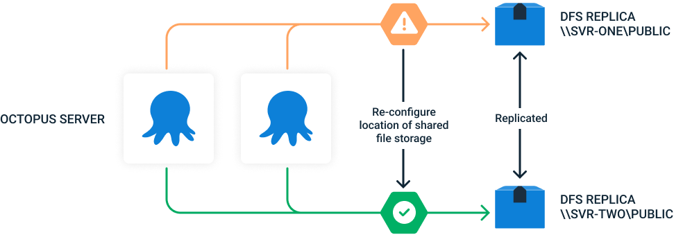

Microsoft DFS is a [distributed file system](https://en.wikipedia.org/wiki/Clustered_file_system#Distributed_file_systems), which is important to consider when configuring Octopus Deploy with a DFS file share. Octopus Server makes specific assumptions about the performance and consistency of the file system when accessing log files, performing log retention, storing deployment packages and other deployment artefacts and temporary storage when communicating with tentacles.

**DFS in the standard configuration (ie, accessed through a DFS Namespace Root) is _not_ suitable for use as a shared file store with Octopus Deploy.**

Operating Octopus Deploy with the non-recommended DFS configuration will likely result in significant, intermittent and difficult to trace problems.

Below are recommendations and more details on:

- [Configuring DFS with a Single Octopus Server](#Configuring-Octopus-with-a-Single-Octopus-Server)
- [Configuring DFS with a Multi-Node Octopus Server cluster (Octopus HA)](#Configuring-DFS-with-a-Multi-Node-Octopus-Server-cluster-(Octopus-HA))
- [DFS for Redundancy (Disaster Recover)](#DFS-for-Redundancy-(Disaster-Recover))

# Configuring DFS with a Single Octopus Server

For a single node Octopus server using DFS for file storage it is imperative that the node is **configured to use a specific DFS Replica and not the DFS Namespace Root**. Despite there being no contention between nodes in the single node configuration, there is still the DFS location transparency, which will cause unpredictable behaviour when the node is directed to a different replica.

In the diagram the single node is configured to use the replica `\\SVR_ONE\public` as the DFS file share and not the namespace root (`\\Contoso\public`). 

# Configuring DFS with a Multi-Node Octopus Server cluster (Octopus HA)

For a multi-node Octopus cluster using DFS for file storage it is imperative that **_all_ nodes in the cluster are configured to use the same DFS Replica and not the DFS Namespace Root**. Both using the namespace root, or using different replicas for different Octopus nodes will cause unpredictable behaviour.

In the diagram below each node in the cluster is configured to use the same replica (`\\SVR_ONE\public`) as the DFS file share and not the namespace root (`\\Contoso\public`). 

# DFS for Redundancy (Disaster Recovery)

DFS can still be used for redundancy and disaster recovery as normal.

In the event that the replica that OD is configured to use becomes unavailable, simply changing the configuration to another replica in the DFS Namespace with the same target folders is sufficient to restore service.

OD does not need to be restarted in this scenario. Customers can either do this manually, or can automate.

In the simplified diagram below, when an outage at DFS Replica `\\SVR_ONE\Public` occurs, by re-configuring each Octopus node to use a different replica (ensuring all nodes are re-configured to the same replica) customers can still take advantage of the redundancy within DFS.

