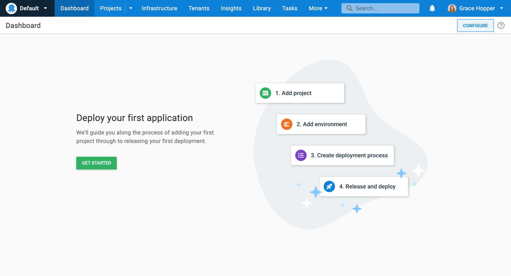
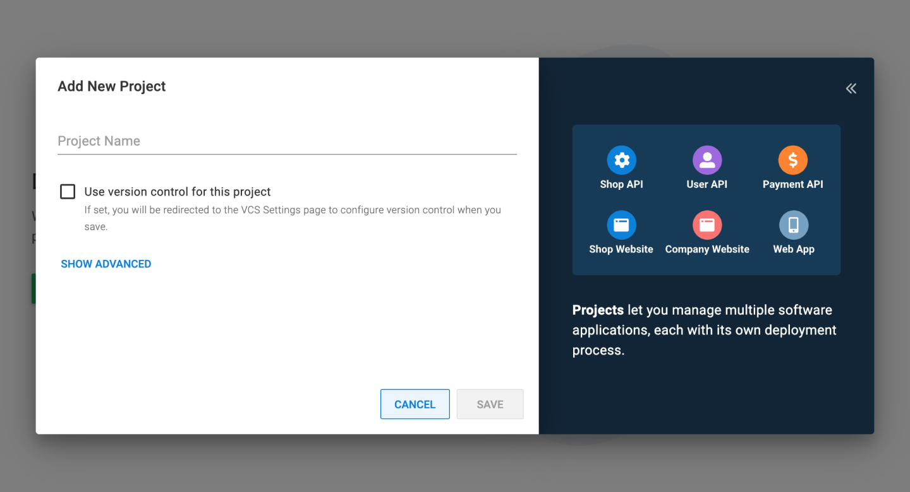
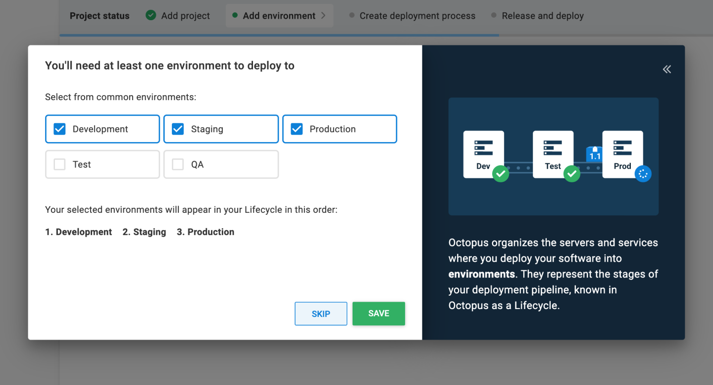
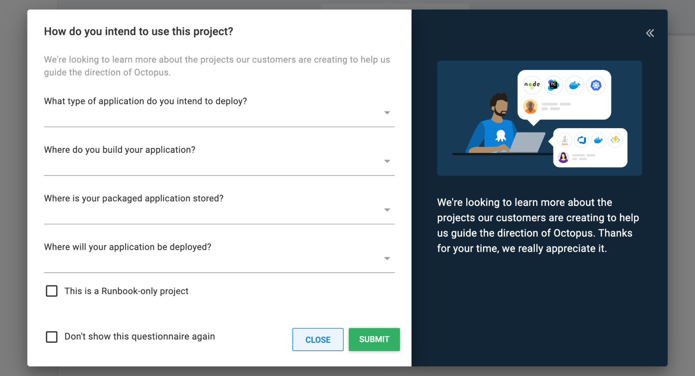
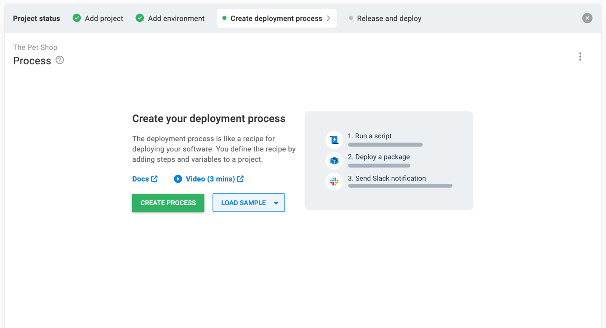
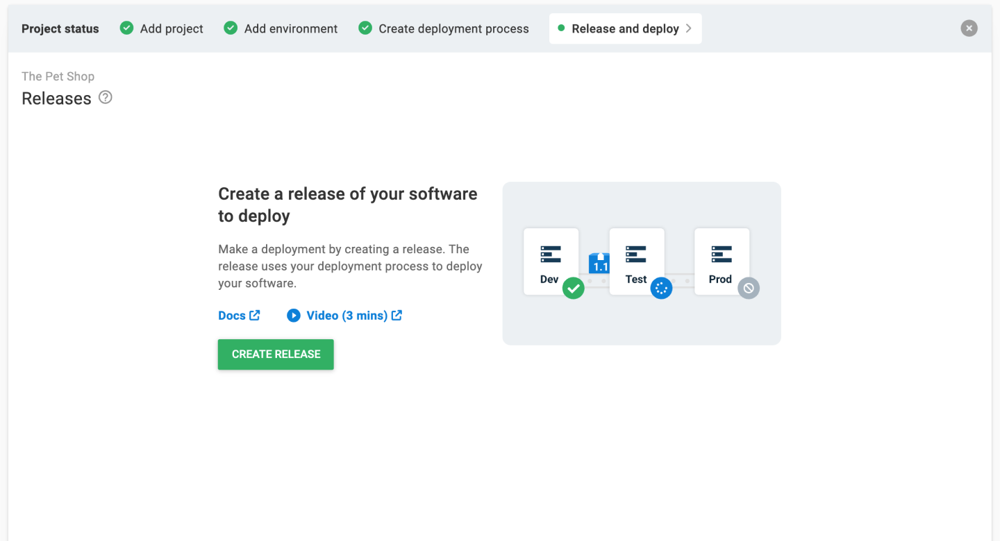
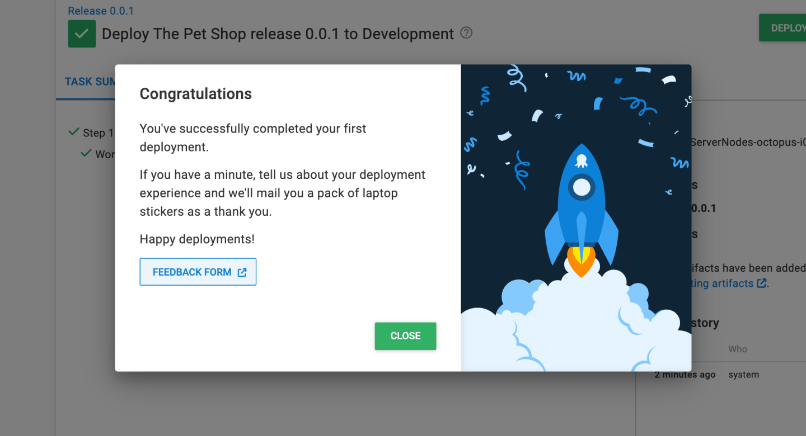

👋 Welcome to Octopus Deploy!

This tutorial will help you complete your first deployment in Octopus Deploy. We’ll walk you through the steps to deploy a sample [hello world package](https://octopus.com/images/docs/hello-world.1.0.0.zip) to one or more of your servers. All you’ll need is a running Octopus Deploy instance.

:::hint
If you are using **Octopus 2022.2** or earlier, please visit the legacy [First deployment guide](/docs/getting-started/first-deployment/legacy-guide.md)
:::

Before starting the tutorial, if you haven't set up an Octopus Deploy instance, please do so by picking from one of the following options:

!include <octopus-deploy-setup-options>

Log in to your Octopus instance to get started. You’ll be guided through the process of deploying your first application.

Click **GET STARTED** to begin your deployment journey.



## Add project

Projects let you manage software applications and services, each with its own deployment process.

Give your project a descriptive name and click **SAVE**.



## Add Environments

You will need an environment to deploy to.

Environments are how you organize your infrastructure, on prem or cloud, into groups that represent the different stages of your deployment pipeline, for instance, dev, test, and production.

Select the environments you’d like to create and click **SAVE**.


## Project questionnaire

You have the option to fill out a short survey. This helps our team learn about the technologies our customers are using, which guides the future direction of Octopus. It should only take about 30 seconds to complete.

Click **SUBMIT** and you will be taken to your project.



## Create deployment process

The next step in the journey is to create your deployment process. This is where you define the steps that Octopus uses to deploy your software. For our simple Hello World deployment, we will configure one step to print _Hello World_.



1. Click **CREATE PROCESS** to see the available deployment steps.
2. Select the **Script** tile to filter the types of steps.
3. Scroll down and click **ADD** on the **Run a Script** tile.
4. Accept the default name for the script.
5. In the Execution Location section, select **Run once on a worker** if you’re using Octopus Cloud, or **Run once on the Octopus Server** if you’re using a self-hosted Octopus instance.
6. Scroll down to the Script section, select your script language of choice, and enter the following script in the Inline Source Code section. 
```
Write-Host "Hello, World!"
```

:::hint
If you are using Octopus Cloud, Bash scripts require you to select the Hosted Ubuntu worker pool. The Default Worker Pool is running Windows and doesn't have Bash installed.
:::

7. Click **SAVE** to save the step.

## Release and deploy

Next, we will create a release that we can deploy to our environments. A release is a snapshot of the deployment process and the associated assets (packages, scripts, variables) as they exist when the release is created.



1. Click **CREATE RELEASE**.
2. Give the release a version number such as 0.0.1. You have the option to add release notes. Click **SAVE**.
3. After reviewing the details, click **DEPLOY TO DEVELOPMENT**.
4. This screen gives you the details of the release you are about to deploy. Click **DEPLOY** to start the deployment.

The deployment progress page displays a task summary. If you click **TASK LOG**, you'll see the steps Octopus is taking to execute your hello world script.

Success, you have finished your first deployment! 🎉



Take a moment to enjoy your first deployment! The next step will introduce you to the power of variables.


Subsequent pages in the guide:
1. [Define and use variables](/docs/getting-started/first-deployment/define-and-use-variables.md)
2. [Approvals with manual interventions](/docs/getting-started/first-deployment/approvals-with-manual-interventions.md)
3. [Add deployment targets](/docs/getting-started/first-deployment/add-deployment-targets.md)
4. [Deploy a sample package](/docs/getting-started/first-deployment/deploy-a-package.md)

**Further Reading**

This tutorial will deploy a sample package to your servers.  If you prefer to skip that and start configuring Octopus Deploy for your application right away, please see:

- [Customizable End-to-End CI/CD pipeline tutorial](https://octopus.com/docs/guides)
- [Deployment Examples](/docs/deployments/index.md)

<span><a class="btn btn-success" href="/docs/getting-started/first-deployment/define-and-use-variables.md">Next</a></span>
