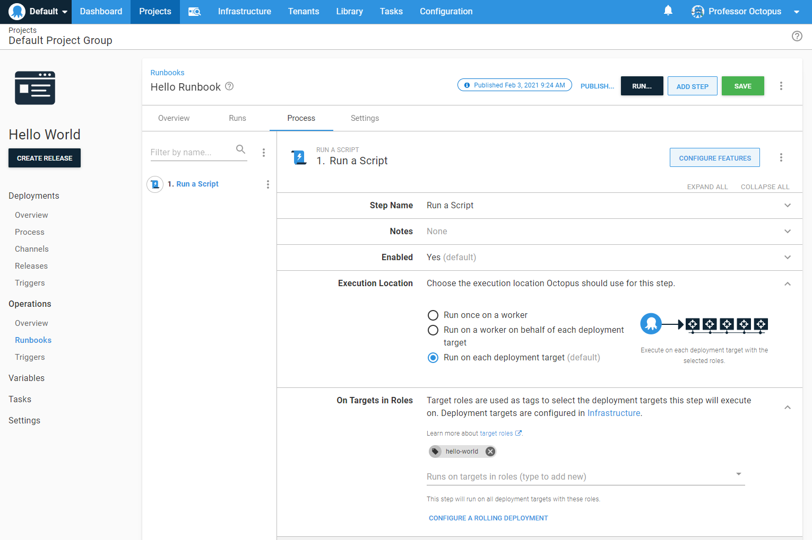
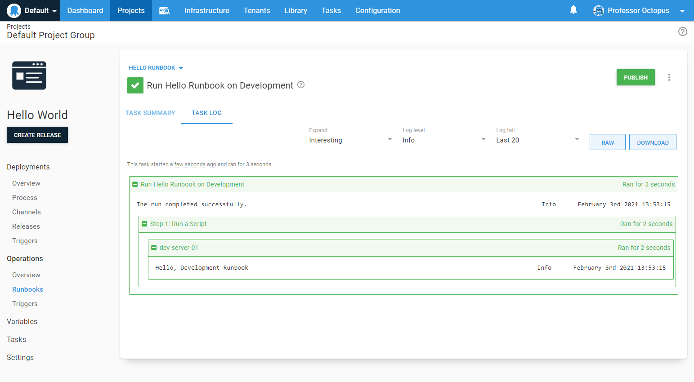

!include <add-deployment-targets>

Now that we have the deployment targets added, let's update the runbook process to run on the new targets.

1. Click **Runbooks** on the left menu.
1. Click *Hello Runbook* in the list of runbooks.
1. Click **Process** in the runbook menu.
1. Select the script step.
1. In the **Execution Location** section change the option to be **Run on a deployment target**.
1. In the **On Target In Roles** section change the role to be `Hello-World`.
1. Click **SAVE**

8. Click **RUN...** and select an environment to run on.

:::hint
Not all steps can and should be run on a deployment target.  The rule of thumb is to run a runbook step on a deployment target if that step needs to modify something specific on that target, such as restarting a service, or installing a web server.  If you need to manage PaaS targets, K8s clusters, or database servers, the recommendation is to run the runbook script on a worker.
:::

We've reached the point where the runbook is ready to [be published](/docs/getting-started/first-deployment/publishing-a-runbook.md) so it can used by triggers and users have a good known version to run.
