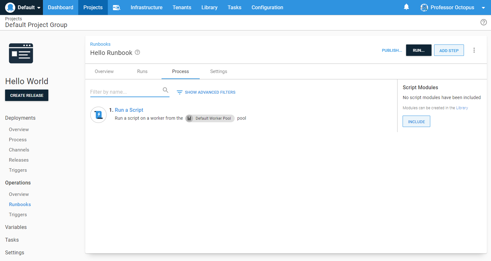

The runbook process is the steps the Octopus Server orchestrates to perform various tasks on your infrastructure.  For our simple hello world script, we will only have one step.



1. From the *Hello Runbook* runbook you created in the previous page, click **DEFINE YOUR RUNBOOK PROCESS**.
1. Click **ADD STEP**.
1. Select the **Script** tile to filter the types of steps.
1. Scroll down and click **ADD** on the **Run a Script** tile.
1. Accept the default name for the script and leave the **Enabled** check-box ticked.
1. In the **Execution Location** page, select **Run once on a worker** (if you are on self-hosted Octopus, select **Run once on the Octopus Server**).  If you are using Octopus Cloud and want to use Bash scripts change the worker pool from **Default Worker Pool** to **Hosted Ubuntu**.
1. Scroll down to the **Script**, select your script language of choice and enter the following script in the **Inline Source Code** section:

```powershell PowerShell
Write-Host "Hello, World!"
```
```bash Bash
echo "Hello, World!"
```

:::hint
If you are using Octopus Cloud, Bash scripts require you to select the **Hosted Ubuntu** worker pool.  The **Default Worker Pool** is running Windows and doesn't have Bash installed.
:::

8. Click **SAVE**.

:::success
Learn more about [defining a deployment process](/docs/projects/deployment-process/index.md).
:::

You have created your first runbook process. Next, we'll [run the runbook](/docs/getting-started/first-runbook-run/running-a-runbook.md).