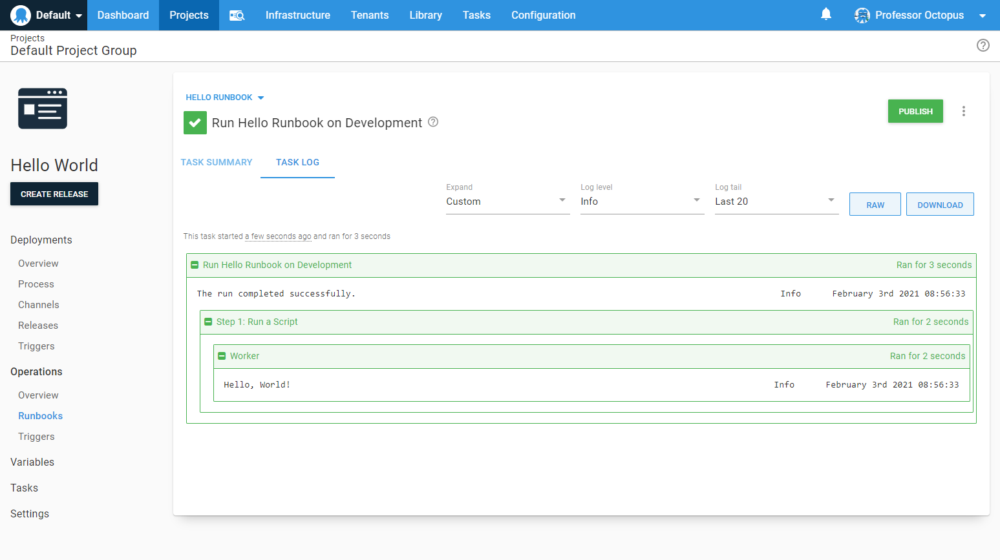

Unlike a deployment with a pre-defined lifecycle, a runbook can be run on any environment in any order.  That is because Runbooks are designed to automate routine maintenance tasks.  A maintenance tasks might need to run on **Test** and **Production** but not on **Development** environments.

1. From the *Hello Runbook* runbook you created in the previous page, click **RUN...**.

This screen provides the details of the runbook you are about to run.

2. Select an environment.
3. Click **RUN**.

Because we didn't define any deployment targets for the target environment, Octopus ran the script directly on the Octopus Server.  If you are on Octopus Cloud, Octopus Deploy leased a [dynamic worker](/docs/infrastructure/workers/dynamic-worker-pools.md#on-demand) (a machine that executes tasks on behalf of the Octopus Server) that was then used to execute the hello world script.

You have run your first runbook. Next, we'll cover [runbook specific variables](/docs/getting-started/first-runbook-run/runbook-specific-variables.md).