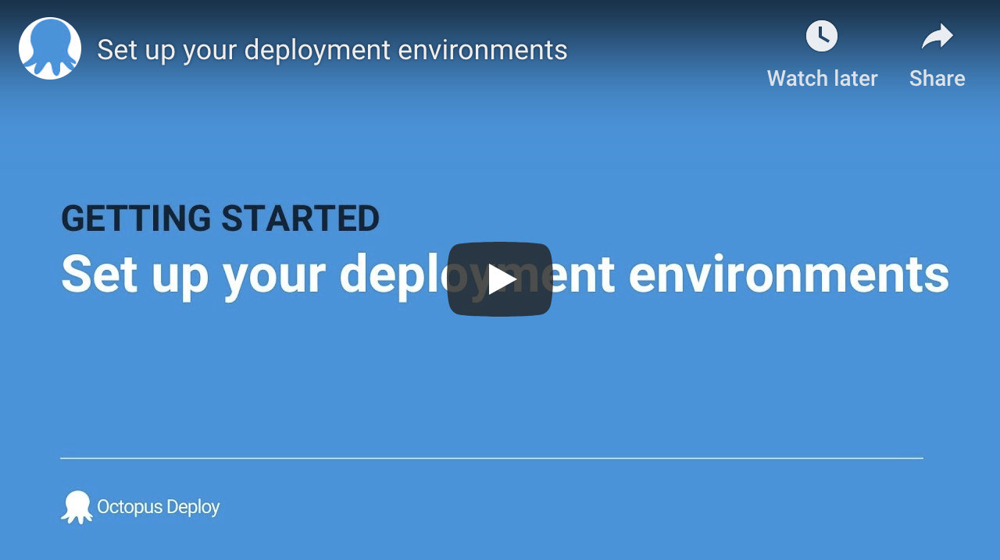

## How Octopus Works

Octopus Deploy allows users to consistently and reliably deploy by creating a Release and deploying it following the steps defined in a Projects Deployment Process.

As an Octopus user, you define the process for deploying your software. You specify the environments the applications are deployed to and who on your team can deploy to which environments. For instance, you might want QA to deploy to test environments, but not to production. Taking this approach means that even if different members of the team trigger deployments, the deployment process remains consistent. Once releases have been created, they can be deployed as many times as you need.

Below outlines the main steps for doing your first deployment:

### 1. Hosting the Octopus Deploy Server

The first thing you will need to do is decide where you want to host your [Octopus Deploy server](/docs/installation/index.md). You can install your own [self-hosted](#self-hosted-octopus) instance or use [Octopus Cloud](/docs/octopus-cloud/index.md) which is hosted and maintained by Octopus Deploy.

### 2. Set up deployment environments

Octopus will need to know where you are going to deploy to. You can deploy to Windows servers, Linux servers, Microsoft Azure, an Offline Package Drop, Cloud Regions, or Kubernetes. These are known as your deployment targets, and they are organized into environments so you can promote your software through your deployment pipeline, for instance, from Development to Testing and finally into Production.
Learn more about managing your [Infrastructure](/docs/infrastructure/index.md)

* Create your first environment 0:00
* Create your first deployment target 0:00

:::hint
**Terms you will need to know**

#### Deployment Targets

Deployment targets represent the servers, machines and cloud services where your software and services will be deployed.

#### Environments

Octopus organizes your deployment targets into groups called environments so you can promote your software through your deployment pipeline, for instance, from Development to Test and finally into Production.

#### Target Roles

Target roles allow you to “tag” deployment targets with a specific keyword which can be used in your deployments.

#### Tentacle Agent

When you deploy to servers, running either Windows, Linux or Mac, you need to install the Tentacle Agent, a lightweight agent service, on your servers so they can communicate with the Octopus server in either a listening or a polling mode.
A Tentacle Agent isn't required for deploying to Azure Web Apps, Kubernetes clusters, Azure Service Fabric and Azure Cloud Service targets.

#### Lifecycle

Lifecycles give you control over the way releases are promoted between environments.
:::

### 3. Package and upload your software

Before you can deploy software with Octopus Deploy, you need to bundle all the files required for the software to run into a supported package. The package must be versioned and stored in a repository. Octopus Deploy includes a built-in repository. We recommend configuring your existing tool chain to push packages automatically to the built-in repository; however, you can push packages manually to the repository if you choose to.

#### Package

A Package is an archive (zip, tar, NuGet) that contains all the files needed to run your software. You can host Packages in external repositories or the built-in Octopus repository.

#### Naming a Package

The package will need to be named correctly with a packageID, version number and format, for Octopus to recognize it. For example MyPackage.1.0.1.zip

#### Creating a Package

There are many more tools you might choose to use to create your package, but as long as you can create one of our [supported packages](/docs/packaging-applications/index.md#supported-formats) you can deploy your applications with Octopus Deploy.

We've created the following tools to help package your applications for deployment with Octopus:

 - [Octo.exe](/docs/packaging-applications/octo.exe.md) to create Zip Archives and NuGet packages for **.NET Core** apps and full **.NET framework** applications.
 - [Octopack](/docs/packaging-applications/octopack/index.md) to create NuGet packages for **ASP.NET** apps (.NET Framework) and **Windows Services** (.NET Framework).
 - A [TeamCity plugin](/docs/packaging-applications/build-servers/teamcity.md).
 - An [Azure DevOps plugin](/docs/packaging-applications/build-servers/tfs-azure-devops/using-octopus-extension/index.md).

#### Getting your package into Octopus

Most Octopus users push their package from their build server to Octopus. But you can manually upload the package or host it in an external repository.

:::hint
**New to Octopus and don’t have a package?**

Use our example package to quickly create your first deployment. [hello-world.1.0.0.zip](https://octopus.com/images/docs/hello-world.1.0.0.zip)
:::

Learn more about [packaging your applications](/docs/packaging-applications/index.md) or how to automate your existing tool chain to push packages to your Octopus Deploy server with our [API and Integrations](/docs/octopus-rest-api/index.md).

### 4. Define your deployment process

Octopus Deploy is designed to work with teams following agile software development methodologies, that is, continuously deploying software, iterating, making changes, and redeploying.
Before you can deploy, a Project will need to be created with a Deployment Process which will contain all the information needed to have your teams successfully redeploy every time.

#### Projects

Projects let you manage multiple software projects from the Octopus Web Portal. For each project you have, you define a deployment process, configuration variables, and the environments the software will be deployed to.

#### Deployment Process

The deployment process is like a recipe for deploying your software. You define the recipe by adding steps and variables to a project. Each step contains a specific action (or set of actions) that is executed as part of the deployment process each time your software is deployed.

#### Variables

Octopus lets you define variables for configuration values that change, so you can have a different value for each environment or deployment target

Learn more about the [deployment process](/docs/deployment-process/index.md), how you can set up [projects](/docs/deployment-process/projects/index.md), use [variables](/docs/deployment-process/variables/index.md) and [lifecycles](/docs/deployment-process/lifecycles/index.md) in your deployments.

### 5. Deploy your release

Once you have access to an Octopus Server, your infrastructure is configured, your applications packaged, and the deployment process defined, you're ready to start deploying your software.

#### Creating a Release

A Release is a snapshot of your deployment process, configuration variables, and software packages. Releases are created from Projects and deployed via a Lifecycle to your Environments.

#### Deploying a Release

When you deploy a release, you are executing the deployment process with all the associated details, as they existed when the release was created. You can deploy a release as many times as you want to.

Learn more about how you can [deploy releases](/docs/deployment-process/releases/index.md), or see some [deployment examples](/docs/deployment-examples/index.md).

## In this section

- [Terms](/docs/getting-started/terms.md)
