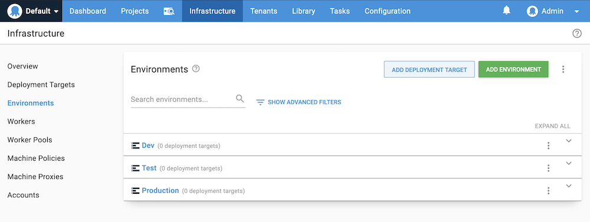
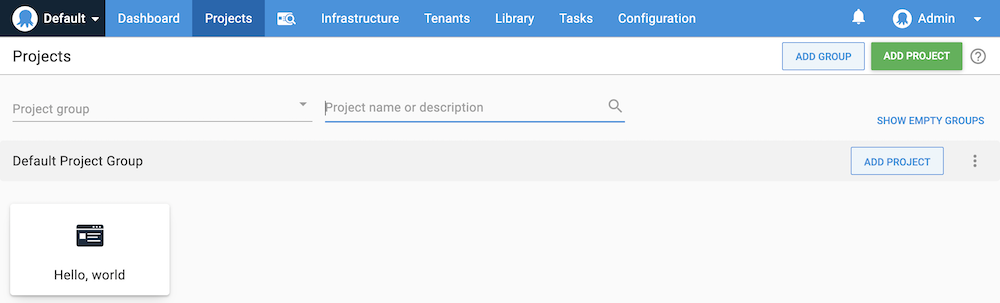
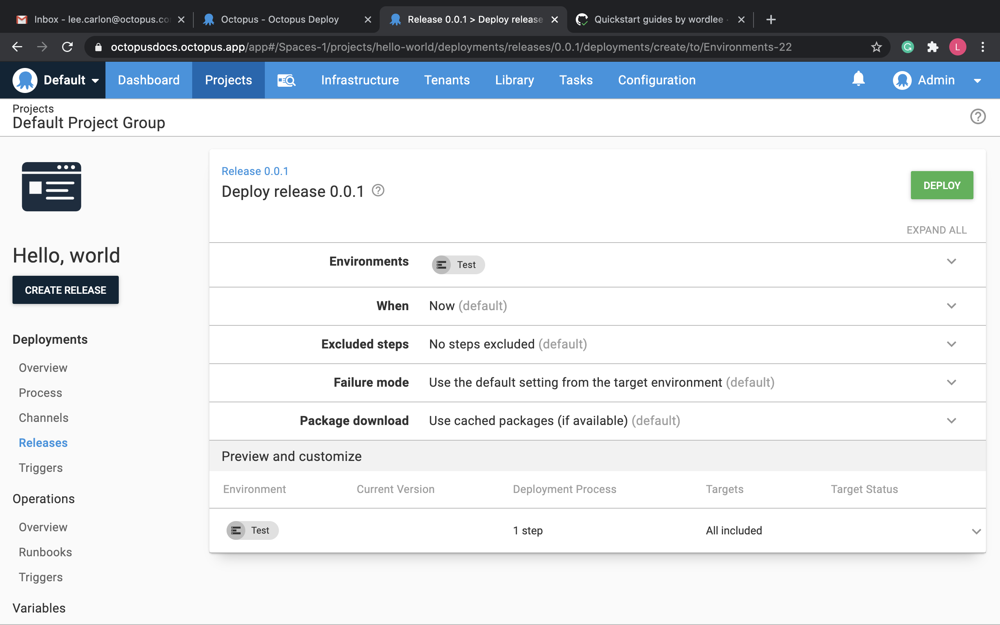
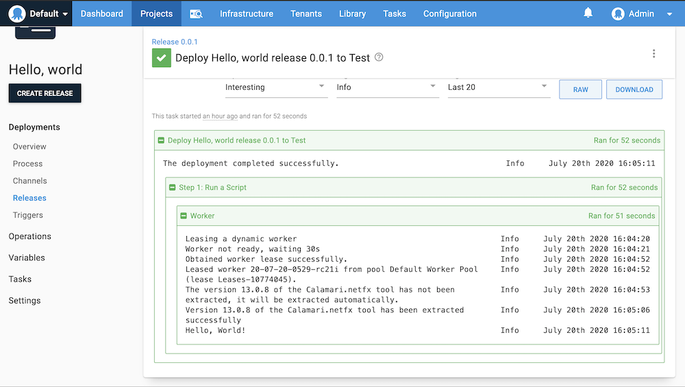

Octopus Deploy can help with your complex deployment scenarios, but it can also deploy simple projects. 

This section walks you through the simplest deployment possible to help familiarize you with the process and the Octopus Web Portal.

The steps in this procedure are completed in an Octopus Cloud instance, but the process is almost identical in self-hosted instances of Octopus Server.

## Environments

<iframe width="560" height="315" src="https://www.youtube.com/embed/tPb6CLHyNLA" frameborder="0" allow="accelerometer; autoplay; encrypted-media; gyroscope; picture-in-picture" allowfullscreen></iframe>

Octopus organizes the servers and services where you deploy your software into environments. Typical environments are **Dev**, **Test**, and **Production**, and they represent the stages of your deployment pipeline.



### Add an environment

1. To create an environment, in the Octopus Web Portal, navigate to **{{Infrastructure,Environments}}** and click **ADD ENVIRONMENT**.
1. Give your new environment a meaningful name, for instance, *Test*, and click **SAVE**.

You now have your first environment.

## Projects

<iframe width="560" height="315" src="https://www.youtube.com/embed/gfaRUIlQybA" frameborder="0" allow="accelerometer; autoplay; encrypted-media; gyroscope; picture-in-picture" allowfullscreen></iframe>

Projects are used to collect all the assets that make up your deployment processes. To deploy our simple hello world script, we first need a project. 



## Create a project

1. Navigate to the **Projects** tab, and click **ADD PROJECT**.
1. Give the project a name, for instance, *Hello, world*, and click **Save**.

You now have your first project and are ready to define your deployment process.

## Deployment process

<iframe width="560" height="315" src="https://www.youtube.com/embed/0oWRg_TxWxM" frameborder="0" allow="accelerometer; autoplay; encrypted-media; gyroscope; picture-in-picture" allowfullscreen></iframe>

The deployment process is the steps the Octopus Server orchestrates to deploy your software. For our simple hello world script, we will only have one step.


### Define the deployment process

1. From the *Hello world* project you created in the previous section, click **DEFINE YOUR DEPLOYMENT PROCESS**.
1. Click **ADD STEP**.
1. Select the **Script** tile to filter the types of steps.
1. Scroll down and click **ADD** on the **Run a Script** tile.
1. Accept the default name for the script and leave the **Enabled** check-box ticked.
1. In the **Execution Location** section, select **Run once on a worker**.
1. Scroll down to the **Script** and enter the following PowerShell script in the **Inline Source Code** section:

```PowerShell
Write-Host "Hello, World!"
```

8. Click **SAVE**.

You have created your first deployment process. Next, we'll create a release and deploy it.

## Releases and deployments

<iframe width="560" height="315" src="https://www.youtube.com/embed/syfl59pR4ZU" frameborder="0" allow="accelerometer; autoplay; encrypted-media; gyroscope; picture-in-picture" allowfullscreen></iframe>

A release is a snapshot of the deployment process and the associated assets (packages, scripts, variables) as they existed when the release was created. Our hello world deployment process only has one step that executes the script we entered in the previous section.

When you deploy the release, you are executing the deployment process with all the associated details, as they existed when the release was created.

### Create and deploy a release 

1. Click **CREATE RELEASE**.
1. The release is created and given a version number. There is a space to add release notes. Click **SAVE**.
1. To deploy this version of the release, click **DEPLOY TO TEST...**.

The next screen gives you the details of the release you are about to deploy:



4. To deploy the release, click **Deploy**.
5. The next screen displays a task summary. If you click the **TASK LOG**, you'll see the steps Octopus took execute your hello world script.

Because we didn't define any deployment targets for the **Test** environment, Octopus leased a dynamic worker (a machine that execute tasks on behalf of the Octopus Server) that was then used to execute the hello world script.



Now that you've created and deploy a basic hello world project, you're ready learn more about the [CI/CD pipeline](/docs/getting-started/the-cicd-pipeline.md), set up [Octopus Deploy](/docs/getting-started/setup-octopus-deploy.md), or explore the other [getting started guides](/docs/getting-started/getting-started-guides.md#getting-started-guides).
