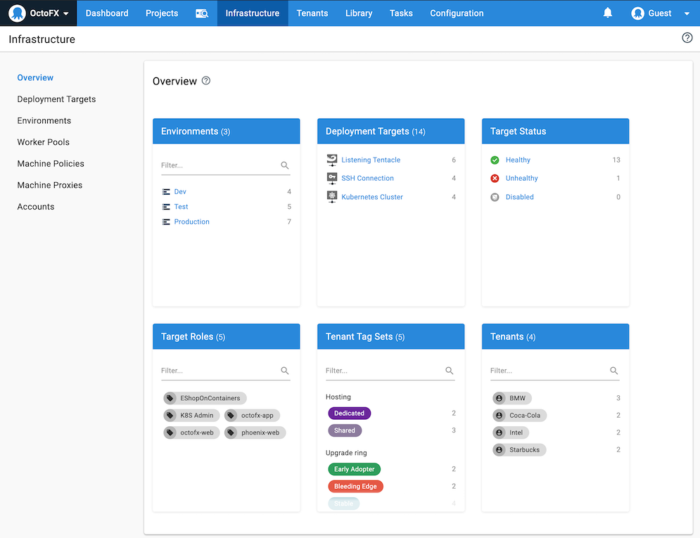

This section provides an overview of Octopus Deploy concepts and links to the relevant documentation, which explore the concepts further and guide you through implementing them with [Octopus Cloud](#octopus-cloud) or your own [self-hosted Octopus Server](#self-hosted-octopus).

## Consistent Releases

Octopus Deploy simplifies complex deployments. 

Octopus Deploy sits between your build servers and the deployment targets your software will be deployed to, and gives you control over ever step in the process. 

After your build server has compiled and packaged your software, Octopus progresses the software through your environments from Test and QA all the way through to Production, whether your deployment targets are Windows servers, Linux servers, Azure, AWS, Kubernetes, or Google Cloud Platform.

## Octopus Deploy Server

You can install your own [self-hosted](#self-hosted-octopus) instance of the Octopus Deploy Server or use [Octopus Cloud](#octopus-cloud).

## Self-Hosted Octopus

Installing the self-hosted [Octopus Server](/docs/installation/index.md) sets up the [Octopus Web Portal](#the-octopus-web-portal) and the [Octopus REST API](/docs/octopus-rest-api/index.md).

The [installation documentation](/docs/installation/index.md) provides instructions for downloading, installing, and configuring your Octopus Deploy Server.

## Octopus Cloud

**Octopus Cloud** is the hosted version of Octopus Deploy. We designed Octopus Cloud and self-hosted Octopus to provide the same functionality; however, there are some minor differences, for instance, with Octopus Cloud, we're [responsible](/docs/security/index.md#responsibility) for taking backups, upgrading the service, and maintaining and monitoring the underlying systems.

Learn more about [Octopus Cloud](/docs/octopus-cloud/index.md).

## The Octopus Web Portal

Whether you're self-hosting the Octopus Server, or using Octopus Cloud, the Octopus Web Portal is where you'll manage your infrastructure, projects, access the built-in repository, grant your team access to projects, and create your automated deployments.

## Infrastructure

Octopus Deploy organizes your deployment targets (the machines and services you deploy software to) into groups called environments. Typical environments are **Development**, **Test**, and **Production**.

With Octopus Deploy your deployment targets could be Windows servers, Linux servers, Azure, AWS, Google Cloud Platform, cloud regions, or even an offline package drop.

Organizing your infrastructure into environments lets you define your deployment processes (no matter how many deployment targets are involved) and have Octopus deploy the right versions of your software, with the right configuration, to the right environments at the right time.

Learn more about managing your [infrastructure](/docs/infrastructure/index.md).

## Packaging Applications

Before you can deploy software with Octopus Deploy, you need to bundle all the files required for the software to run into a supported package. The package must be versioned and stored in a repository. Octopus Deploy includes a built-in repository. You can configure you build server to push packages automatically to Octopus's built-in repository or to your existing [package repository](/docs/packaging-applications/package-repositories/index.md).

Learn more about [packaging your applications](/docs/packaging-applications/index.md).

## Projects

<!-- needs runbooks -->

Octopus Deploy can manage the deployment of many applications across your organization. Projects within Octopus Deploy let you manage multiple software projects across different environments with different deployment processes (the specific deployment steps) defined per project.

A project in Octopus can consist of many deliverable components (e.g., web sites, micro services, and database scripts). It's usually helpful to think of Octopus projects in terms of business projects, for instance, if you have five developers working together on the "HR Portal rewrite" project, then that's probably a single project in Octopus.

Learn more about [projects](/docs/projects/index.md).

## Deploying Applications

Octopus Deploy is designed to work with teams following modern DevOps methodologies, that is, continuously deploying software, getting feedback, making changes, and redeploying.

The deployment process is like a recipe for deploying your software. You define the recipe by adding steps and variables to a project. Each step contains a specific action (or set of actions) that is executed as part of the deployment process each time your software is deployed.

Octopus Deploy provides a range of built-in step templates that can be included in your deployment processes, you can also add steps from the community step template library, and even create your own custom steps. Each step contains a specific action (or set of actions) that is executed as part of the deployment process each time your software is deployed. After the initial setup, your deployment process shouldn't change between deployments even though the software being deployed will change as part of the development process.

Learn more about the [deployment process](/docs/projects/deployment-process/index.md) and see some example [deployments](/docs/deployments/index.md).

### Variables

As you deploy your applications between different environments, you'll need to change their configuration files based on the scope of the deployment. Octopus has advance support for managing and scoping variables. For instance, your test environment shouldn't have access to your production database. Using variables, you can specify a different database for each environment, ensuring your production data won't be impact by codes changes that are still in review.

Learn more about [variables](/docs/projects/variables/index.md) and advanced [configuration features](/docs/projects/steps/configuration-features/index.md).

### Lifecycle

When you define a project, you also select a lifecycle. The lifecycle defines the rules around how releases of the project are deployed between environments, which projects are deployed to which environments.

Lifecycles are defined by phases, each phase can have one or more environments, and each environment can be defined as an automatic deployment environment or a manual deployment environment. Each phase can have a set number of environments that must be released to before the next phase is available for deployment.

Learn more about [lifecycles](/docs/releases/lifecycles/index.md).

### Releases

A release in Octopus, is a snapshot of the packaged software, variables, and the deployment process.

A release is deployed to the environments defined in the deployment process. Typically, releases are deployed to one environment and then promoted to the next environment when they are successful. Releases can be deployed manually each time or set up to deploy automatically.

Learn more about [deploying releases](/docs/releases/index.md).

## Runbook automation {#octopus-runbooks}

A deployment is only one phase in the life of an application. There are typically many other tasks that are performed to keep an application operating. A large part of DevOps is running operations separate from deploying applications, and this is where runbooks helps.

Runbooks are used to automate routine maintenance and emergency operations tasks like infrastructure provisioning, database management, and website failover and restoration.

Learn more about [Octopus Runbooks](/docs/runbooks/index.md).

We have created a [step by step guide on how to complete your first runbook run](/docs/getting-started/first-runbook-run/index.md).

## Config as Code

Octopus now provides the option to host multiple branches of your deployment processes in Git. This feature enables you to track changes to your deployment process via commits directly to your Git repository. This provides greater control when testing changes to your projects, allowing you to branch your deployment process and test changes before altering your main branch.

Learn more about [Config as Code](/docs/projects/version-control/index.md)

We have created a [step by step guide on getting started with Config as Code](/docs/projects/version-control/configuring-version-control-on-a-project.md).

## Tenants

Over time your software may become so successful that you on-sell it to some external customers, and due to the way the software is architected, you need to deploy slightly different versions of the software configured for each customer. For instance, you might deploy version 1.0.1 to Customer A with the software configured to display customer A's logo on their landing page, and version 1.1.0 to Customer B configured to display their logo on their landing page. The multi-tenant feature in Octopus Deploy helps you manage deploying different versions of the same software to multiple customers.

Learn more about [tenants](/docs/tenants/index.md).

## Spaces

If you're a large organization with lots of teams working in Octopus, from 2019.1 you can use the Spaces feature to provide each of your teams with a space for the projects, environments, and infrastructure they work with, while keeping other team's assets separate in their own spaces.

Learn more about [Octopus Spaces](/docs/administration/spaces/index.md).

<a class="btn btn-success" href="https://octopus.com/start">Start a Trial</a>

## Next steps

<!-- old content 

## Octopus Server

You can install a self-hosted instance of the **Octopus Server** or use the hosted version **Octopus Cloud**. You can get started with either Octopus Server or Octopus Cloud for [free](https://octopus.com/start/cloud).

### Consistent deployments and releases

As an Octopus user, you define the process for deploying your applications. You specify the environments the applications are deployed to and who on your team can deploy to which environments. For instance, you might want developers to deploy to dev environments but not testing or production, and members of QA to deploy to test environments but not to production. Taking this approach means that even if different team members trigger deployments, the deployment process remains consistent. After releases have been created, they can be deployed as many times as you need.

Learn more about [Deployments in Octopus Deploy](/docs/deployments/index.md).

We have created a [step by step guide to completing your first deployment](/docs/getting-started/first-deployment/index.md) using a sample application.  

### Infrastructure

Octopus Deploy organizes your deployment targets (the machines and services you deploy software to) into groups called environments. Typical environments are **Dev**, **Test**, and **Production**.  With Octopus Deploy, your deployment targets can be Windows servers, Linux servers, Microsoft Azure, AWS, Kubernetes Clusters, Cloud Regions, or even an offline package drop.  Organizing your infrastructure into environments lets you define your deployment processes (no matter how many steps, environments, or deployment targets are involved) and have Octopus deploy the right versions of your software, with the right configuration, to the right environments at the right time.

### Packaging applications

Before you can deploy software with Octopus Deploy, you need to bundle all the files required for the software to run into a supported package. The package must be versioned and stored in a repository. Octopus Deploy includes a built-in repository. We recommend configuring your existing toolchain to push packages automatically to the built-in repository or an external feed; however, you can push packages manually to the repository if you choose to. 

Learn more about [packaging applications](/docs/packaging-applications/index.md)

### Runbook automation {#octopus-runbooks}

A deployment is only one phase in the life of an application. There are typically many other tasks that are performed to keep an application operating. A large part of DevOps is running operations separate from deploying applications, and this is where runbooks helps.

Runbooks are used to automate routine maintenance and emergency operations tasks like infrastructure provisioning, database management, and website failover and restoration.

Learn more about [Octopus Runbooks](/docs/runbooks/index.md).

We have created a [step by step guide on how to complete your first runbook run](/docs/getting-started/first-runbook-run/index.md).

### Config as Code

Octopus now provides the option to host multiple branches of your deployment processes in Git. This feature enables you to track changes to your deployment process via commits directly to your Git repository. This provides greater control when testing changes to your projects, allowing you to branch your deployment process and test changes before altering your main branch.

Learn more about [Config as Code](/docs/projects/version-control/index.md)

We have created a [step by step guide on getting started with Config as Code](/docs/projects/version-control/configuring-version-control-on-a-project.md).

## Glossary

As you start using Octopus Deploy, you will learn a lot of new terms. You can view a list of common terms on the [glossary page](docs/getting-started/glossary.md).

## Next steps

You can get started with either Octopus Server or Octopus Cloud for [free](https://octopus.com/start/cloud).  After setting up your instance, you can use our guides to help you deploy your software, run your first runbook, or integrate Octopus Deploy into your CI/CD pipeline.

- [Hello World Deployment using sample scripts and packages](/docs/getting-started/first-deployment/index.md)
- [Hello World Runbook run using sample scripts](/docs/getting-started/first-runbook-run/index.md)
- [Customizable end to end CI/CD tutorials](https://octopus.com/docs/guides)

## Further Reading

This guide covered the basics of Octopus Deploy.  There are still many more concepts to learn.

- [Build server integration](/docs/packaging-applications/build-servers/index.md)
- [Deployment targets](/docs/infrastructure/deployment-targets/index.md)
- [Deployment examples](/docs/deployments/index.md)
- [Multi-tenancy](/docs/tenants/index.md)
- [Workers](/docs/infrastructure/workers/index.md)
- [Security considerations for Octopus Deploy](/docs/security/index.md)
- [Upgrading Octopus](/docs/administration/upgrading/index.md)
- [Create your own CI/CD pipeline tutorial](https://octopus.com/docs/guides)
- [Runbooks](/docs/runbooks/index.md)
- [Octopus REST API](/docs/octopus-rest-api/index.md)
