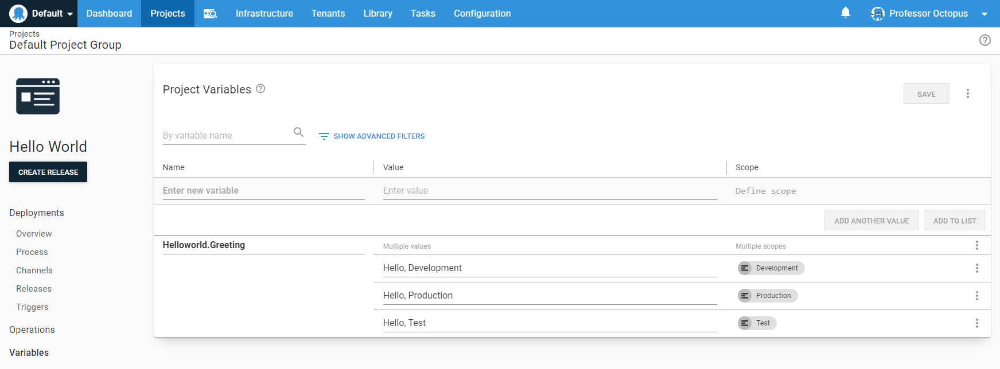
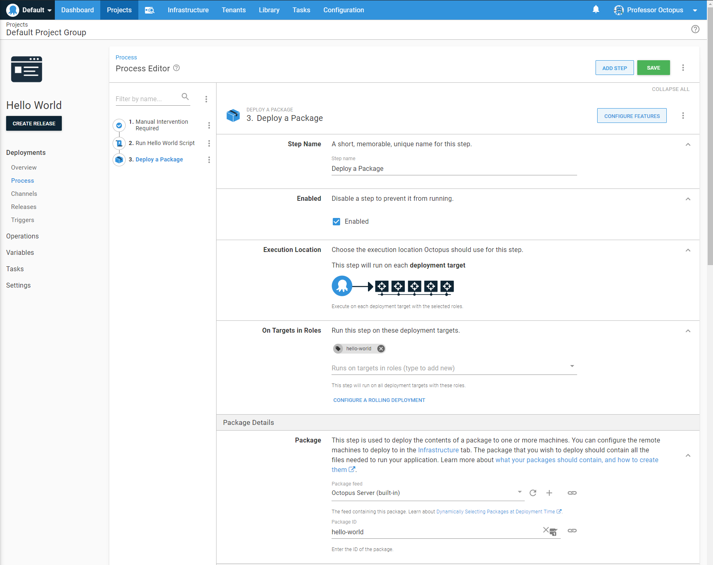

This section provides a conceptual overview of Octopus Deploy along with step-by-step instructions to help you master the fundamentals of Octopus Deploy whether you are using the self-hosted Octopus Server or Octopus Cloud.  

## Core Concepts

Octopus Deploy is a deployment tool.  It takes the packages and artifacts generated by your build server and deploys them to various targets, be it Windows, Linux, Azure, AWS, or Kubernetes, in a safe and consistent process.

### Consistent releases

As an Octopus user, you define the process for deploying your applications. You specify the environments the applications are deployed to and who on your team can deploy to which environments. For instance, you might want developers to deploy to dev environments but not testing or production, and members of QA to deploy to test environments but not to production. Taking this approach means that even if different team members trigger deployments, the deployment process remains consistent. After releases have been created, they can be deployed as many times as you need.

### Octopus Server

You can install your own self-hosted instance of the **Octopus Server** or use the hosted version **Octopus Cloud**. Small teams can get started with either Octopus Server or Octopus Cloud for [free](https://octopus.com/free).

The guide below provides more information on how to [setup Octopus Deploy](#setup-octopus-deploy)

### Infrastructure

Octopus Deploy organizes your deployment targets (the machines and services you deploy software to) into groups called environments. Typical environments are **dev**, **test**, and **Production**.  With Octopus Deploy, your deployment targets can be Windows servers, Linux servers, Microsoft Azure, AWS, Kubernetes Clusters, Cloud Regions, or even an offline package drop.  Organizing your infrastructure into environments lets you define your deployment processes (no matter how many steps, environments, or deployment targets are involved) and have Octopus deploy the right versions of your software, with the right configuration, to the right environments at the right time.

You can also use [Octopus Runbooks](#octopus-runbooks) to manage the same infrastructure your software is deployed to.  

The guide below provides more information on how to [connect your deployment targets to Octopus](#setup-deployment-targets)

### Packaging applications

Before you can deploy software with Octopus Deploy, you need to bundle all the files required for the software to run into a supported package. The package must be versioned and stored in a repository. Octopus Deploy includes a built-in repository. We recommend configuring your existing toolchain to push packages automatically to the built-in repository or an external feed; however, you can push packages manually to the repository if you choose to.  

The guide below provides more information on how to [package your software](#package-software).

## Hello World

The best way to learn something new is through hands-on interaction.  One of the first tasks when learning a new programming language is to create something that prints "hello world."  By the end of this guide, you will learn the fundamentals of how to:

- Configure environments
- Create projects
- Define a deployment process
- Create a release and deploy it
- Use variables in the deployment process
- Configuring and installing deployment targets
- Deploying a package to the deployment targets

### Setup Octopus Deploy {#setup-octopus-deploy}

Before configuring a hello world deployment, you need to set up Octopus Deploy.  You have a choice of three.

1. Octopus Cloud -> we host everything for you.  Learn more about [getting started](https://octopus.com/start/cloud).
2. Self-hosted on a Windows Server -> you host it on your infrastructure by [downloading our MSI](https://octopus.com/download) and installing it onto a Windows Server with a SQL Server backend.  Learn more about [our installation requirements](https://octopus.com/docs/installation/requirements).
3. Self-hosted as a Docker container -> you run Octopus Deploy in a docker container (currently EAP).  Learn more about [hosting Octopus in a docker container](https://octopus.com/blog/introducing-linux-docker-image).

Don't forget; you will need a license to self-host Octopus Deploy.  If you are starting, we offer a [free license](https://octopus.com/start/server).

:::success
Read more on [setting up a self-hosted instance of Octopus Deploy](docs/installation/index.md).
:::

### Octopus Web Portal

Once you setup Octopus Deploy, login to the Octopus Web Portal.  

!include <octopus-web-portal>

### Environments

<iframe width="560" height="315" src="https://www.youtube.com/embed/tPb6CLHyNLA" frameborder="0" allow="accelerometer; autoplay; encrypted-media; gyroscope; picture-in-picture" allowfullscreen></iframe>

Octopus organizes the servers and services where you deploy your software into environments. Typical environments are **Dev**, **Test**, and **Production**, and they represent the stages of your deployment pipeline.


1. To create an environment, in the Octopus Web Portal, navigate to **{{Infrastructure,Environments}}** and click **ADD ENVIRONMENT**.
1. Give your new environment a meaningful name, for instance, *Test*, and click **SAVE**.

You now have your first environment.

:::Success
To learn more about how Octopus Deploy organizes machines into environments please see the [environments documentation](/docs/infrastructure/environments/index.md).
:::

### Projects

<iframe width="560" height="315" src="https://www.youtube.com/embed/gfaRUIlQybA" frameborder="0" allow="accelerometer; autoplay; encrypted-media; gyroscope; picture-in-picture" allowfullscreen></iframe>

Projects are used to collect all the assets that make up your deployment processes. To deploy our simple hello world script, we first need a project. 


1. Navigate to the **Projects** tab, and click **ADD PROJECT**.
1. Give the project a name, for instance, *Hello, world*, and click **Save**.

You now have your first project and are ready to define your deployment process.

:::Success
To learn more about projects, variables and various settings, please refer to the [projects documentation](/docs/projects/index.md).
:::

### Deployment process

<iframe width="560" height="315" src="https://www.youtube.com/embed/0oWRg_TxWxM" frameborder="0" allow="accelerometer; autoplay; encrypted-media; gyroscope; picture-in-picture" allowfullscreen></iframe>

The deployment process is the steps the Octopus Server orchestrates to deploy your software. For our simple hello world script, we will only have one step.


1. From the *Hello world* project you created in the previous section, click **DEFINE YOUR DEPLOYMENT PROCESS**.
1. Click **ADD STEP**.
1. Select the **Script** tile to filter the types of steps.
1. Scroll down and click **ADD** on the **Run a Script** tile.
1. Accept the default name for the script and leave the **Enabled** check-box ticked.
1. In the **Execution Location** section, select **Run once on a worker** (if you are on self-hosted Octopus, select **Run once on the Octopus Server**).  If you are using Octopus Cloud and want to use Bash scripts change the worker pool from **Default Worker Pool** to **Hosted Ubuntu**.
1. Scroll down to the **Script**, select your script language of choice and enter the following script in the **Inline Source Code** section:

```powershell PowerShell
Write-Host "Hello, World!"
```
```bash Bash
echo "Hello, World!"
```

:::hint
If you are using Octopus Cloud, Bash scripts require you to select the **Hosted Ubuntu** worker pool.  The **Default Worker Pool** is running Windows and doesn't have Bash installed.
:::

8. Click **SAVE**.

You have created your first deployment process. Next, we'll create a release and deploy it.

:::success
Learn more about [define deployment process](/docs/deployment-process/index.md).
:::

### Releases and deployments

<iframe width="560" height="315" src="https://www.youtube.com/embed/syfl59pR4ZU" frameborder="0" allow="accelerometer; autoplay; encrypted-media; gyroscope; picture-in-picture" allowfullscreen></iframe>

A release is a snapshot of the deployment process and the associated assets (packages, scripts, variables) as they existed when the release was created. Our hello world deployment process only has one step that executes the script we entered in the previous section.

When you deploy the release, you execute the deployment process with all the associated details, as they existed when the release was created.

1. Click **CREATE RELEASE**.
1. The release is created and given a version number. There is a space to add release notes—click **SAVE**.
1. To deploy this version of the release, click **DEPLOY TO TEST...**.

The next screen gives you the details of the release you are about to deploy:


4. To deploy the release, click **Deploy**.
5. The next screen displays a task summary. If you click the **TASK LOG**, you'll see the steps Octopus took to execute your hello world script.

Because we didn't define any deployment targets for the **Test** environment, Octopus leased a [dynamic worker](/docs/infrastructure/workers/dynamic-worker-pools.md#on-demand) (a machine that executes tasks on behalf of the Octopus Server) that was then used to execute the hello world script.  If you are on a self-hosted instance of Octopus Deploy, you won't see that message.


:::success
To learn more about release creation options, scheduling releases, and version rules please refer to the [release documentation](/docs/releases/index.md)
:::

### Variables

<iframe width="560" height="315" src="https://www.youtube.com/embed/Hd71uhcD61E" frameborder="0" allow="accelerometer; autoplay; clipboard-write; encrypted-media; gyroscope; picture-in-picture" allowfullscreen></iframe>

Octopus allows you to define variables and scope them for use in different phases of your deployments.  Variables allow you to have a consistent deployment process across your infrastructure without having to hard-code or manually update configuration settings that differ across environments, deployment targets, channels, or tenants.

1. From the *Hello world* project you created earlier, click **Variables** in the left menu.
1. Enter **Helloworld.Greeting** into the variable name column on the first row of the table.
1. Add **Hello, Development** into the value column.
1. Click the **Scope** column and select the `Development` environment.
1. Click **ADD ANOTHER VALUE** button.
1. Add **Hello, Test** and scope it to the `Test` environment.
1. Click **ADD ANOTHER VALUE** button.
1. Add **Hello, Production** and scope it to the `Production` environment.
1. Click the **SAVE** button.



Steps in the deployment process can reference the variables.

1. Click **Process** on the left menu.
1. Select the **Hello World** step.
1. Change the script in the script step based on your language of choice:

```powershell PowerShell
Write-Host $OctopusParameters["Helloworld.Greeting"]
```
```bash Bash
greeting=$(get_octopusvariable "Helloworld.Greeting")
echo $greeting
```

:::hint
If you are using Octopus Cloud, Bash scripts require you to select the **Hosted Ubuntu** worker pool.  The **Default Worker Pool** is running Windows and doesn't have Bash installed.
:::

4. Click the **SAVE** button and create a new release.

:::hint
A release snapshots everything about your project, including variables and the deployment process. You have to create a new release to see any changes.
:::

As you promote through the environments, you will see the greeting change.


:::success
To learn more about variables, variable types, and sharing variables between projects, please refer to the [variable documentation](/docs/projects/variables/index.md)
:::

### Approvals With Manual Interventions

<iframe width="560" height="315" src="https://www.youtube.com/embed/ePQjCClGfZQ" frameborder="0" allow="accelerometer; autoplay; clipboard-write; encrypted-media; gyroscope; picture-in-picture" allowfullscreen></iframe>

The manual intervention step accomplishes approvals in Octopus Deploy.  A deployment will pause when a manual intervention step is encountered and wait for approval or a rejection from a member of the specified team.

1. From the *Hello world* project you created earlier, click on **Process** on the left menu.
1. Click **ADD STEP**.
1. Select the **Other** tile to filter the types of steps.
1. Scroll down and click **ADD** on the **Manual Intervention Required** tile.
1. Accept the default name for the script and leave the **Enabled** check-box ticked.
1. Leave the **Container Image** set on the default.
1. Enter "Please verify the Production environment is ready before proceeding" in the **Instructions**.
1. Select "Octopus Administrators" and "Octopus Managers" as **Responsible Teams**
1. Select "Run only for specific environments" and select *Production* in the **Environments** conditions.
1. Click the **SAVE** button.

Right now, the step is configured to execute after the hello world script runs.  It makes much more sense for the approval to come before any other step.

1. Click on the overflow menu next to the **Filter by name** text box, and select **Reorder Steps**
1. Reorder the steps, so the manual intervention is the first one on the list.
1. Click on **DONE** and then click on **SAVE**.

Please create a new release and deploy it through to **Production**.  You will see the approval step being skipped in *Development* and *Testing*.  When you deploy to **Production** the deployment will pause, and you will need to approve it before continuing.


:::success
To learn more about the manual intervention and approval step please refer to the [documentation](/docs/deployment-process/steps/manual-intervention-and-approvals.md)
:::

### Deployment Targets {#setup-deployment-targets}

<iframe width="560" height="315" src="https://www.youtube.com/embed/CBws8yDaN4w" frameborder="0" allow="accelerometer; autoplay; encrypted-media; gyroscope; picture-in-picture" allowfullscreen></iframe>

With Octopus Deploy, you can deploy software to Windows servers, Linux servers, Microsoft Azure, AWS, Kubernetes clusters, cloud regions, or an offline package drop. Regardless of where you're deploying your software, these machines and services are known as your deployment targets.  Octopus organizes your deployment targets (the VMs, servers, and services where you deploy your software) into [environments](/docs/infrastructure/environments/index.md). 

1. Navigate to **{{ Infrastructure, Deployment Targets }}** and click **ADD DEPLOYMENT TARGET**.
1. Select the type of deployment target you are adding.
1. Select the type of connection your deployment target will make, and follow the on-screen instructions.

If you run into any issues, refer to the documentation for the type of deployment target you are configuring:

- [Windows](/docs/infrastructure/deployment-targets/windows-targets/index.md)
- [Linux](/docs/infrastructure/deployment-targets/linux/index.md)
- [Azure](/docs/infrastructure/deployment-targets/azure/index.md)
- [Kubernetes](/docs/infrastructure/deployment-targets/kubernetes-target/index.md)
- [Offline package drop](/docs/infrastructure/deployment-targets/offline-package-drop.md)
- [Cloud region](/docs/infrastructure/deployment-targets/cloud-regions.md)

As you configure your deployment targets, select the environment, they will belong to, and assign the target role(s).  Roles ensure you deploy the right software to the correct deployment targets. Typical target roles include:

- web-server
- app-server
- db-server 

<iframe width="560" height="315" src="https://www.youtube.com/embed/AU8TBEOI-0M" frameborder="0" allow="accelerometer; autoplay; encrypted-media; gyroscope; picture-in-picture" allowfullscreen></iframe>

1. Enter *dev-server-01* in the **Display Name**
1. In **Environments** select *Development*.
1. In your deployment target select enter in **hello-world** as the target role. 
1. Click on the **SAVE** button.


:::success
To learn more about managing and configuring your infrastructure, refer to the [infrastructure documentation](/docs/infrastructure/index.md).
:::

### Deploy a package to a deployment target {#package-software}

Octopus Deploy's primary purpose is to push software packages, .zip, .jar, .war, .tar, .nupkg, etc., to your deployment targets.  Software packages contain all the necessary binaries, configuration files, CSS files, and more to run your application.

Packages must have the following attributes:

- Package ID. i.e., `hello-world`.
- Version number, i.e., `1.0.0`. 
- Package format, i.e., `.zip`.

:::success
To learn more about supported formats, versioning, and packaging applications, refer to the [packaging documentation](/docs/packaging-applications/index.md).
:::

The following is a sample package that could be deployed with Octopus Deploy:

> [hello-world.1.0.0.zip](https://octopus.com/images/docs/hello-world.1.0.0.zip)

You can manually upload that package to the Octopus built-in repository in the Octopus Web Portal.

1. Navigating to the **Library** tab.
1. Click **UPLOAD PACKAGE**.
1. Select the package you want to upload and click **UPLOAD**.

Add a step to the hello world deployment process to push that package to the desired deployment target.

1. Click the **Projects** link in the top menu.
1. Select the **Hello World** project.
1. Click the **Process** link in the left menu.
1. Click the **ADD STEP** button.
1. Select the **Package** tile.
1. Click **ADD** on the **Deploy a Package** tile.
1. Leave the **Step Name** and the **Enabled** check-box as is.
1. Select *hello-world* as the **On Targets in Roles**.
1. Select *hello-world* as the **Package ID**.
1. Click the **SAVE** button.



Create a new release and deploy it to *Development*.  The release will deploy the *hello world* package to *dev-server-01*.


:::success
To learn more on how to package your software using your CI server of choice and deploy software to your specific deployment targets, please see our [End-to-End CI/CD pipeline tutorial](https://octopus.com/docs/guides).
:::

## Runbook automation {#octopus-runbooks}

A deployment is only one phase in the life of an application. There are typically many other tasks that are performed to keep an application operating. A large part of DevOps is running operations separate from deploying applications, and this is where runbooks helps.

Runbooks are used to automate routine maintenance and emergency operations tasks like infrastructure provisioning, database management, and website failover and restoration.

Learn more about [Octopus Runbooks](/docs/runbooks/index.md).

## Further Reading

This guide covered the basics of Octopus Deploy.  There are still many more concepts to learn.

- [Build server integration](/docs/packaging-applications/build-servers/index.md)
- [Deployment targets](/docs/infrastructure/deployment-targets/index.md)
- [Deployment examples](/docs/deployment-examples/index.md)
- [Multi-tenancy](docs/deployment-patterns/multi-tenant-deployments/index.md)
- [Workers](/docs/infrastructure/workers/index.md)
- [Security considerations for Octopus Deploy](/docs/security/index.md)
- [Upgrading Octopus](/docs/administration/upgrading/index.md)
- [Create your own CI/CD pipeline tutorial](https://octopus.com/docs/guides)
- [Runbooks](/docs/runbooks/index.md)
- [Octopus REST API](/docs/octopus-rest-api/index.md)
