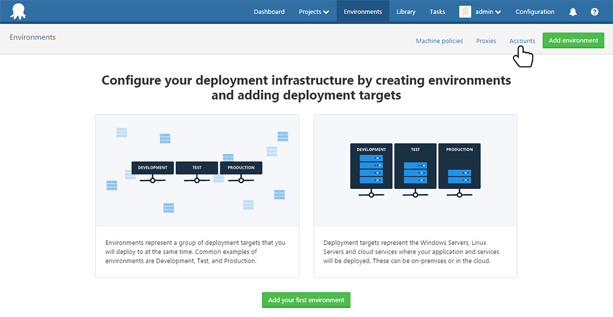
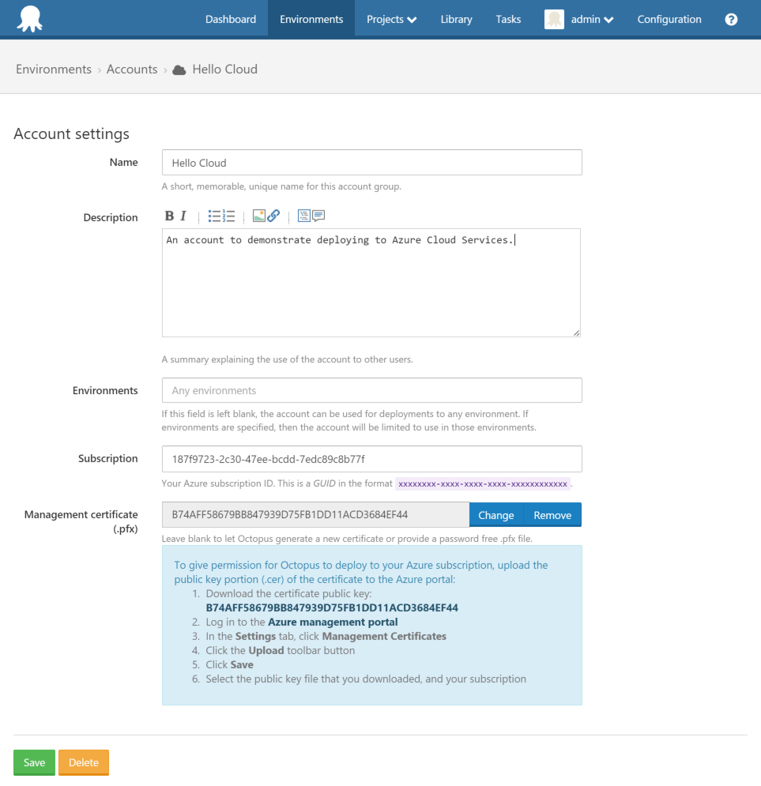
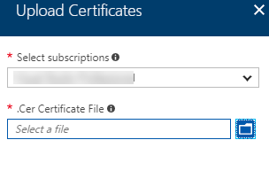
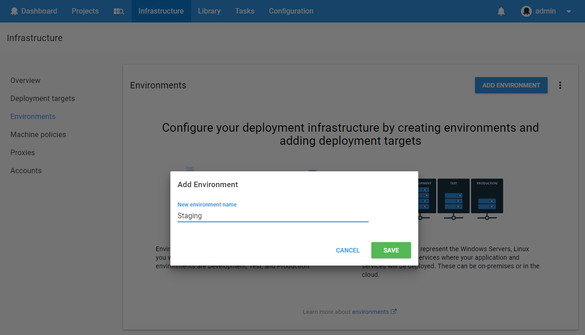

This guide will help you deploy your first Azure Cloud Service application using Octopus Deploy.  This guide assumes some familiarity with Octopus. If you are just starting out please see the general [getting started guide](/docs/getting-started.md).

In order to complete this guide you will need to have an Azure account and create an Azure Cloud Service and Azure Storage Account. Please refer to the [Azure documentation](https://azure.microsoft.com/en-us/documentation/) for completing these steps.  In this guide the Cloud Service is called hello-octopus and the storage account is called octostore.

## Create a package {#GettingstartedwithAzureCloudServices-Createapackage}

You will need a NuGet package containing the Azure Cloud Service application you want to deploy.  The NuGet package contains the .cspkg and .cscfg files that are published from Visual Studio. Here is one we prepared earlier that you can use for this guide: [HelloCloud.1.0.0.nupkg](https://download.octopusdeploy.com/demo/HelloCloud.1.0.0.nupkg)

Upload your NuGet package to the Octopus [built-in package repository](/docs/packaging-applications/package-repositories/index.md):

## Create an account {#GettingstartedwithAzureCloudServices-Createanaccount}

In Octopus Deploy, go to the Environments tab and select Accounts:

Add an Azure Subscription account and fill in your account details:

If you are allowing Octopus to generate a management certificate for you, first save the account and then upload the generated certificate to your Azure management certificates in the Azure Portal.

## Create an environment {#GettingstartedwithAzureCloudServices-Createanenvironment}

In order to deploy a Cloud Service we require an Octopus environment to deploy to. Cloud Services have slots which map nicely to environments. Create a new environment called "Staging":

## Create a project {#GettingstartedwithAzureCloudServices-Createaproject}

Now have the NuGet package we want to deploy, the account we are going to use for the deployment and an environment to deploy to.  Now all we need is a project to do all the work.  Create a new project:

In the project's process add a new Deploy an Azure Cloud Service step. Select the NuGet package that you are going to deploy and the Azure account to use for the deployment. The settings for this step should look something like this:

Save the step and create a release for your project. Deploy the release to the Staging environment:

Grab a coffee and by the time you get back your application should be deployed to the staging slot of your Azure Cloud Service.
