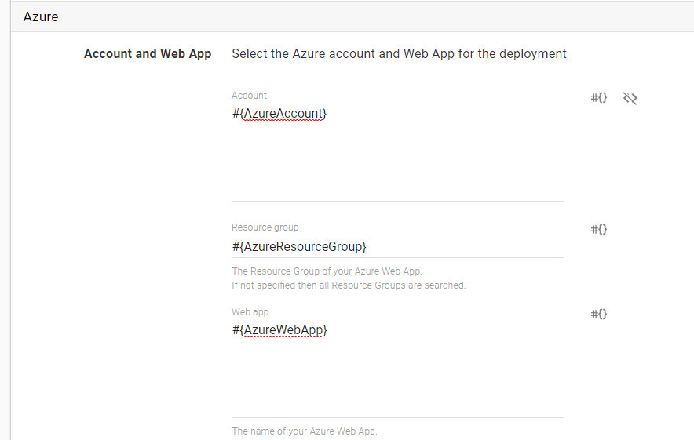
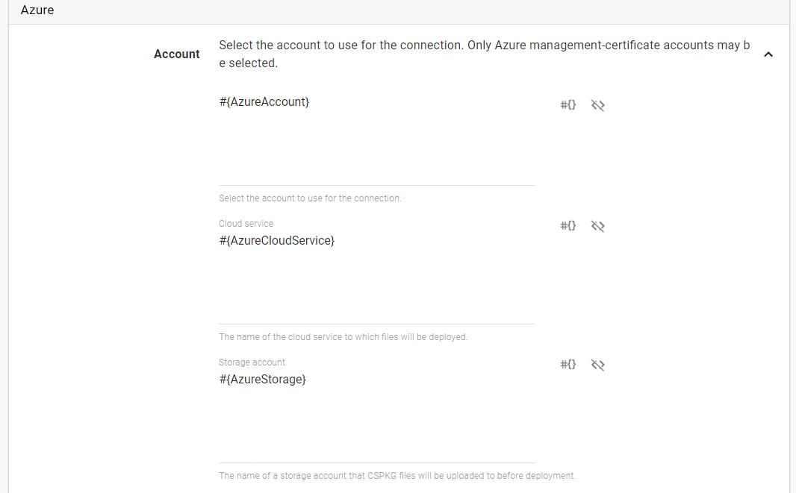

1. Add an [Azure Account](/docs/key-concepts/environments/accounts/azure-account.md) to Octopus.
   * If you want to use the Account ID in your variable, open the account you just added from {{Infrastructure,Accounts,[Account name]}} and copy the account ID from the URL.

   
   ​    
   The Account ID is the value after the last `/` in the Url.

2. Create a variable in your project and set the Account ID or Account Name as its value. Make sure to scope this variable to the Environment/Role/Target where you'll be using it.

   

3. If you are deploying an **Azure Web App**, create another variable that holds the name of your App.  

   

   If you are deploying an **Azure Cloud Service,** create 2 more variables for the **Service** and **Storage Account** names

   

4. If you are deploying an **Azure Web App** - On your [Azure Web App step](/docs/deploying-applications/deploying-to-azure/deploying-a-package-to-an-azure-web-app/index.md) use the variables to set the **Account** and **WebApp**

   

   If you are deploying an **Azure Cloud Service** - On your [Azure Cloud Service step](/docs/deploying-applications/deploying-to-azure/deploying-a-package-to-an-azure-cloud-service/index.md) use the variables to set the **Account**, **Cloud Service** and **Storage Account**

   

5. Once you start the deployment, Octopus will resolve the variables that hold the Account and WebApp/Cloud Service info based on their scope. To use a different account, repeat steps 1-3 and scope the new account variable accordingly.
