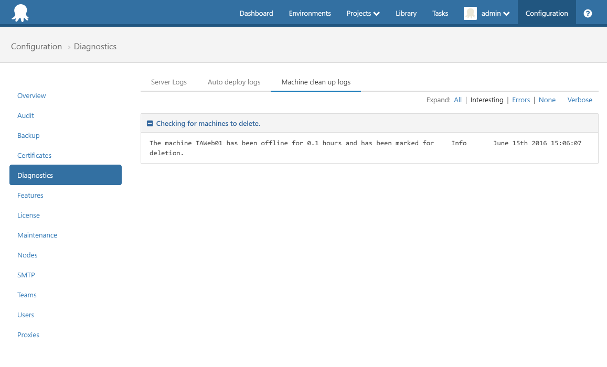

:::hint
The features discussed in this guide are available in Octopus 3.4 and newer.
:::

Octopus can automatically remove unwanted machines from environments based on their health status.  This is useful when an environment is scaled down and orphaned deployment targets remain in Octopus.  Automatic environment clean up can be configured through machine policies.

## Machine policies {#Cleaningupenvironments-Machinepolicies}

!partial <menu>

In this example we will create a machine policy to automatically delete machines when they become unavailable.

## Creating a machine policy for environment cleanup {#Cleaningupenvironments-Creatingamachinepolicyforenvironmentcleanup}

1. Navigate to the *Machine policies* screen from the *Environments* screen
2. Create a new machine policy by selecting **Add machine policy**:

3. Name the machine policy "Clean up machines"
4. Change the setting "Clean up unavailable machines" to "Automatically delete unavailable machines".  By selecting this option and leaving the "Hours unavailable" at 0, any machines that fail a health check and become unavailable will be deleted:

5. Save the machine policy

6. Assign the machine policy to a machine by selecting a machine from the *Environments* screen and using the *Policy* drop down to select the machine policy:

7. Turn the machine off and run a health check.  A scheduled task will detect that the machine is unavailable and remove it from Octopus.  The task runs every 5 minutes so there may be a delay from the health check running and the machine being deleted.

:::hint
Read more about [machine policies](/docs/key-concepts/environments/machine-policies.md)
:::

## Troubleshooting automatic environment clean up {#Cleaningupenvironments-Troubleshootingautomaticenvironmentcleanup}

Troubleshoot automatic machine deletion by accessing the log from the *Diagnostics* screen in the *Configuration* area, and any failures to clean up a given machine will be shown in the [Audit log](/docs/administration/auditing.md):

