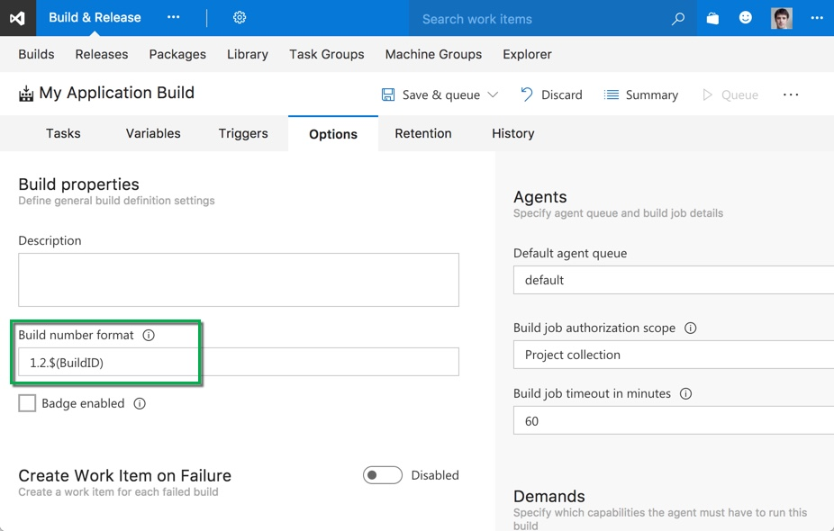
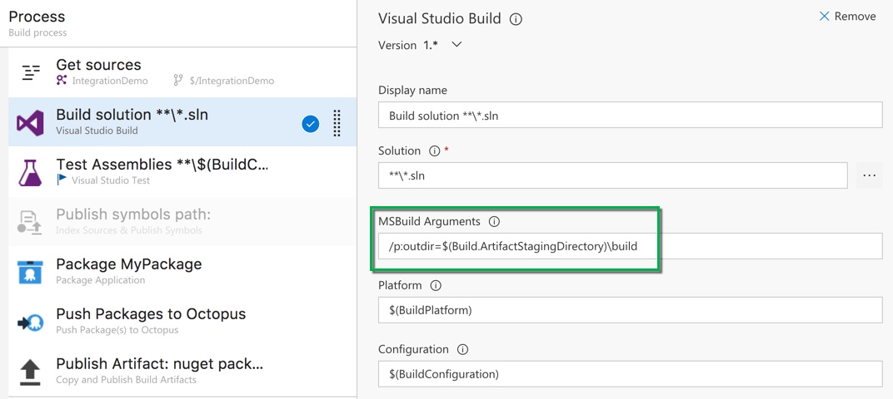
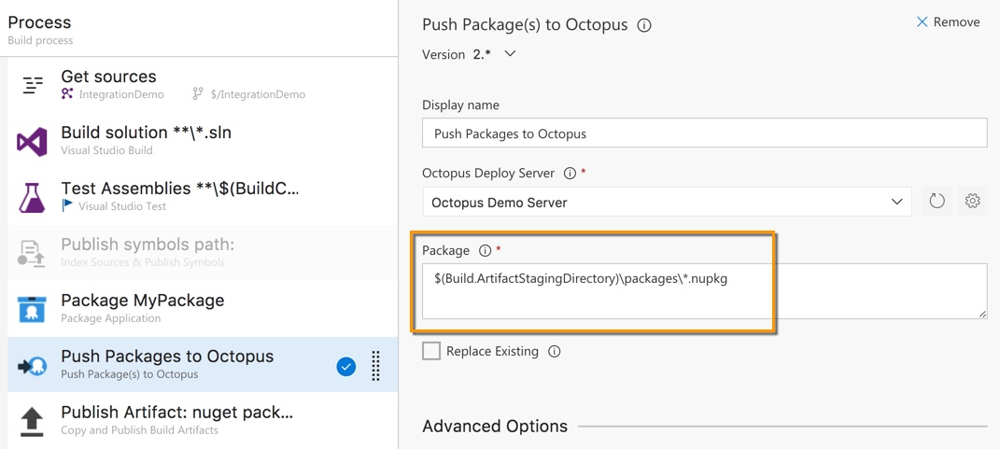

Correctly versioning the packages you deploy with Octopus Deploy is important so the right version gets deployed at the right time. With Team Foundation Server (TFS) and Visual Studio Team Services (VSTS), specifying a package version isn't always straightforward.

This guide shows you how best to version your builds and packages in TFS and VSTS, whether you're using [OctoPack](#versioning-when-using-octopack), or the [Octopus Extension in the Visual Studio Marketplace](#versioning-when-using-the-octopus-build-tasks).

!toc

## Build numbers in Team Build

In Team Build (the build system in TFS and VSTS), build numbers may be in a format that doesn't represent a valid Semver number.

For example, Microsoft's [Build Number format documentation](https://www.visualstudio.com/en-gb/docs/build/define/general#build-number-format) gives an example: `$(TeamProject)_$(BuildDefinitionName)_$(SourceBranchName)_$(Date:yyyyMMdd)$(Rev:.r)` will result in a version number like `Fabrikam_CIBuild_master_20090805.2`.

While this is a valid Team Build build number, it can cause issues when trying to pack the build output into a Nuget package or zip file for Octopus.

## Semver

Packages used by Octopus must conform to [Semver 1.0 or 2.0](https://octopus.com/docs/packaging-applications/versioning-in-octopus-deploy) depending on the version of Octopus you're using.

The link above explains versioning in detail, but in its simplest form it means two things:

1. Numbered versions in 3 or 4 segments that can be interpreted as `major.minor.patch`, with an optional "prerelease tag" afterwards in the form `-tag`
2. Versions can be sorted predictably. For example, `1.2.3` is newer than `1.2.0`.

As you can see, a package version of `Fabrikam_CIBuild_master_20090805.2` won't be valid will cause issues!

### Setting a Semver-compliant build number

The recommendations below generally rely on the build number itself being Semver-compliant. To do this, you can change the build number format.

Our recommended build number format is: `x.y.$(BuildID)` where `x` and `y` are integers. You can change them when you want to bump a version. This format will produce a three-part version number like `1.2.350`.

If you have a build for a separate branch, it's a good idea to add the version tag. For example: `x.y.$(BuildID)-feature-1` will produce a version number like `1.2.350-feature1`. Even better, you can use the `$(Build.SourceBranchName)` variable to set it to the branch name.

:::warning
The only downside of this numbering format is the `$(BuildID)` variable _always_ increases, and does so at the Project Collection level. That means it doesn't reset when you increment your major and minor versions, and if you have multiple builds in your Collection, numbers will be skipped.
:::

## Packaging in Team Build

There are two standard ways to package your build output in Team Build. The first is to use [OctoPack](https://octopus.com/docs/packaging-applications/nuget-packages/using-octopack), and the second is to use the build tasks in the [Octopus marketplace extension]().

You can mix and match these two methods. For example, you might prefer to use OctoPack and the `/p:RunOctoPack` MS Build argument, but then use the Push and Create Release tasks from the extension.

## Versioning when using OctoPack

Unless told otherwise, OctoPack will attempt to set the package version itself. You can see exactly how it tries to find a version [on this documentation page](https://octopus.com/docs/packaging-applications/nuget-packages/using-octopack#UsingOctoPack-Versionnumbers).

More often than not, the version number will come from the `[assembly: AssemblyVersion]` attribute found in the `AssemblyInfo.cs` file (usually in the `Properties` folder of your project).

The assembly version number doesn't always behave the way we want. It may not change, and if it does, it may not change sequentially.

Setting the `AssemblyVersion` number to `x.y.*` will [fix the two most common problems here](http://stackoverflow.com/questions/356543/can-i-automatically-increment-the-file-build-version-when-using-visual-studio). A version like `1.0.*` will result in an always-increasing version number.

1. If the version number is fixed (e.g. `1.0.0.0`), Octopus will complain that the package number already exists.
2. If the version number only changes "revision" number (e.g. `1.0.0.*`), numbers can repeat.

One problem remains - particularly for web projects. If you only change content files, triggering a new build _won't update the version number_ because Team Build realizes no compilable code has changed. OctoPack won't get a new version number!

### OctoPack recommendation

To solve all these issues, we recommend using the `/p:OctoPackPackageVersion` argument when using OctoPack. This lets you specify the version directly, and you can use build variables to specify the version number.

1. Set the build definition build number format (described [above](#setting-a-semver-compliant-build-number)) to a valid Semver version.
2. Add the appropriate `/p:OctoPackPackageVersion` MSBuild argument:
    - In the new build engine (VSTS and from TFS 2015 onwards): `/p:OctoPackPackageVersion=$(Build.BuildNumber)`
    - In the older XAML-based builds: `/p:OctoPackPackageVersion=$(TF_BUILD_BUILDNUMBER)`. You may also need to do some [extra work](http://stackoverflow.com/questions/40120013/how-to-get-msbuild-build-number-in-name-of-nuget-package-using-octopack) for certain build definitions.

:::hint
You can use the [additional MSBuild arguments for OctoPack](https://octopus.com/docs/packaging-applications/nuget-packages/using-octopack#UsingOctoPack-Publishing) to give yourself more control over the packaging process.
:::

## Versioning when using the Octopus Build Tasks

If you're using the new [Octopus Deploy extension from the Visual Studio Marketplace](https://marketplace.visualstudio.com/items?itemName=octopusdeploy.octopus-deploy-build-release-tasks), you'll have access to a new **Package Application** build task.

This task does not provide you with a default version number - this is something you have to set yourself. Clearly it wouldn't be feasible to change this value every time you do a build, so we recommend you make use of the build variables that Team Build provides.

Build and Release variables can be found in [the Microsoft Documentation](https://www.visualstudio.com/en-us/docs/build/define/variables), but the more useful ones include:

- `$(Build.BuildNumber)` - This is the full build number (see [above](#setting-a-semver-compliant-build-number) for setting an appropriate format)
- `$(Build.BuildID)` - This is a unique, incrementing ID at the Project collection level. Every new build will give you a new number.
- `$(Build.SourceBranchName)` - this is the last path segment in the name of the branch. For example, a branch of `refs/heads/master` will return `master`.

### Build task recommendation

There are two options we recommend for specifying a version number to the Package Application task.

1. Use a combination of static values and variables directly. For example, `1.0.$(Build.BuildID)` will always give you a new version number.
2. Use the full build number, and format that number appropriately as [described above](#setting-a-semver-compliant-build-number).

We recommend the second option for a few reasons.

First, it's very easy to match the build to the package because they'll have the same number, and secondly, if you have multiple pack steps, you only need to change a single version number.

### Specifying the files to pack and push

One of the frequent causes of issues when using the Octopus build tasks is properly specifying the folders to pack and the nuget package to push. Especially if you're using the hosted build server, it can be hard to figure out where everything ends up when the build is running.

Rather than guessing, it can be helpful to specify these folders specifically. Again, there are some useful build variables you can make use of.

- `$(Build.SourcesDirectory)` - the location of your source before it gets built.
- `$(Build.ArtifactStagingDirectory)` - A staging location for artifacts - useful for output files you want to use later (e.g. Nuget files)

1. Use the `/p:outdir=` MSBuild argument in your compile step to specify where the compiled code should end up.
2. In the **Package Application** step, put the location from step 1 into the **Source Path** field.
3. In the **Package Application** step, put a new location into the **Output Path** field.
4. In the **Push Package(s) to Octopus** step, specify the full path and filename from step 3 above.

By way of example, here's a nicely-configured set of build, pack, and push steps.

