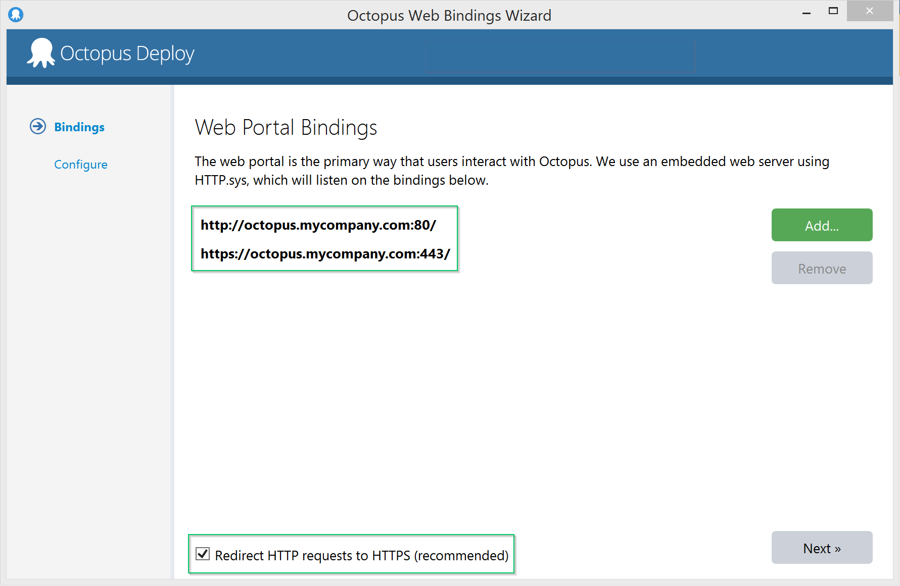

The Octopus web portal is the main interface that your team will use to interact with the Octopus Deploy server. During installation, you'll choose a port number for the server to listen on, and it uses HTTP by default. However, Octopus can also be configured to run on HTTPS.

## Changing your web portal bindings {#ExposetheOctopuswebportaloverHTTPS-Changingyourwebportalbindings}

The following steps will show how to configure Octopus to listen on HTTPS.

1. Open the **Octopus Manager** application on the Octopus Deploy server. You'll find this in the start menu.

    

1. From Octopus Manager, you can launch a wizard to modify the bindings that are associated with the Octopus web portal:

    

1. In the Web Bindings wizard, click **Add...** to add a new binding, and choose the HTTPS scheme. Other options such as the port can also be configured here.

    

    Since HTTPS requires an SSL certificate, you can either choose to generate a new, self-signed (untrusted) certificate, or to select an existing certificate. Self-signed certificates are useful for testing or to achieve encryption without trust, but for production use we recommend using a trusted SSL certificate.

1. Follow the rest of the Wizard steps to add the binding and reconfigure the Octopus server.

## Importing your SSL certificate {#ExposetheOctopuswebportaloverHTTPS-ImportingyourSSLcertificate}

When you choose to select an existing certificate when configuring your HTTPS binding, the available certificates will be shown. If the certificate you intend to use doesn't exist in the Windows certificate store, you'll need to import it. The following steps will show you how to import your certificate:

1. Launch an empty Microsoft Management Console shell by running **mmc.exe** from the start menu, command line or Win+R run dialog

1. From the File menu, click Add/Remove Snap-in...

    

1. Add the Certificates snap-in, and when prompted, choose the Computer account scope:

    

1. On the "Select Computer" page of the Wizard, select the **Local computer**, then click **Finish**. Click **OK** to close the Add/Remove Snap-ins dialog.

1. You can either import the certificate to the **Personal** store, or the **Web Hosting** store (this store may or may not exist on your server). Expand to the Certificates directory, then open the import wizard:

    

1. Follow the steps in the wizard to import your certificate. Your certificate will normally be in a .**PFX** file, and it should include both the public X.509 certificate, and the private key for the certificate.

1. Once the certificate is imported, double click the certificate to bring up the properties. You should see an icon indicating that the private key has also been imported:

    

1. If all these requirements have been met (**private key** imported, either the **Web Hosting** or **Personal** stores, in the **Local Computer** scope), the certificate should appear when you select to use an existing certificate when adding your HTTPS binding:

    

## Forcing HTTPS {#ForcingHTTPS}

A common scenario when hosting the Octopus Server is to redirect all requests initiated over HTTP to HTTPS. With this configuration you can navigate to the Octopus Server using either the `http://` or `https://` scheme, but have Octopus automatically redirect all `http://` requests to use the equivalent `https://` route.

1. Configure binding(s) for `http://` - this allows browsers to initiate their request over HTTP so Octopus can then redirect to HTTPS
1. Configure SSL binding(s) for `https://` using the correct SSL certificate
1. Test you can use Octopus with either `http://` or `https://` schemes without being redirected (the scheme stays the same) - this proves both endpoint bindings are working as expected
1. Configure Octopus to `Redirect HTTP requests to HTTPS` - you can do this using the Octopus Server Manager application where you configure the bindings as soon as you have configured an HTTPS binding

    

## HTTP Strict Transport Securtity (HSTS) {#HSTS}

HTTP Strict Transport Security is an HTTP header that can be used to tell the web browser that it should only ever communicate with the website using HTTPS, even if the user tries to use HTTP. This allows you to lessen the risk of a Man-in-the-Middle (MITM) attack or a HTTP downgrade attack. However, it is not a panacea - it still requres a successful connection on first use (ie, it does not resolve the Trust-On-First-Use (TOFU) issue).

Octopus 3.13 and above can send this header, but due to the potential pitfalls, it is opt-in. To switch it on, run the following commands on your Octopus server:

```text
PS \> Octopus.Server.exe configure --hstsEnabled=true --hstsMaxAge=31556926
PS \> Octopus.Server.exe service --stop --start
```

This will send the header on every HTTPS response, telling browsers to enforce HTTPS for 1 year (31556926 seconds) from the most recent request.

:::hint
We highly recommend using a short value for `hstsMaxAge`, like 1 hour (3600 seconds) until you are comfortable that it works in your environment. This way you can disable HSTS and browsers will return to normal after 1 hour.
:::

:::warning
Please note that enabling HSTS comes with its own challenges. For example:

* Untrusted / self-signed certificates will not work with HSTS - the certificate chain needs to be fully trusted by the browser.
* Your Octopus Server must be hosted on standard ports - HTTP on port 80 and HTTPS on port 443.
* Reverting from HTTPS to HTTP will not be simple - each browser will need to be manually reconfigured to remove the HSTS entry.
:::
