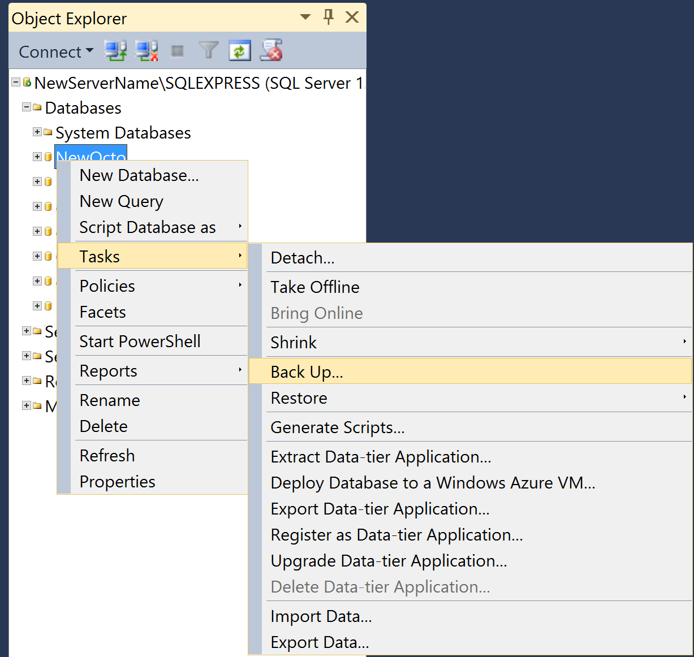

When you contact Octopus Deploy support, sometimes we aren't able to reproduce the issue you're experiencing. This can be due to specific circumstances in your instance, or corrupted data which we can't reproduce. We may ask you to send us a database backup and your encrypted master key. This guide provides a walkthrough to get the best information for us to help troubleshoot these issues.

## Step-by-step guide

1. Create the database backup

The easiest way to import a database is to restore from a .bak file, and this is the format we will ask for. This can be produced in your [SQL Server Mangement Studio](https://docs.microsoft.com/en-us/sql/relational-databases/backup-restore/create-a-full-database-backup-sql-server). Right-click your database, and select *Tasks > Back Up...*, and select the directory in which the .bak file will save to.



2. Encrypt your master key

:::hint
You can get your master key from your [Octopus Manager](/docs/reference/security-and-encryption.md#Securityandencryption-YourMasterKey) or use the `show-master-key` command in [Octo.exe](/docs/api-and-integration/octopus.server.exe-command-line/show-master-key.md).
:::

We have a PowerShell snippet which will encrypt your master key. The security certificate to decrypt this is kept private, so we won't display it. You can use this snippet to encrypt your master key, and when you send it to us, we can decrypt it and use it to restore your backup.

```
$octopusPublicKey = "MIIDnzCCAwigAwIBAgIJAK5yFHmnxrYxMA0GCSqGSIb3DQEBBQUAMIGSMQswCQYDVQQGEwJBVTEMMAoGA1UECBMDUUxEMREwDwYDVQQHEwhCcmlzYmFuZTEhMB8GA1UEChMYT2N0b3B1cyBEZXBsb3kgUHR5LiBMdGQuMRcwFQYDVQQDEw5PY3RvcHVzIERlcGxveTEmMCQGCSqGSIb3DQEJARYXaGVsbG9Ab
2N0b3B1c2RlcGxveS5jb20wHhcNMTQwNzI1MTE0NzI2WhcNMzIxMDA4MTE0NzI2WjCBkjELMAkGA1UEBhMCQVUxDDAKBgNVBAgTA1FMRDERMA8GA1UEBxMIQnJpc2JhbmUxITAfBgNVBAoTGE9jdG9wdXMgRGVwbG95IFB0eS4gTHRkLjEXMBUGA1UEAxMOT2N0b3B1cyBEZXBsb3kxJjAkBgkqhkiG9w0BCQ
EWF2hlbGxvQG9jdG9wdXNkZXBsb3kuY29tMIGfMA0GCSqGSIb3DQEBAQUAA4GNADCBiQKBgQDD532q7wcbDAE65sZn5kdWQEv+yFHTUn9wPXEfPztv1cc/xjLts6zuKcfcRVITyB+n02Rg/VAGpNdZeAIWTtptKLkcdttwf+xoySPF13jc7DSnYabGamRR/hqzn9QcLq87WHIQF8olecpokoTsdBfE6e3idR8
hLKKIlJgb5g5dcwIDAQABo4H6MIH3MB0GA1UdDgQWBBRYd4/ytF84FZVaSVHfhPb0Z/EYZzCBxwYDVR0jBIG/MIG8gBRYd4/ytF84FZVaSVHfhPb0Z/EYZ6GBmKSBlTCBkjELMAkGA1UEBhMCQVUxDDAKBgNVBAgTA1FMRDERMA8GA1UEBxMIQnJpc2JhbmUxITAfBgNVBAoTGE9jdG9wdXMgRGVwbG95IFB0
eS4gTHRkLjEXMBUGA1UEAxMOT2N0b3B1cyBEZXBsb3kxJjAkBgkqhkiG9w0BCQEWF2hlbGxvQG9jdG9wdXNkZXBsb3kuY29tggkArnIUeafGtjEwDAYDVR0TBAUwAwEB/zANBgkqhkiG9w0BAQUFAAOBgQAcEMAykQaazLd2ZewE7d+0PeIWv/YlZMIDeg5LF1/UtKMMCaaspN7rNA1lUPfjK/ofWh43s4R0J
tjlbuEtZr+HKmOGzr+wbMCRIggbu2j3GEcC5i7zeoa85olokubwO1QDVZVaELWyXnDZl1UoJ9VyGsV5pEAE571XS9oTUyUssQ=="
 
function Encrypt-ForOctopusEyesOnly($secretMessage) {
    $certBytes = [System.Convert]::FromBase64String($octopusPublicKey)
    $x = New-Object System.Security.Cryptography.X509Certificates.X509Certificate2 -ArgumentList @(,$certBytes)
    $publicKey = $x.PublicKey.Key;
    $plainBytes = [System.Text.Encoding]::UTF8.GetBytes($secretMessage)
    $encryptedBytes = $publicKey.Encrypt($plainBytes, $false);
    $encryptedText = [System.Convert]::ToBase64String($encryptedBytes)
    return $encryptedText
}
 
$message = Encrypt-ForOctopusEyesOnly "YourMasterKey"
write-host $message
```

3. Upload your database backup and encrypted master key

In your email or forum thread with Octopus support, we will provide to you a secure and private link in which you can upload your database backup and encrypted master key to. Only we have access to view and download these.

