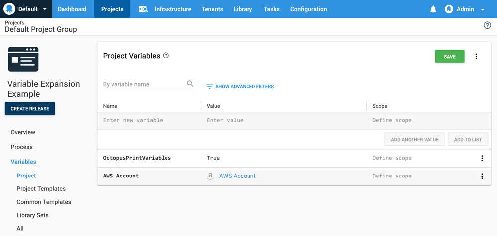

AWS support was introduced in **Octopus 2018.2**.

To deploy infrastructure to AWS, you can define an AWS account in Octopus.

Octopus manages the AWS credentials used by the AWS steps.

The AWS account is either a pair of access and secret keys, or the credentials are retrieved from the IAM role assigned to the instance that is executing the deployment.

## Create an AWS Account

AWS steps can use an Octopus managed AWS account for authentication. This account must first be created under {{Infrastructure>Accounts}} by clicking the **ADD ACCOUNT** button in the **Amazon Web Services Account** section.

:::hint
AWS steps can also defer to the IAM role assigned to the instance that hosts the Octopus Server for authentication. In this scenario there is no need to create the AWS account.
:::


And AWS account requires a **Name**, the **Access Key** and the **Secret Key**.

See the [AWS documentation](https://docs.aws.amazon.com/general/latest/gr/managing-aws-access-keys.html) for details on how to create the access and secret keys.


Clicking the **SAVE AND TEST** button will verify that the credentials are valid.


## AWS Account Variables

You can access your AWS account from within projects through a variable of type **AWS Account Variable**. Learn more about [AWS Account Variables](/docs/deployment-process/variables/aws-account-variables.md)

## Using AWS Service Roles for an EC2 Instances

AWS allows you to assign a role to an EC2 instance, referred to as an [AWS service role for an EC2 instance](https://g.octopushq.com/AwsDocsRolesTermsAndConcepts), and that role can be accessed to generate the credentials that are used to deploy AWS resources and run scripts.

Because the AWS steps run on the Octopus Server, this means that Octopus itself needs to be running on an EC2 instance with an IAM role applied in order to take advantage of this feature.

:::hint
It is expected that in future these steps will be run on [worker instances](https://github.com/OctopusDeploy/Specs/blob/master/Workers/index.md), which can execute on their own EC2 instances with their own roles applies. This will make IAM roles much more useful and flexible.
:::

When using the IAM role assigned to the Octopus EC2 instance, there is no need to create an AWS account in Octopus.

## Manually Using AWS Account Details in a Step

A number of steps in Octopus use the AWS account directly. For example, in the CloudFormation steps, you define the AWS account variable that will be used to execute the template deployment, and the step will take care of passing along the access and secret keys defined in the account.

It is also possible to use the keys defined in the AWS account manually, such as in script steps.

First, add the AWS Account as a variable. In the screenshot below, the account has been assigned to the **AWS Account** variable.

The **OctopusPrintVariables** has been set to true to print the variables to the output logs. This is a handy way to view the available variables that can be consumed by a custom script. You can find more information on debugging variables at [Debug problems with Octopus variables](/docs/support/debug-problems-with-octopus-variables.md).



When running a step, the available variables will be printed to the log. In this example, the following variables are shown:

```
[AWS Account] = 'amazonwebservicesaccount-aws-account'
[AWS Account.AccessKey] = 'ABCDEFGHIJKLONOPQRST'
[AWS Account.SecretKey] = '********'
```

**AWS Account.AccessKey** is the access key associated with the AWS account, and **AWS Account.SecretKey** is the secret key. The secret key is hidden as asterisks in the log because it is a sensitive value, but the complete key is available to your script.

You can then use these variables in your scripts or other step types. For example, the following PowerShell script would print the access key to the console.

```
Write-Host "$($OctopusParameters["AWS Account.AccessKey"])"
```

## Known AWS Connection Issue

If you are experiencing SSL/TLS connection errors when connecting to AWS from your Octopus Server, you may be missing the **Amazon Root CA** on your Windows Server. The certificates can be downloaded from the [Amazon Trust Repository](https://www.amazontrust.com/repository/).

## AWS deployments

Learn more about [AWS Deployments](/docs/deployment-examples/aws-deployments/index.md)
