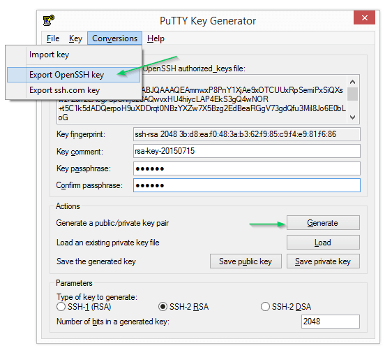

A SSH Key Pair account is one of the more secure authentication methods available for connections to [SSH Targets](/docs/infrastructure/deployment-targets/ssh-targets/index.md).

## Creating an SSH Key Pair  {#SSHKeyPair-CreatingaSSHKeyPaircreate-key-pair}

Before you can configure the SSH Key Pair account in Octopus, you need to generate public and private keys. This can be done on either the [Linux target](#SSHKeyPair-Linux) or the [Octopus Server](#SSHKeyPair-Windows).

### Generating a Key Pair on Linux {#SSHKeyPair-Linux}

1. Run the following command on your Linux server: `ssh-keygen`
1. Accept the default location: `~/.ssh/id_rsa`
1. Enter a passphrase (or press enter for no passphrase).
1. If you entered a passphrase, re-enter the passphrase.

You now have two files:

- id_rsa (the private key)
- id_rsa.pub (the public key)

The public key will be stored on this server and the private key will be copied to the Octopus Server.

5. Copy the public key to the `authorized_keys` file that is used during authentication:

```bash
cat ~/.ssh/id_rsa.pub >> ~/.ssh/authorized_keys
```

6. Modify the permissions of the `authorized_keys`:

```bash
chmod 600 ~/.ssh/authorized_keys
```

If you need more information about generating an SSH key pair, see the [useful links section](#SSHKeyPair-UsefulLinks).

### Generating a Key Pair on Windows {#SSHKeyPair-Windows}

The easiest way to generate valid keys on windows is to use a tool like[ PuTTYgen](http://www.chiark.greenend.org.uk/~sgtatham/putty/download.html). Start by clicking "Generate" and wait for the tool to finish creating the random key pair.



Provide your passphrase if desired and export the private key to the accepted format by going to {{Conversions,Export OpenSSH Key}}.  Clicking "Save private key" will actually produce a file that, while it can be used by this tool again, is not compatible with the standard SSH process. To get the public key over to the server you can either click "Save public key", copy the file across to the server and add the key to `~/.ssh/authorized_keys` as outlined above, or just cut+paste the content from the textbox directly into the remote file.

If you need more information about generating an SSH key pair, see the [useful links section](#SSHKeyPair-UsefulLinks).

## Creating the Account {#SSHKeyPair-Creatingtheaccount}

Provide the username that you wish Octopus Deploy to connect as, along with the generated private key that is linked to the public key stored on the server being targeted. The server will confirm that this private key matches its public key at the start of each SSH connection. The "Passphrase" is an optional field that will need to be provided if the private key has been encrypted. If you are storing this key on disk it is recommended, but not mandatory, that your key be encrypted.


## Useful Links {#SSHKeyPair-UsefulLinks}

Due to the number and configurable nature of the various Linux distributions available, there are other dedicated sites that can provide more precise information & tutorials for your specific use case.

- [PuTTY download page](http://www.chiark.greenend.org.uk/~sgtatham/putty/download.html) has several useful Windows tools.
- [ssh-keygen man page](https://linux.die.net/man/1/ssh-keygen).
- [sshd\_config man page (ubuntu)](http://manpages.ubuntu.com/manpages/zesty/en/man5/sshd_config.5.html).
- Great intro SSH keygen articles from [DigitalOcean](https://www.digitalocean.com/community/tutorials/how-to-set-up-ssh-keys--2), [GitHub](https://help.github.com/articles/connecting-to-github-with-ssh/) or [Atlassian](https://confluence.atlassian.com/display/STASH/Creating+SSH+keys).
