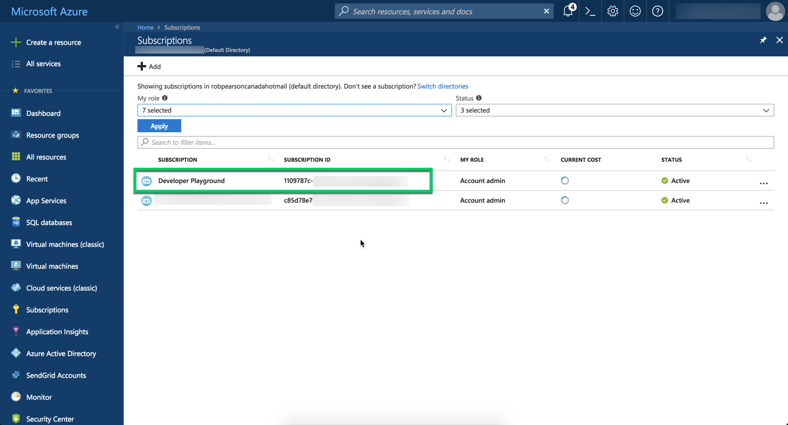
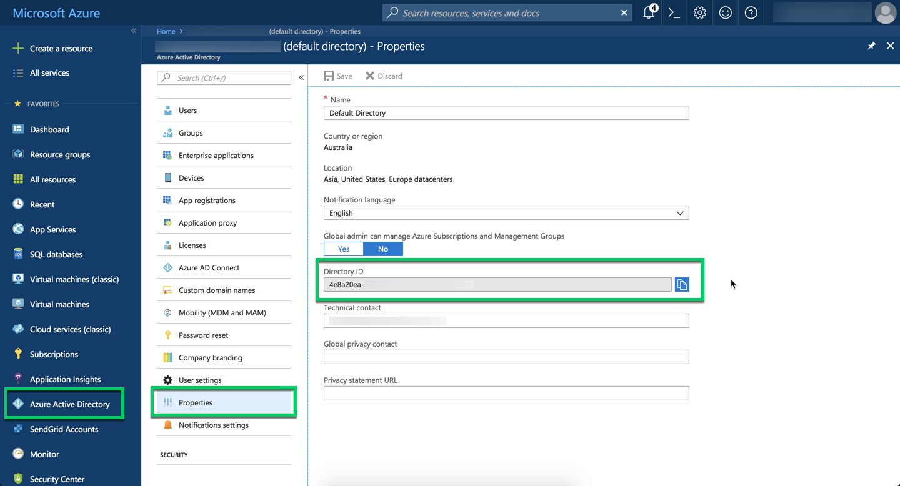
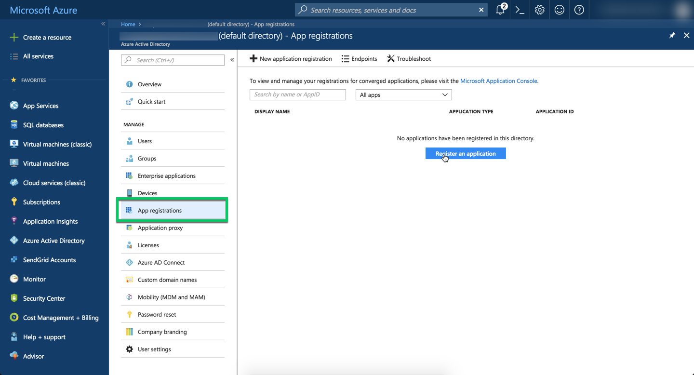
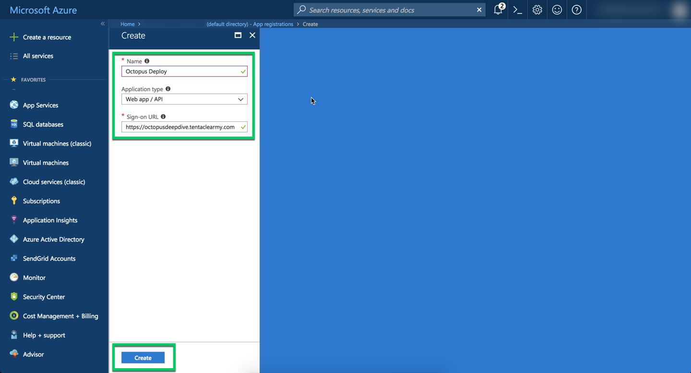
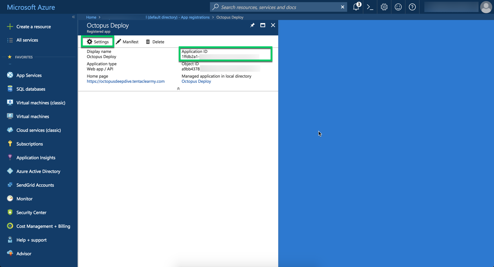
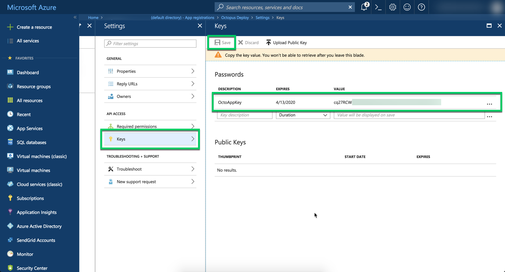
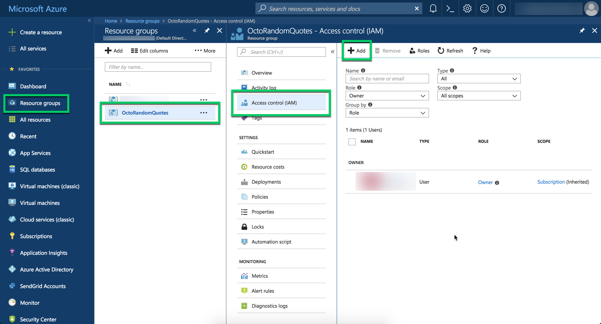
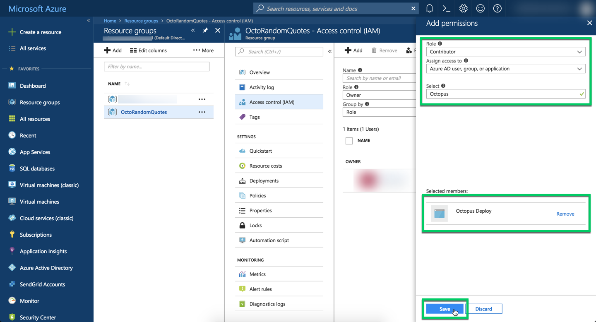

:::hint
**Azure Service Principal Accounts Work with the Azure Resource Management (ARM) API only**
**Azure Service Principal Accounts Are Only Available from Octopus 3.3 Onwards**

Prior to **Octopus 3.3**, [Azure Management Certificate Accounts](/docs/infrastructure/azure/index.md) (previously known simply as "Azure Subscription Accounts") were the only type of Azure Account available.

[Azure Management Certificate Accounts](/docs/infrastructure/azure/creating-an-azure-account/creating-an-azure-management-certificate-account.md) are only able to interact with the legacy Azure interface known as the "Azure Service Management API", which is used when Octopus deploys [Cloud Services](/docs/deployment-examples/azure-deployments/deploying-a-package-to-an-azure-cloud-service/index.md) and [Azure Web Apps](/docs/deployment-examples/azure-deployments/deploying-a-package-to-an-azure-web-app/index.md).

To interact with Azure Resource Manager (ARM), like when Octopus deploys a [Resource Group Template](/docs/deployment-examples/azure-deployments/resource-groups/index.md), you must use an [Azure Service Principal Account](/docs/infrastructure/azure/creating-an-azure-account/creating-an-azure-service-principal-account.md).
:::

There are two steps to enable your Octopus Server to manage your Azure subscription via a Service Principal:

1. Create an Azure Active Directory registered application (or application registration) and service principal (via the Azure Portal or PowerShell).
2. Allow Octopus to authenticate with Azure using a Service Principal.

## Step 1: Create an Azure Active Directory Application and Service Principal

The first step is to create an Azure Active Directory (AAD) application and service principal. You will configure your Octopus Server to authenticate using the service principal you create in AAD, which means you can configure finely grained authorization for your Octopus Server. Creating an Azure Active Directory application and service principal can be done either via PowerShell or the Azure Portal.

### Option 1: Use the Azure Portal

The first option to create an Azure Active Directory registered application is to use the Azure Portal. Azure Accounts in Octopus require four values which are used to authenticate with Azure and interact with it securely.

* Azure Subscription ID
* Azure AD Tenant ID
* Azure AD Registered Application ID
* Azure AD Registered Application Password/Key

The first three values are GUIDs, and the final one is a password.

<iframe width="560" height="315" src="https://www.youtube.com/embed/KnN-ahD6nN4" frameborder="0" allow="autoplay; encrypted-media" allowfullscreen></iframe>

### Azure Subscription ID

Finding your Azure Subscription ID is very easy. Navigate to the Azure Portal `Subscriptions` service and pick the appropriate Subscription ID.



### Azure AD Tenant ID

Finding your Azure AD Tenant ID is also very easy. Navigate to the `Azure Active Directory` service and select the Properties blade. The Directory is your AAD Tenant ID. NOTE: This value is a GUID.



### Azure AD Registered Application ID and AAD Registered Application Password/Key

If you have created an AAD registered application, then it's relatively straight forward to note the Application ID and Password/Key. Navigate to to the `Azure Active Directory` service and select the 'App registrations' blade. Make sure to click the 'View all applications' button if you don't see anything there. If you have already created a 'registered app' for integration, select the app and note its Application ID.



If you haven't created an registered app, Click the 'New application registration' button and fill in the appropriate details and then click the 'Save' button. Then copy or note the Application ID.





Application Passwords are one-time generated tokens so if you don't know your existing password, you'll need to generate a new one. If you haven't set one, the process is the same.

Click the 'Settings' button and then select the the 'Keys' blade. Add a new Password with a good description and click the 'Save' button. The password will be displayed after saving. Be sure to copy it as it won't be available once you navigate away.



That's it, you now have your 'registered application' ID and password.

### Option 2: Use PowerShell

You can use the PowerShell script below to create the Service Principal.

:::hint
This script requires [Azure PowerShell](https://azure.microsoft.com/en-us/documentation/articles/powershell-install-configure/) 1.0 or greater.

During the script, you will be prompted to authenticate with Azure. The authenticated user must have administrator permissions in the Active Directory in which the Service Principal is being created.
:::

```powershell
# Obviously, replace the following with your own values
$subscriptionId = "cd21dc34-73dc-4c7d-bd86-041284e0bc45"
$tenantId = "2a681dca-3230-4e01-abcb-b1fd225c0982"
$password = "correct horse battery staple"

# Login to your Azure Subscription
Login-AzureRMAccount
Set-AzureRMContext -SubscriptionId $subscriptionId -TenantId $tenantId

# Create an Octopus Deploy Application in Active Directory
Write-Output "Creating AAD application..."
$securePassword = ConvertTo-SecureString $password -AsPlainText -Force
$azureAdApplication = New-AzureRmADApplication -DisplayName "Octopus Deploy" -HomePage "http://octopus.com" -IdentifierUris "http://octopus.com" -Password $securePassword
$azureAdApplication | Format-Table

# Create the Service Principal
Write-Output "Creating AAD service principal..."
$servicePrincipal = New-AzureRmADServicePrincipal -ApplicationId $azureAdApplication.ApplicationId
$servicePrincipal | Format-Table

# Sleep, to Ensure the Service Principal is Actually Created
Write-Output "Sleeping for 10s to give the service principal a chance to finish creating..."
Start-Sleep -s 10

# Assign the Service Principal the Contributor Role to the Subscription.
# Roles can be Granted at the Resource Group Level if Desired.
Write-Output "Assigning the Contributor role to the service principal..."
New-AzureRmRoleAssignment -RoleDefinitionName Contributor -ServicePrincipalName $azureAdApplication.ApplicationId

# The Application ID (aka Client ID) will be Required When Creating the Account in Octopus Deploy
Write-Output "Client ID: $($azureAdApplication.ApplicationId)"
```

The values required for the script above are:

**Subscription ID**: The ID of the Azure subscription the account will interact with.

**Password**: A secret value created by you. Ensure you record it, as you will need to enter it into Octopus Deploy.

**Tenant ID**: The ID of the Active Directory tenant.  You can find this in the *Properties* blade of the *Azure Active Directory*, listed as 'Directory ID'.

## Permissions

The final step is to ensure your registered app has permission to work with your Azure resources. Navigate to the `Resource Groups` service and select the resource group(s) that you want the registered app to access.



Next, select the 'Access Control (IAM)' blade and if your app isn't listed, click the 'Add' button. Select the appropriate role (`Contributor` is a common option) and search for your new application name. Select it from the search results and then click the 'Save' button.  



Microsoft's page on [how to create a Service Principal via the Azure Portal](https://azure.microsoft.com/en-us/documentation/articles/resource-group-create-service-principal-portal/) is excellent as well.

:::hint
Note on roles: Your Service Principal will need to be assigned the *Contributor* role in order to deploy.
:::

:::warning
The Service Principal will default to expiring in 1 year from the time of creation.

Using the PowerShell script in option 1, you can specify the expiry date by adding the *-EndDate* parameter to the *New-AzureRmADApplication* command

```powershell
-EndDate (new-object System.DateTime 2018, 12, 31)
```

Using option 1, the Azure portal will allow you to select the expiry time when creating the key.
:::

## Note on Least Privilege

In the PowerShell and Permissions example above the service principal is assigned the `Contributor` role on the subscription. This isn't always the best idea, you might want to apply a principle of least privilege to the access the service principal has. If that is the case then there are a couple of things worth noting.

Firstly, you might want to constrain the service principal to a single resource group, in which case you just need to assign it the `Contributor` role on the resource group.

Next you might want to get even more granular and constrain the service principal to a single resource, e.g. a Web App. **In this case you have to assign the `Contributor` role on the Web App and also explicitly assign the `Reader` role on the subscription itself**.

The reason behind this is to do with the way Octopus queries for the web app resources in Azure. In order to be able to handle scenarios where [ASEs](/docs/deployment-examples/azure-deployments/ase/index.md#resource_groups) are being used, Octopus first queries the resource groups and then queries for the web apps within each resource group. When the service principal is assigned `Contributor` on a resource group it seems to implicitly get `Reader` on the subscription, but this doesn't seem to be the case when `Contributor` is assigned directly to a web app and you have to assign `Reader` explicitly.

## Step 2: Allow Octopus to Authenticate with Azure Using a Service Principal

Navigate to {{Infrastructure,Accounts}} and click *Add account* in the *Azure Subscriptions* section.


On the Create New Account page, in the *Authentication Method* field select *Use a Service Principal*.


The values for the following fields come from Azure:

**Subscription ID**:  The ID of the Azure Subscription this account will interact with. In the Azure Portal, this can be found in the properties of the subscription.

**AD Client\Application ID**:  This is the ID of the application in Azure Active Directory. It is known as ApplicationID in the PowerShell API, and in the new Azure Portal it can be found under the *App registrations* blade in the *Azure Active Directory*. In the old Azure Portal it may be listed as 'Client ID'.

**AD Tenant ID**: The ID of the Active Directory tenant. You can find this in the *Properties* blade of the *Azure Active Directory*, listed as 'Directory ID'.

**AD Password\Key**: The password for the Azure Active Directory application: this is know as 'Password' in the API or 'Key' in the Azure Portal. New keys can be generated in the portal under the *Keys* blade of the Azure Active Directory application.

Use the *Save and test* button to confirm the account can interact with Azure.

:::hint
**What is actually tested?**
When you click the Save and Test button, Octopus will attempt to use the account credentials to access the Azure Resource Management (ARM) API and list the Resource Groups in that subscription. You may need to whitelist the appropriate IP Addresses for the Azure Data Center you are targeting. See [deploying to Azure via a Firewall](/docs/deployment-examples/azure-deployments/index.md) for more details.
:::

## Creating a New Service Principal Credential

If you need to create a new **Service Principal Credential**, this can also be done either via PowerShell or the Azure Portal.

### Step 1: Creating a New AAD Service Principal Credential

#### Option 1: Use PowerShell
The following PowerShell script will create an additional credential under the existing AAD application


```powershell
# Obviously, replace the following with your own values
$subscriptionId = "cd21dc34-73dc-4c7d-bd86-041284e0bc45"
$tenantId = "2a681dca-3230-4e01-abcb-b1fd225c0982"
$applicationId = "1d7f3207-0d20-4ff3-bdd2-c6928a5dd3f0"
$password = "correct horse battery staple 2"

# Login to your Azure Subscription
Login-AzureRMAccount
Set-AzureRMContext -SubscriptionId $subscriptionId -TenantId $tenantId

# Get the Azure AD Appliction
Write-Output "Getting the Azure AD Application"
$azureAdApp = Get-AzureRmADApplication -ApplicationId $applicationId
$azureAdApp | Format-Table

Write-Output "Getting the Azure AD Service Principal"
$azureAdServicePrincpal = Get-AzureRmADServicePrincipal -SearchString $azureAdApp.DisplayName
$azureAdServicePrincpal | Format-Table

Write-Output "Creating a new Service Principal Credential"
$securePassword = ConvertTo-SecureString $password -AsPlainText -Force
$servicePrincipalCred = New-AzureRmADSPCredential -ObjectId $azureAdServicePrincipal.Id -EndDate (New-Object System.DateTime 2019,1,31) -Password $securePassword
$servicePrincipalCred | Format-Table

```
#### Option 2: Use the Azure Portal

For the Azure Portal steps, create a new Key using the directions [here](https://azure.microsoft.com/en-us/documentation/articles/resource-group-create-service-principal-portal/).

### Step 2: Updating the Password/Key in the Octopus Azure Subscriptions

Navigate to {{Environments,Accounts}} and click on the account you wish to update in the *Azure Subscriptions* section.

Use the **Change** button to modify the password or key and enter the password or key from Step 1.


Use the *Save and test* button to confirm the account can interact with Azure.
