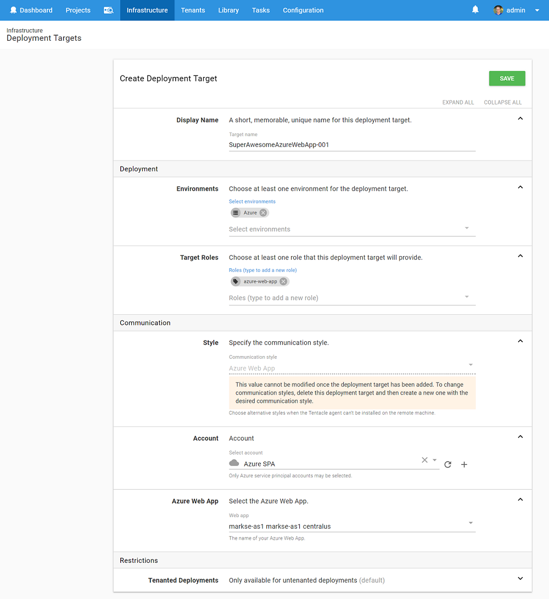

Azure Web App deployment targets allow you to reference existing Web Apps in your Azure subscription, that you can then reference by role during deployments.

## Requirements

:::hint
This new target type was introduced in `2018.4`. You can read more about all the new PaaS targets [in our blog](https://octopusdeploy.com/blog/paas-targets).
:::

You will firstly need an [Azure Service Principal account](/docs/infrastructure/azure/creating-an-azure-account/creating-an-azure-service-principal-account.md) that references your Azure subscription.

Once your Azure account is setup, you will then need an existing Azure Web App / App Service setup within your Azure subscription. To learn more about App Services, the Azure team provide [useful documentation on App Services](https://docs.microsoft.com/en-us/azure/app-service/) that can help you get started.

## Creating Web App targets

Once you have an App Service setup within your Azure subscription, you are then ready to map that to an Octopus deployment target.

To create an Azure Web App target within Octopus:

- Go to `Infrastructure` > `Deployment Targets` > `Add Deployment Target`
- Select `Azure Web App` from the list of available targets and click _Next_
- Fill out the necessary fields, being sure to provide a unique role that clearly identifies your Azure Web App target

- After clicking _Save_, your deployment target will be added and go through a health check to ensure Octopus can connect to it.
- If all goes well, you should see your newly created target in your `Deployment Targets` list, with a status of _Healthy_

### Creating Web App Targets by scripts

Azure Web App targets can also be created via a Powershell Cmdlet within a Deployment Process, this can be especially handy if you are also creating the Azure Web App via a script.

See [Creating Resources by script](/docs/infrastructure/managing-resources-using-scripts) for more information on creating Azure Web Apps via a script.

## Deploying to Web App targets

See our [documentation about this topic](/docs/deploying-applications/azure-deployments/deploying-a-package-to-an-azure-web-app/index.md)

## Troubleshooting

If your Azure Web App target is not completing a health check successfully, you may need to check that your Octopus Server can communicate with Azure. It may be worth checking that your Azure Account is able to complete a _Save and Test_ to ensure Octopus can communicate with Azure. If your Octopus Server is behind a proxy or firewall, you will need to consult with your Systems Administrator to ensure it is able to communicate with Azure.