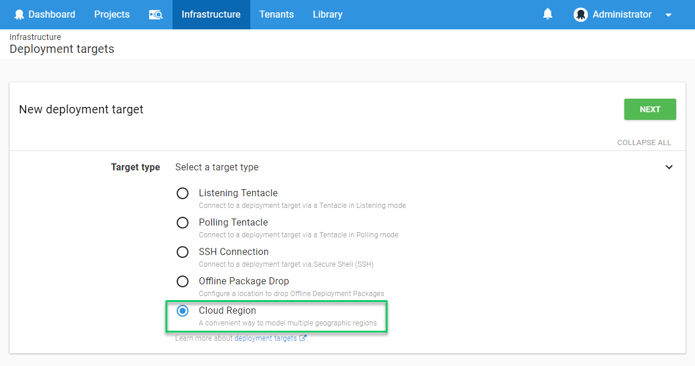

Cloud Region targets will enable steps which execute on the Octopus Server to execute multiple times, with variables scoped for each iteration. The specific scenario this is designed to support is deploying cloud applications to multiple geographic regions:

> The OctoFX trading platform has been so successful it is being expanded from Asia/Pacific into Europe and the USA. The same components need to be deployed to each geographic region but with different configuration for each region.
>
>
> In this case you could modify your deployment process to become multi-region by:
>
> 1. Creating the three different Cloud Regions
> 2. Scoping the existing region-specific variables to the Asia/Pacific Cloud Region
> 3. Creating new region-specific variables and scoping those to the appropriate Cloud Region
>
>
>
> Now when you deploy OctoFX you can create a [rolling deployment](/docs/deployment-patterns/rolling-deployments.md) targeting these regions one at a time, or in parallel.

:::success
We originally considered calling these "Generic Targets" because they can be used as a target for any steps that run on the Octopus Server. For example if you have a script step you want to run multiple times with different variable values, without installing Tentacles, you can take advantage of cloud regions. A concrete example is running the same SQL scripts against both production and disaster-recovery database servers. Maybe Cloud Regions can help with your deployment design even if you aren't deploying to the cloud.
:::

You can create Cloud Regions just like other deployment targets.

1. Go to {{Infrastructure,Deployment Targets}} and click **Add deployment target** in the environment where you want to create the cloud region.

2. Select **Cloud Region** from the list of available deployment target types.

3. Give the cloud region a name and select the roles for the cloud region.

4. Now you can see the cloud regions in the {{Infrastructure,Deployment Targets}} page, just like the other deployment targets.

5. To make use of your cloud regions you should scope region-specific variables to them appropriately.

6. Now when you deploy your application, the appropriate steps will run once per region.

