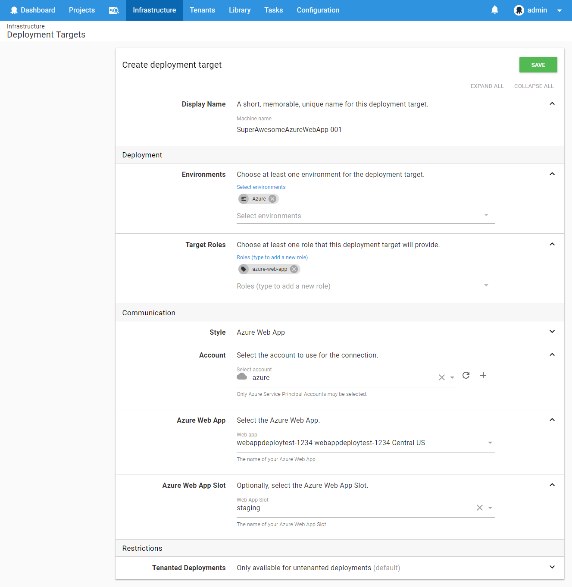

Azure Web App targets have been supported since **Octopus 2018.5**.

Azure Web App deployment targets allow you to reference existing Web Apps in your Azure subscription, that you can then reference by role during deployments.

## Requirements

- You need an [Azure Service Principal account](/docs/infrastructure/accounts/azure/index.md##azure-service-principal) that references your Azure subscription.

- Once your Azure account is setup, you need an existing Azure Web App / App Service setup within your Azure subscription. To learn more about App Services, see the [Azure App Services documentation](https://docs.microsoft.com/en-us/azure/app-service/) that can help you get started. If you are dynamically creating the web app during your deployment, check our section about [creating Web App targets by scripts using service messages](#creating-web-app-targets-by-scripts).

## Creating Web App Targets

Once you have an App Service setup within your Azure subscription, you are ready to map that to an Octopus deployment target.

To create an Azure Web App target within Octopus:

- Navigate to **{{Infrastructure>Deployment Target>Add Deployment Target}}**.
- Select **Azure Web App** from the list of available targets and click _Next_.
- Fill out the necessary fields, being sure to provide a unique role that clearly identifies your Azure Web App target.

:::info
If you are using a **Standard** or **Premium** Azure Service Plan, you can also select a specific slot as your target.
The _Azure Web App Slot_ field will allow you to select one of the slots available on the Web App. If there are no slots, this will be empty.

You can also leave the slot selection blank and specify the slot, by name, on the step too. The slot selected on the deployment target will take precedence over a slot defined on the step.
:::

- After clicking _Save_, your deployment target will be added and go through a health check to ensure Octopus can connect to it.
- If all goes well, you should see your newly created target in your **Deployment Targets** list, with a status of _Healthy_.

### Creating Web App Targets by Scripts

Azure Web App targets can also be created via a PowerShell Cmdlet within a Deployment Process, this can be especially handy if you are also creating the Azure Web App via a script.

See [Managing Resources by script](/docs/infrastructure/deployment-targets/dynamic-infrastructure/index.md) for more information on creating Azure Web Apps via a script.

## Troubleshooting

If your Azure Web App target does not successfully complete a health check, you may need to check that your Octopus Server can communicate with Azure. It may be worth checking that your Azure Account is able to complete a _Save and Test_ to ensure Octopus can communicate with Azure. If your Octopus Server is behind a proxy or firewall, you will need to consult with your Systems Administrator to ensure it can communicate with Azure.

## Deploying to Web App Targets

To learn about deploying to Azure Web App targets, see our [documentation about this topic](/docs/deployment-examples/azure-deployments/deploying-a-package-to-an-azure-web-app/index.md)
