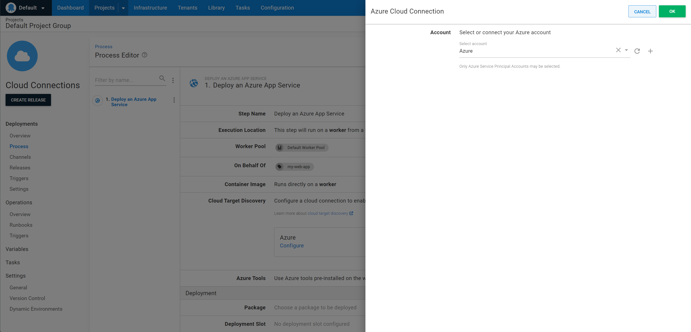

Octopus can discover deployment targets during deployments using tags added to your cloud resources. Target discovery takes place during deployment, and is useful when your deployment process creates your target cloud infrastructure before deploying software to it.

:::hint
Cloud Target Discovery was introduced in **Octopus 2022.2** for Azure Web Apps and ECS. EAP support for AKS clusters is provided via a feature toggle in **{{Configuration, Features}}**.

**Octopus 2022.3** will include EKS cluster support.
:::

This page will walk you through the steps needed to enable cloud target discovery.

:::hint
We recommend cloud target discovery over the existing [dynamic infrastructure](/docs/infrastructure/deployment-targets/dynamic-infrastructure/index.md) functionality.
:::

## Configure credentials for discovery

To perform discovery of targets from cloud resources, Octopus uses a well-known set of variables configured within your project to provide the credentials for authentication to the cloud provider. Variables can be [scoped](/docs/projects/variables/index.md#scoping-variables) allowing for different credentials to be used when performing discovery as required (for example in different environments).

:::hint
From **Octopus 2022.3**, you can configure the well-known variables used for target discovery when editing your deployment process in the Web Portal.
:::

The variables used are different for each supported cloud provider.

### Azure

To discover Azure cloud resources, Octopus uses the following variables:

| Name                    | Required | Description                                                                                                   |
| ----------------------- | -------- | ------------------------------------------------------------------------------------------------------------- |
| `Octopus.Azure.Account` | Y        | An [Azure account](/docs/projects/variables/azure-account-variables.md) to use when discovering cloud targets |

From **Octopus 2022.3**, Azure steps that support target discovery will allow you to configure the variables above from within the step configuration if they have not been configured within your project yet.

1. Open the deployment process and navigate to the Azure step.
1. Expand the **Cloud Connections** section.
1. Click the **Azure** tile. If target discovery variables have not been configured, this will say **Configure Now**.
1. Select the Azure Account to use.
1. Click **Ok**. This will save the well-known variables above into your project.



### AWS

To discover AWS cloud resources, Octopus uses the following variables:

| Name                                      | Required | Description                                                                                                                                                                                                                                                  |
| ----------------------------------------- | -------- | ------------------------------------------------------------------------------------------------------------------------------------------------------------------------------------------------------------------------------------------------------------ |
| `Octopus.Aws.Regions`                     | Y        | A comma separated list of AWS regions to perform target discovery in.                                                                                                                                                                                        |
| `Octopus.Aws.Account`                     | N        | An [AWS account](/docs/projects/variables/aws-account-variables.md) account to use when discovering cloud targets. If this is not set then credentials from the worker on which the step is run will be used.                                                |
| `Octopus.Aws.WorkerPool`                  | N        | A [worker pool](/docs/projects/variables/worker-pool-variables.md) to use when discovering cloud targets. If this is not set then the worker pool from the step will be used. If this is set any discovered targets will have this set as their worker pool. |
| `Octopus.Aws.AssumedRole.Arn`             | N        | The ARN of an IAM role to assume during the discovery of targets. See [Using IAM roles](https://docs.aws.amazon.com/IAM/latest/UserGuide/id_roles_use.html) for more information on using and assuming roles.                                                |
| `Octopus.Aws.AssumedRole.SessionName`     | N        | The name of the session to use if assuming a role during discovery. If not set then an automatically generated name provided by AWS will be used.                                                                                                            |
| `Octopus.Aws.AssumedRole.SessionDuration` | N        | The maximum duration the session will be available for if assuming a role during discovery. If not set then the default duration from the IAM role will be used.                                                                                             |
| `Octopus.Aws.AssumedRole.ExternalId`      | N        | An external ID to use if assuming a role during discovery. See the AWS documentation for more information on the use of external IDs.                                                                                                                        |

From **Octopus 2022.3**, AWS steps that support target discovery will allow you to configure the variables above from within the step configuration if they have not been configured within your project yet:

1. Open the deployment process and navigate to the AWS step
1. Expand the **Cloud Connections section.
1. Click the **Amazon Web Services** tile. If target discovery variables have not been configured, this will say **Configure Now**.
1. Choose the credentials to use for target discovery.
1. Click **Ok**. This will save the well-known variables above into your project.


## Tag cloud resources

Octopus looks for tags applied to cloud resources to discover and create deployment targets for you.

Tags are in the format `octopus-{scope}` and support the following for discovery. Note that only a single value is supported in tags at the moment.

| Tag                   | Required | Description                                                                                                                                                                                  | Example                             |
| --------------------- | -------- | -------------------------------------------------------------------------------------------------------------------------------------------------------------------------------------------- | ----------------------------------- |
| `octopus-environment` | Yes      | The name of the [environment](/docs/infrastructure/environments/index.md) the target can be used in during deployments. Only deployments matching the environment will discover the target.  | `octopus-environment = Development` |
| `octopus-role`        | Yes      | The [role](/docs/infrastructure/deployment-targets/index.md#target-roles) that should be applied to the target. Only deployments with a step that matches the role will discover the target. | `octopus-role = PetShotFrontEnd`    |
| `octopus-space`       | No       | The name of the [space](/docs/administration/spaces/index.md) the target can be used in. If present only deployments within the matching space can discover the target.                      | `octopus-space = PetShopTeam`       |
| `octopus-project`     | No       | The name of the [project](/docs/projects/index.md) the target will be discovered by. If present only deployments for the matching project can discover the target.                           | `octopus-project = PetShop`         |
| `octopus-tenant`      | No       | The name of the [tenant](/docs/projects/index.md) the target can be discovered for. If present only deployments for the matching tenant will discover the target.                            | `octopus-tenant = MyClient`         |

## Add step to deployment process

Octopus will discover targets if one of the following steps are in your deployment process. Each step will discover targets that match it's target role.

- Deploy an Azure App Service
- Deploy an Azure Web App (Web Deploy)
- Deploy Amazon ECS Service
- Update Amazon ECS Service
- Kubernetes Steps:
  - Deploy Kubernetes containers
  - Run a kubectl CLI Script
  - Deploy raw Kubernetes YAML
  - Update a Helm Chart
  - Deploy Kubernetes config map resource
  - Deploy Kubernetes ingress resource
  - Deploy Kubernetes secret resource
  - Deploy Kubernetes service resource

## Enabling discovery for existing projects

Target discovery is enabled for all new projects and environments by default.

If you have an existing project or environment, enable it with the following steps.

### Enable dynamic infrastructure

To discover targets for an environment, dynamic infrastructure needs to be enabled. To enable for an existing environment:

1. Navigate to **{{Infrastructure,Environments}}**.
1. Click the overflow menu (`...`) for the environment you want to enable or disable dynamic infrastructure on and select **Edit**.
1. Expand the **Dynamic infrastructure** section and tick the check-box to enable dynamic infrastructure.
1. Click **SAVE**.

### Enable deployments without a target

Using target discovery during a deployment means that there may be no existing targets at the start of a deployment. To allow deployments to start without any targets:

1. Navigate to **{{Projects,Project name,Deployments,Settings}}**.
2. Expand the **Deployment Targets Required** and select the **Allow deployments to be created when there are no deployment targets** option.
3. Click **SAVE**.

## Discovering existing targets

Cloud Target Discovery will often discover resources which already have targets in Octopus. Here are some things to be aware of:

### Previously discovered targets

If a target has been created via Cloud Target Discovery, the next time the same cloud resource is discovered, the target will simply be updated. Existing targets are matched by target name, which is formatted depending on the discovered resource. The names are chosen to be unique but as readable as possible.

- Azure Web App: `azure-web-app/{resource-group}/{web-app-name}`
- ECS Cluster: `{ecs-cluster-arn}`
- AKS Cluster: `aks/{subscription-id}/{resource-group}/{cluster-name}`
- EKS Cluster: `{eks-cluster-arn}`

:::warning
Renaming or moving cloud resources can cause target discovery to create duplicate targets. In most cases the old target will become unhealthy and be removed automatically by Octopus (see [Cleaning up unhealthy targets]) but in some cases the old target may still be healthy. In these cases, it must be removed manually.

**Example:** If you move an AKS Cluster to a different subscription and then update your Account in Octopus to use the new subscription ID, the old target will still pass its health-check. When discovery occurs a new target will be created (with the new Subscription ID in the target name) and the old target will need to be removed manually.
:::

### Overwriting manually added targets

Manually added targets can be overridden by Cloud Target Discovery but this will only happen if they match the name format above exactly. If they are different, a new target will be created.

:::hint
We recommend not manually adding targets when using Cloud Target Discovery to avoid duplicate targets for a single cloud resource.
:::

### Cleaning up unhealthy targets

When targets are created via Cloud Target Discovery, they are monitored by Octopus. When the cloud resources are removed, Octopus will detect unhealthy targets and remove them periodically.

:::hint
Server will not remove unhealthy targets immediately. Targets need to fail multiple health checks over a period of at least one hour before they are removed.
:::

## Examples

### Azure Web App

Let's say you have an project in Octopus called _Pet Shop_ that deploys an application to an Azure Web App in a _Development_ environment using a role of _PetShopFrontEnd_ and this web app is dynamically created as part of the deployment using an ARM template.

To use this web app previously in Octopus you might have either registered the target manually, or used a [script step](/docs/infrastructure/deployment-targets/dynamic-infrastructure/azure-web-app-target.md) with custom code to try and find and create the web app target. In addition, previously when this web app was no longer needed you might have needed to either [run a script](/docs/infrastructure/deployment-targets/dynamic-infrastructure/remove-octopustarget.md) or manually remove the target in Octopus.

By configuring a well-known variable and tagging your Azure Web App appropriately, Octopus can discover this target for you at deployment time. Additionally, Octopus will continue to monitor the target, and will remove it if it is removed in Azure.

- Configure an [Azure account](/docs/projects/variables/azure-account-variables.md) variable in your project named **Octopus.Azure.Account**, selecting an account that has permissions to be able to find the web app.
- Add tags to the web app resource within the ARM template to allow Octopus to discover it. For our example we can add the following tags to ensure that it is discovered correctly by our (and only by our project) using [variable substitution](/docs/projects/variables/variable-substitutions.md):

```json
"resources": [{
    "type": "Microsoft.Web/sites",
    //...otherProperties,
    "tags": {
        "octopus-environment": "#{Octopus.Environment.Name}",
        "octopus-role": "PetShopFrontEnd",
        "octopus-project": "#{Octopus.Project.Name}"
    }
}]
```

Octopus will now discover the web app as a target before deploying to it, matching the environment, role, and project from the deployment to the tags created with the ARM template, without any custom scripts or manual registration! Octopus will also remove this target if it is later removed from Azure.

### Amazon ECS

Let's say you have a project in Octopus called _Pet Shop_ that deploys an application to an Amazon ECS Cluster in a _Development_ environment using a role of _PetShopFrontEnd_ and the cluster is dynamically created as part of the deployment using a CloudFormation template.

To use this cluster previously in Octopus you might have either registered the target manually, or used a [script step](/docs/infrastructure/deployment-targets/dynamic-infrastructure/new-octopustarget.md) with custom code to try and find and create the cluster target. In addition, previously when this cluster was no longer needed you might have needed to either [run a script](/docs/infrastructure/deployment-targets/dynamic-infrastructure/remove-octopustarget.md) or manually remove the target in Octopus.

By configuring some well-known variables and tagging your ECS cluster appropriately, Octopus can discover this target for you at deployment time. Additionally, Octopus will continue to monitor the target, and will remove it if it is removed in AWS.

- Set the credentials to use during discovery by
  - Configuring an [AWS account](/docs/projects/variables/aws-account-variables.md) variable in your project named **Octopus.Aws.Account**, selecting an account that has permissions to be able to find the cluster. If not configured the credentials from the worker set on the deployment step will be used.
  - Optionally configuring a [worker pool](/docs/projects/variables/worker-pool-variables.md) variable in your project named **Octopus.Aws.WorkerPool** if discovery should be executed in a specific worker pool.
  - Optionally configuring discovery to use an assumed role by setting a variable in your project named **Octopus.Aws.AssumedRole.Arn** as well as other variables to configure the session name, duration and external id if required.
- Configure which AWS region to search for your ECS cluster in by setting a variable in your project named **Octopus.Aws.Regions**.
- Add tags to the ECS cluster resource within the CloudFormation template to allow Octopus to discover it. For our example we can add the following tags to ensure that it is discovered correctly by our project (and only by our project) using [variable substitution](/docs/projects/variables/variable-substitutions.md):

```json
{
  "Type": "AWS::ECS::Cluster",
  "Properties": {
    //...otherProperties
    "Tags": [
      {
        "Key": "octopus-environment",
        "Value": "#{Octopus.Environment.Name}"
      },
      {
        "Key": "octopus-role",
        "Value": "PetShopFrontEnd"
      },
      {
        "Key": "octopus-project",
        "Value": "#{Octopus.Project.Name}"
      }
    ]
  }
}
```

Octopus will now discover the ECS cluster as a target before deploying to it, matching the environment, role, and project from the deployment to the tags created with the CloudFormation template, without any custom scripts or manual registration! Octopus will also remove this target if it is later removed from AWS.
