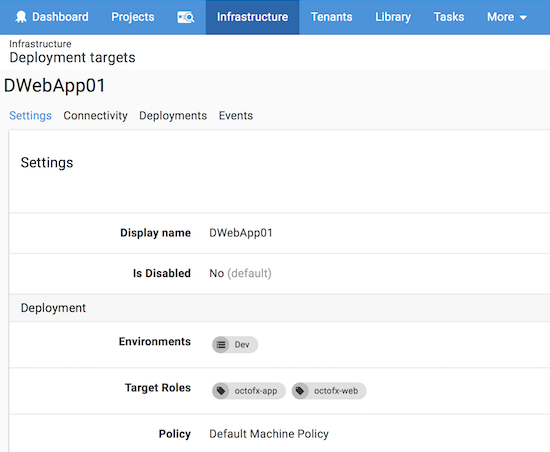

All of the environments that you work with, for instance, Development, Test, or Production, will likely have multiple deployment targets. In production, your software might run on different physical servers or cloud services; perhaps dozens of them. However, unless you are extremely lucky, it's unlikely that you have the budget to have an equal number of deployment targets in any of your pre-production environments. When testing your software in a test environment, you might only have a single virtual machine which is used to test all of your software.

Octopus handles these differences by applying roles to the deployment targets within your environments.

When you deploy your software, you deploy it to deployment targets tagged with specific roles.

Instead of saying:

> The trading web app should be deployed to the deployment targets PWEB01, PWEB02, ...

We say:

> The trading web app should be deployed to the deployment targets that are tagged with the **web-server** role.

For instance, you could have the following target roles:

- web-server
- app-server
- db-server

The deployment targets in your **test** environment might be tagged with all three target roles. This lets you deploy your software to all the deployment targets in your test environment.

Whereas, the deployment targets in your **production** environment are more likely to tagged with specific roles. This lets you deploy you software to production, confident it will only be deployed to the appropriate deployment targets, for instance, only the targets tagged with **web-server**, **db-server** or whatever the case might be.

You can define as many environments, deployment targets, and target roles as you need; it all depends on how software is deployed.

## Plan Your Roles

By definition, a role is "the function assumed by a thing in a particular situation". Roles are not **Environments** or **OS versions**. Try to use roles to tag servers by their utility and watch out if you find yourself putting more than 3 roles on the same server.

## Scope

Almost all the steps in a deployment process that run on a deployment target can be scoped to one or more roles. This means that the step will only execute on targets with at least one of those roles.

For instance, imagine you have a deployment target, *TargetOne*, which is tagged with the target roles *web-server* and *app-server*. Any steps in your deployment processes that are scoped to run on *web-server* or *app-server* will run on *TargetOne*. If a second deployment target, *TargetTwo*, is only tagged with the target role *app-server* only deployment processes with steps scoped to run on *app-server* will run on *TargetTwo.*

Steps will only run once per deployment target, not once per applicable target role.

## Creating Target Roles

Roles are created and saved in the database as soon as you assign them to a deployment target.

Decide on the naming convention you will use before creating your first target role as it's not possible to change the case after the role has been created, for instance, all lowercase to camel case.

1) Register a deployment target or click on an already registered deployment target and go to **Settings**.

2) In the **Target Roles** field, enter the target role you'd like to use (no spaces).

3) Save the target settings.

The role has been created and assigned to the deployment target and is now available to other deployment targets.

You can check all the roles assigned to your deployment targets from the **Infrastructure** tab.

Learn more about [using target roles in your deployment process](/docs/deployment-process/steps/index.md).
