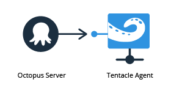

Octopus and Tentacles can be configured to communicate in two different ways depending on your network setup. The mode you are using will change the installation process slightly.

## Listening Tentacles (recommended)

In **Listening** mode, Tentacles *listen* on a TCP port (**10933** by default). When a package needs to be deployed, Octopus connects to the Tentacle service on that port.

In Listening mode Tentacle is the TCP server, and Octopus is the TCP client.

When choosing a communication mode, we recommend Listening mode when possible.

Listening mode uses the least resources (listening on a TCP port is cheaper than actively trying to connect to one). It also gives you the most control (you can use rules in your firewall to limit which IP addresses can connect to the port). [Octopus and Tentacle use SSL when communicating](/docs/administration/security/octopus-tentacle-communication/index.md), and Tentacle will outright reject connections that aren't from an Octopus server that it trusts, identified by an X.509 certificate public key that you provide during setup.

To install and configure Tentacles, see the [Windows Targets (Tentacles) documentation](/docs/infrastructure/deployment-targets/windows-targets/index.md).

## Polling Tentacles

In **Polling** mode, Tentacle will poll the Octopus server periodically to check if there are any tasks for it to perform. Polling mode is the opposite of **Listening mode**.

In Polling mode, Octopus is the TCP server, and Tentacle is the TCP client.

The advantage to Polling mode is that you don't need to make any firewall changes on the Tentacle side; you only need to allow access to a port on the Octopus server. The disadvantage is that it also uses more resources on the Tentacle side, since Tentacle needs to poll periodically even if there aren't any jobs for it to perform.

Polling mode is good for scenarios that involve Tentacles being behind NAT or a dynamic IP address. A good example might be servers at branch offices or a chain of retail stores, where the IP address of each server running Tentacle changes.

To install and configure Tentacles, see the [Windows Targets (Tentacles) documentation](/docs/infrastructure/deployment-targets/windows-targets/index.md).

## SSL Offloading is Not Supported

The communication protocol used by Octopus and Tentacle requires intact end-to-end TLS connection for message encryption, tamper-proofing, and authentication. For this reason SSL offloading is not supported.

## Proxy Servers Supported for Tentacle Communications

The communication protocol used by Octopus and Tentacle 3.4 and above supports proxies. Read more about configuring proxy servers for Tentacle communications in [proxy support](/docs/infrastructure/deployment-targets/windows-targets/proxy-support.md).
