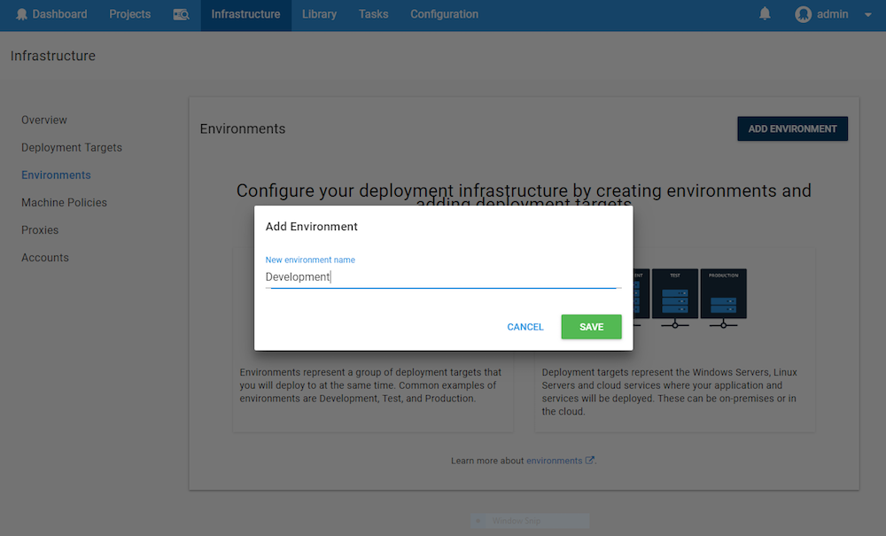
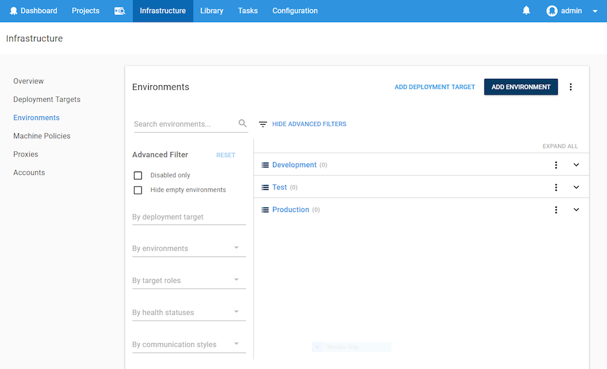

Octopus Deploy organizes your infrastructure, that is the deployment targets you deploy software to (whether on-premises servers or cloud services), into *environments*. Typical examples of environments are **Development**, **Test**, and **Production**.

Organizing your deployment targets into environments lets you define your deployment processes (no matter how many targets are involved) and have Octopus deploy the right versions of your software to the right environments at the right time.

## Add a New Environment

Add new environments to Octopus Deploy by navigating to **{{Infrastructure,Environments}}** in the **Octopus Web Portal** and click **ADD ENVIRONMENT**:

Give your new environment a meaningful name, like **Development**, **Test**, or **Production**:

## Managing Your Environments {#Environments-Managingenvironments}

If you're working with a large number of environments and deployment targets, the infrastructure tab makes it easy to sort, filter, and view your environments.

To edit individual environments, click the overflow menu for that environment. From here, it is possible to edit the environment, description, select [guided failure mode](/docs/infrastructure/environments/index.md#Environments-Guidedfailures), or delete the environment.

### Sorting Your Environments {#Environments-Environmentordering}

Click the overflow menu on the environments sections to reveal the **reorder** menu and access a drag and drop pane to sort your environments

The order that environments are shown in the environments tab also affects:

- The order that they are shown in the Dashboard.
- The order that they are listed in when choosing which environment to deploy a release to.

It's a good idea to put your least production-like environments first, and the most production-like environments last.

### Advanced Filters

You can use advanced filters to search your environments by clicking on **SHOW ADVANCED FILTERS** from the environment tab.

This will let you search by:

- Name
- Deployment Target
- Environment
- Target Roles
- Health Status
- Communication Style

### Guided Failures {#Environments-Guidedfailures}

[Guided failure mode](/docs/deployment-process/releases/guided-failures.md) can be enabled on an environment by default. This is useful for critical environments that are usually deployed to manually (for example, staging and production-like environments), though you may want to disable this feature for environments which are deployed to automatically such as smoke testing environments.

To enable guided failure mode by default for individual environments, click the overflow menu for the environment, select *Default Guided Failure Mode* and click the checkbox. Note, you can still override this setting for individual deployments. For more information, see the section on [Guided Failures](/docs/deployment-process/releases/guided-failures).

### Environment Permissions {#Environments-Environmentpermissions}

You can control who has access to view or edit environments, as well as who can deploy to environments, by assigning users to Teams and assigning roles to those teams. For more information, see the section on [managing users and teams](/docs/administration/managing-users-and-teams/index.md).

## Associating Projects with Environments {#Environments-Associatingprojectswithenvironments}

By default, a project can be deployed to any environment. You can limit which projects can be deployed to which environment using [Lifecycles](/docs/deployment-process/lifecycles/index.md). This is useful if you have one set of environments for projects developed by one team, and another set of environments for projects developed by another team.

## Adding Machines to Environments {#Environments-Addingmachinestoenvironments}

Machines can be added to environments in different ways, depending on the type of target and how they will communicate with the Octopus Deploy Server.

- [Windows targets in listening mode](/docs/infrastructure/windows-targets/listening-tentacles/index.md)
- [Windows targets in polling mode](/docs/infrastructure/windows-targets/polling-tentacles/index.md)
- [SSH targets](/docs/infrastructure/ssh-targets/index.md)
- [AWS targets](/docs/infrastructure/aws/index.md)
- [Azure targets](/docs/infrastructure/azure/index.md)
