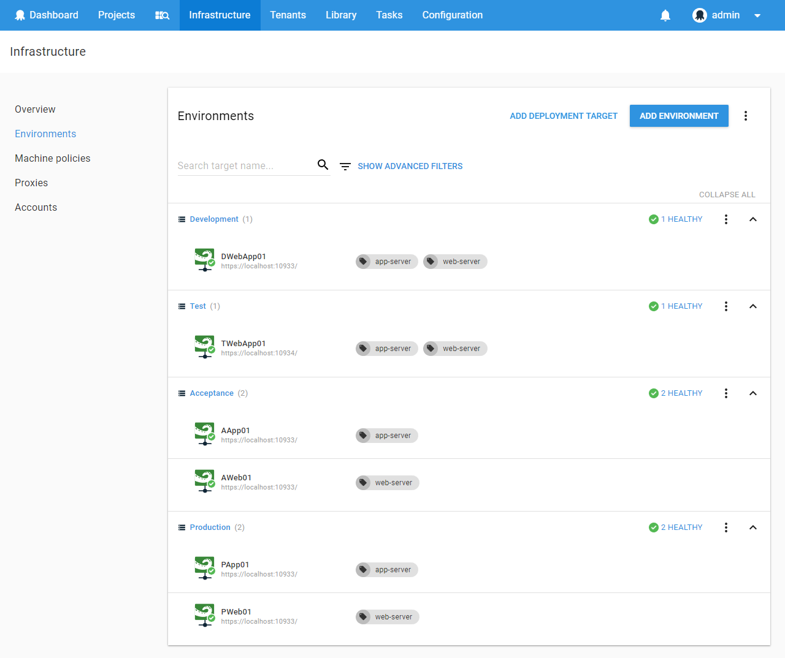
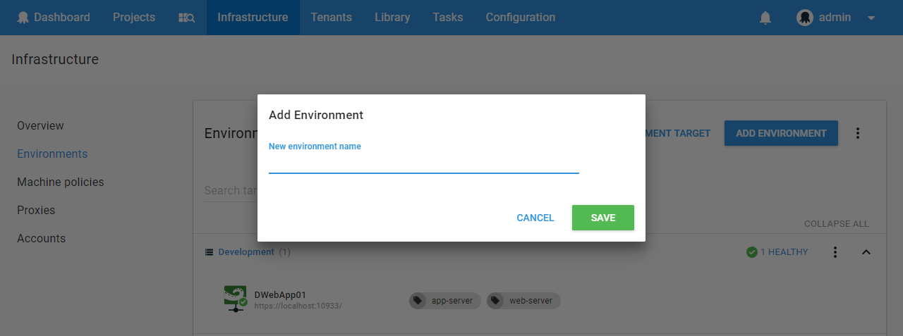

Octopus Deploy organizes your infrastructure, that is the deployment targets you deploy software to (whether on-premises servers or cloud services), into *environments*. Typical examples of environments are **Development**, **Test**, and **Production**.

Organizing your deployment targets into environments lets you define your deployment processes (no matter how many targets are involved) and have Octopus deploy the right versions of your software to the right environments at the right time.

## Managing Environments {#Environments-Managingenvironments}

Environments and the machines inside them can be managed from **{{Infrastructure,Environments}}** within the **Octopus Web Portal**.

Environments can be added using the **Add environment** button.

## Adding Machines to Environments {#Environments-Addingmachinestoenvironments}

Machines can be added to environments in different ways, depending on the type of target and how they will communicate with the Octopus Deploy Server.

- [Windows targets in listening mode](/docs/infrastructure/windows-targets/listening-tentacles/index.md)
- [Windows targets in polling mode](/docs/infrastructure/windows-targets/polling-tentacles/index.md)
- [SSH targets](/docs/infrastructure/ssh-targets/index.md)
- [AWS targets](/docs/infrastructure/aws/index.md)
- [Azure targets](/docs/infrastructure/azure/index.md)

## Environment Ordering {#Environments-Environmentordering}

Environments are shown in order, and can be reordered using the **Reorder** link in the overflow menu at the top right-hand corner of the page.

The order that environments are shown on the Environments tab also affects:

- The order that they are shown in the Dashboard
- The order that they are listed in when choosing which environment to deploy a release to

It's a good idea to put your least production-like environments first, and the most production-like environments last.

## Guided Failures {#Environments-Guidedfailures}

[Guided failure mode](/docs/deployment-process/releases/guided-failures.md) can be enabled on an environment by default. This is useful for critical environments that are usually deployed to manually (for example, staging and production-like environments), though you may want to disable this feature for environments which are deployed to automatically such as smoke testing environments.

Guided failure mode is an option when editing an environment:

(Note that this option only sets it *by* *default*: for individual deployments it can be overridden)

!partial <guided-failure-indicator>

## Associating Projects with Environments {#Environments-Associatingprojectswithenvironments}

By default, a project can be deployed to any environment. You can limit which projects can be deployed to which environment using [Lifecycles](/docs/deployment-process/lifecycles/index.md). This is useful if you have one set of environments for projects developed by one team, and another set of environments for projects developed by another team.

## Environment Permissions {#Environments-Environmentpermissions}

You can control who has access to view or edit environments, as well as who has access to deploy to environments, by assigning users to Teams and assigning roles to those teams. For more information, see the section on [managing users and teams](/docs/administration/managing-users-and-teams/index.md).
