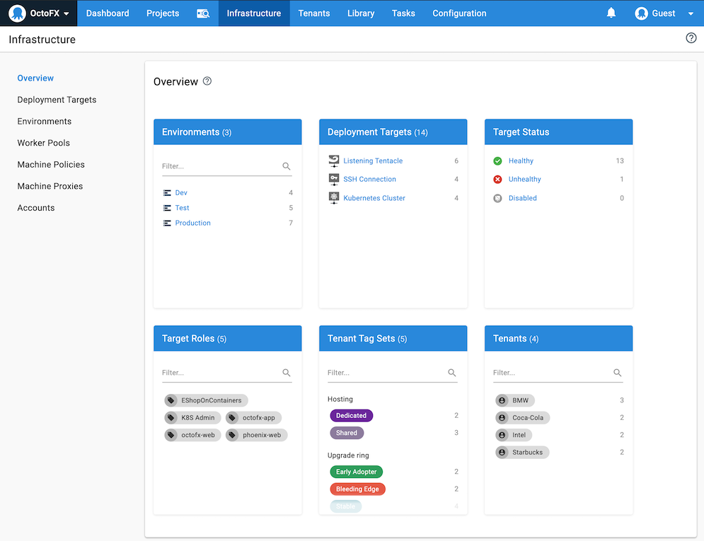

With Octopus Deploy the machines and services you deploy your software to are managed on the **Infrastructure** tab of the Octopus Web Portal:

## Deployment targets

!include <deployment-targets>

Learn more about [deployment targets](/docs/infrastructure/deployment-targets/index.md).

## Environments

Before you can add your deployment targets to Octopus, you need to configure your [environments](/docs/infrastructure/environments/index.md). Environments represent the different stages of your deployment pipeline and ensure that the software that's deployed is the same as it moves through those stages from, for instance, **development**, into **test**, and finally to **production**.

Typical environments include:

 - Development
 - Test
 - Production

You can add as many or as few environments as you require in your deployment pipeline, and you can add as many deployment targets to each environment as you need.

Learn more about [environments](/docs/infrastructure/environments/index.md).

## Workers

[Workers](/docs/infrastructure/workers/index.md) are machines that are used to execute tasks that don't need to be performed on the Octopus Server or specific deployment targets, for instance, if you are deploying a package to an API or running a script. You can register multiple workers and assign them to worker pools.

## Learn more

 - [Environments](/docs/infrastructure/environments/index.md)
 - [Deployment targets](/docs/infrastructure/deployment-targets/index.md)
 - [Workers](/docs/infrastructure/workers/index.md)
 - [Accounts](/docs/infrastructure/accounts/index.md)
