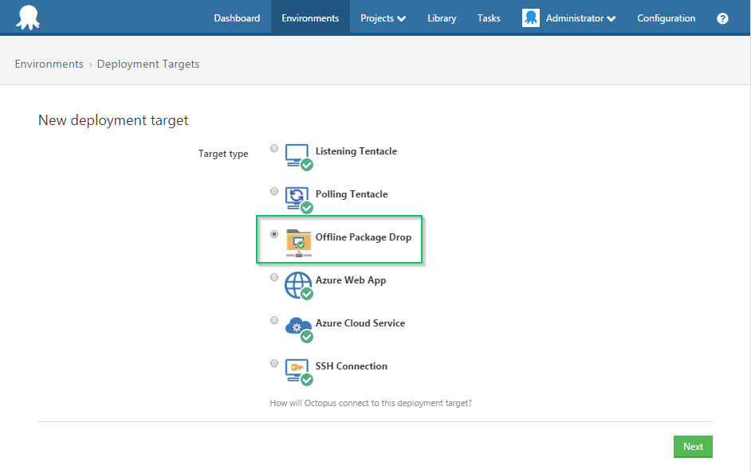

Octopus and Tentacle make deploying simple and secure, but what about situations where you just cannot use Tentacle in Listening nor Polling mode? Perhaps a security policy, compliance control or network topology excludes using Tentacle? This is why we designed the Offline Package Drop as a Deployment Target. You can treat the Offline Package Drop just like any other target, but instead of the application being deployed Octopus will bundle up all of the files needed to perform the deployment on the *actual* target server.

## Configuring the Target {#OfflinePackageDrop-ConfiguringtheTarget}

Offline Package Drop is available as a deployment target.




### Drop Folder Path {#OfflinePackageDrop-Dropfolderpath}

Configure the drop folder path field with the [UNC path](http://en.wikipedia.org/wiki/Path_%28computing%29#Uniform_Naming_Convention) to the directory you wish your offline packages to be located.

### Sensitive-variables Encryption Password  {#OfflinePackageDrop-Sensitive-variablesencryptionpasswordSensitive-variablesencryptionpassword}

As a security measure, any sensitive variables are written to a separate file which is then encrypted.  To perform the encryption\decryption, a password is required.  If your project does not contain any sensitive-variables, this field may be left un-set.  If a project is deployed to an offline package drop target which does not have an encryption password set, the deployment will fail with an indicative error.

Please ensure you store your encryption password in a secure location, as you will require it when executing the batch file to perform the deployment on the target server.

### Applications Directory {#OfflinePackageDrop-Applicationsdirectory}

The applications directory is the directory packages will be extracted to, and is the location applications will execute from by default (if no custom-installation-location is set).  On a regular Tentacle, this is set to `C:\Applications` by default.

### Octopus Working Directory {#OfflinePackageDrop-Octopusworkingdirectory}

The Octopus working directory is a location where some supporting files (e.g. the deployment journal XML file) are stored.

## Building the Offline Package {#OfflinePackageDrop-BuildingtheOfflinePackage}

When Octopus deploys to an Offline Package Drop target it doesn't actually execute the deployment, but will create a folder structure complete with Packages, Scripts, Variable files, Calamari and a batch file to execute the deployment on the actual target server. This example is from the `OctoFX.TradingWebsite` example on [https://demo.octopusdeploy.com](https://demo.octopusdeploy.com).

**Example Offline Package Drop using the OctoFX Trading Website**

```powershell
\\my-share
    \---octopus-drops
        \---Development
            \---OctoFX
                \---3.0.298
                    |   My Offline Drop Target.OctoFX.Deployments-2.cmd
                    |   My Offline Drop Target.OctoFX.Deployments-2.ps1
                    |   
                    +---Calamari
                    |   |   Calamari.exe
                    |   |   ...
                    |           
                    +---Packages
                    |       OctoFX.TradingWebsite.3.0.298_B47863CDE8E3F24E95873F4B59FE990E.nupkg
                    |       
                    +---Scripts
                    |       Remove from Load Balancer.ps1
                    |       Return to load balancer.ps1
                    |       
                    \---Variables
                            My Offline Drop Target.OctoFX.Remove from Load Balancer.variables.json
                            My Offline Drop Target.OctoFX.Return to load balancer.variables.json
                            My Offline Drop Target.OctoFX.Trading Website.variables.json

```

In this example you can see the batch file that will call Calamari to orchestrate the deployment of the `OctoFX.TradingWebsite` package. You can also see the `Remove from Load Balancer.ps1` and `Return to load balancer.ps1` scripts that will be executed as part of the deployment process. Finally you can see the variable files that will be used to configure the variables for each step in the deployment.

:::hint
**Naming Conventions**
The Offline Package Drop will be built and copied into a folder named by this convention:

```
    {{YourConfiguredDropFolderPath}}\{{Environment}}\{{ProjectName}}\{{Release}}
```

For example:

```
    \\my-share\octopus-drops\Production\Acme.Web\0.1
```

The batch file to execute the deployment will be named with this convention:

```
    {{MachineName}}.{{ProjectName}}.{{DeploymentId}}.cmd
```

For example:
`AcmeProductionDrop.Acme.Web.Deployments-1.cmd`
:::

:::success
**Using Sensitive Variables?**
Usually the reason you need to use Offline Package Drop is for some kind of security policy or compliance control. If you indicate any Variables as Sensitive they will be encrypted into a separate variable file so they are protected during transport. When you execute the deployment you will be prompted for the [sensitive-variables password](/docs/infrastructure/offline-package-drop.md) that will be used to decrypt the sensitive values so they can be used as part of the deployment.
:::

## Deploying the Offline Package Drop {#OfflinePackageDrop-DeployingtheOfflinePackageDrop}

To Deploy the Offline Package Drop simply copy the entire folder for that release to the target server and execute the batch file. This will actually execute the deployment on the target server just like Tentacle would.

:::warning
**Output Variables**
Offline drops do not support passing output variables from a deployment package step to another step as part of the same deployment script.
:::
