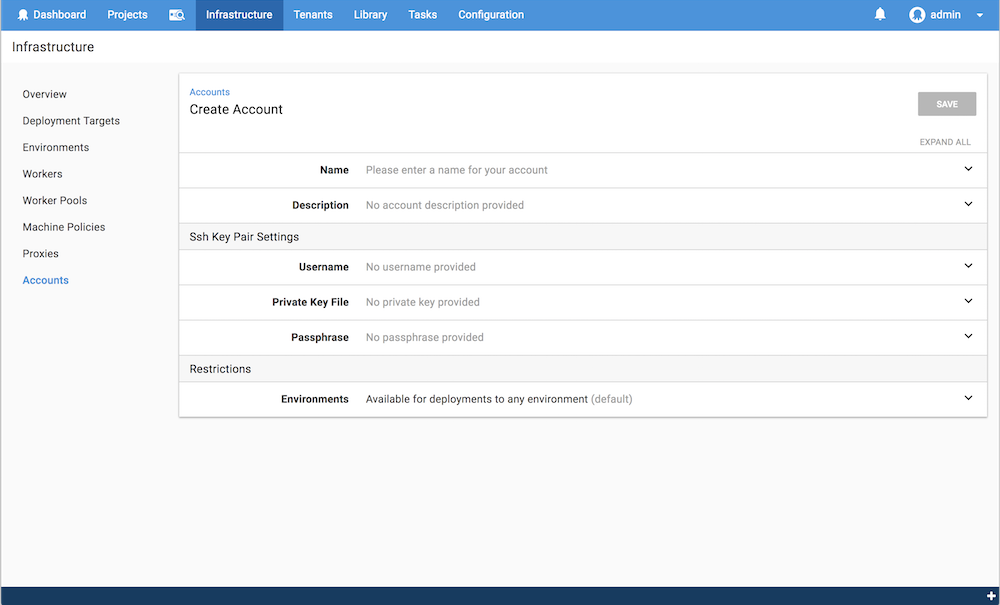

A SSH Key Pair Account is one of the more secure authentication methods available for connections to [SSH Targets](/docs/infrastructure/ssh-targets/index.md).

## Creating the Account {#SSHKeyPair-Creatingtheaccount}

Provide the username that you wish Octopus Deploy to connect as, along with the generated private key that is linked to the public key stored on the server being targeted. The server will confirm that this private key matches its public key at the start of each SSH connection. The "Passphrase" is an optional field that will need to be provided if the private key has been encrypted. If you are storing this key on disk it is recommended, but not mandatory, that your key be encrypted.



## Creating a SSH Key Pair  {#SSHKeyPair-CreatingaSSHKeyPaircreate-key-pair}

Setting up a key for use during authentication is a very simple process and can be done on either the target or Octopus server.

### Linux {#SSHKeyPair-Linux}

Run the following command to generate the key pair

```bash
ssh-keygen
```

It will then prompt you for the location (the default `~/.ssh/id_rsa` is fine) and for a passphrase. The result will be two files, `id_rsa` (the private key) and `id_rsa.pub` (the public key).  The public key will be store on this server while the private key will be copied into the Octopus server.

To allow the linux machine to accept this newly generated key for authentication, the public key needs to be listed in a file used by the ssh process.

```bash
cat ~/.ssh/id_rsa.pub >> ~/.ssh/authorized_keys
```

In some circumstances the permissions on the authorized\_keys file may end up incorrect.  Make sure that your ~/.ssh/authorized\_keys file has the proper permissions using the following.

```bash
chmod 600 ~/.ssh/authorized_keys
```

### Windows {#SSHKeyPair-Windows}

The easiest way to generate valid keys on windows is to use a tool like[ PuTTYgen](http://www.chiark.greenend.org.uk/~sgtatham/putty/download.html). Start by clicking "Generate" and wait for the tool to finish creating the random key pair.


Provide your passphrase if desired and export the private key to the accepted format by going to {{Conversions,Export OpenSSH Key}}.  Clicking "Save private key" will actually produce a file that, while it can be used by this tool again, is not compatible with the standard SSH process. To get the public key over to the server you can either click "Save public key", copy the file across to the server and add the key to `~/.ssh/authorized_keys` as outlined above, or just cut+paste the content from the textbox directly into the remote file.

### Useful Links {#SSHKeyPair-UsefulLinks}

Due to the number and configurable nature of the various Linux distributions available, there are other dedicated sites that can provide more precise information & tutorials for your particular use case.

- [PuTTY download page](http://www.chiark.greenend.org.uk/~sgtatham/putty/download.html) has several useful Windows tools.
- [ssh-keygen man page](https://linux.die.net/man/1/ssh-keygen)
- [sshd\_config man page (ubuntu)](http://manpages.ubuntu.com/manpages/zesty/en/man5/sshd_config.5.html)
- Great intro SSH keygen articles from [DigialOcean](https://www.digitalocean.com/community/tutorials/how-to-set-up-ssh-keys--2), [GitHub](https://help.github.com/articles/connecting-to-github-with-ssh/) or [Atlassian](https://confluence.atlassian.com/display/STASH/Creating+SSH+keys)
