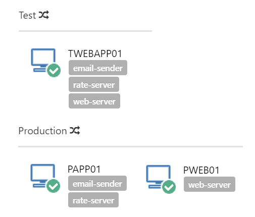

Each environment that you work with, for instance, Dev, Test, or Production, will likely have multiple machines. In production, your web sites and Windows Services might run on different physical servers; perhaps dozens of them. However, unless you are extremely lucky, it's unlikely that you have the budget to have an equal number of servers in any of your pre-production environments. When testing your software in a test environment, you might only have a single virtual machine which will run all of the web sites and services on the same machine.

Octopus handles these differences by applying roles to the machines within your environments.

Instead of saying:

> The trading website ASP.NET application should be deployed to PWEB01, PWEB02, ...

We say:

> The trading website ASP.NET application should be deployed to machines that are tagged with the **web-server** role.

In production, perhaps you have 10 machines with the web-server role. In staging, perhaps you have only 4. In test, perhaps there is a single machine. Roles make defining your deployment process much easier.

You can define as many environments, machines, and roles as you need; it all depends on how your applications are deployed.

## Creating a Role and Assigning it to a Deployment Target {#MachineRoles-CreatingaroleandassigningittoaTarget}

Roles are created and saved in the database the moment you assign them to a deployment target. Decide on the naming convention you will use, before creating your first role as it is not possible to change the case after the role has been created, for instance, all lowercase to camel case.

1) Register a deployment target or click on an already registered target and go to **Settings.**

2) On the **Roles** field, type in a single word without spaces and hit enter. This word will be the role name.

3) Save the target settings.

The role has been created and assigned to the deployment target and is available to other targets.

On the screenshot below we've created the roles **octofx-app** and **octofx-web** and assigned them to our target **DWebApp01**.

You can check all the roles assigned to your machines from the **Infrastructure** screen.

## Using Roles on Deployment Steps {#MachineRoles-Usingrolesondeploymentsteps}

Almost all the steps that run on a deployment target can be scoped to one or more roles. This means that the step will only execute on targets with at least one of those roles. This does not mean that if the step is scoped to multiple roles that it will run for each role. Instead it will run that step for _all machines that have any roles that match any of the step roles._

To scope a step to a specific role, all you have to do is type in the role name on the **Machine Roles** field.

****

After you save the step, all the roles you’ve scoped it for can be viewed from the Deployment Process screen:

According to the screenshot above, our deployment process will do the following:

- Deploy NuGet package OctoFX.Database to deployment targets with the role **app-server**
- Deploy NuGet package OctoFX.RateService to deployment targets with the role **web-server**

## Using Roles with Variables {#MachineRoles-Usingroleswithvariables}

Variables can also be [scoped to specific roles](/docs/deployment-process/variables/index.md). This means that the variable will take the specified value only when it is used on a deployment step that runs on a deployment target with the specified role. This feature can be really handy when you want to use the same variable name multiple times and have their values changed depending on the target they are running on.

Let’s say you have the following targets with their respective roles:

| Target   | Role       |
| ---------- | ---------- |
| Target 1 | app-server |
| Target 2 | web-server |

You want to deploy the same package on each server but the deployment path will be different between servers. In this case you can set the same variables (we’ll call it *DeployPath*) with a different value for each machine role:

Then, on your deployment step, you can set the **[Custom Install Directory](/docs/deployment-process/steps/custom-installation-directory.md)** to `#{DeployPath}` on each of the 3 steps (one for each package Id & Role).

:::warning
**Being Smart with Machine Roles**
By definition, a role is "the function assumed by a thing in a particular situation". Roles are not **Environments** or **OS versions**. Try to use roles to tag servers by their utility and watch out if you find yourself putting more than 3 roles on the same server.
:::
