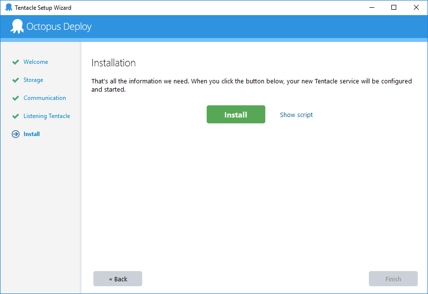

The Tentacle agent can be installed fully automatically from the command line. This is very useful if you're deploying to a large number of servers, or you'll be provisioning servers automatically.

## Tentacle Installers {#AutomatingTentacleinstallation-Tentacleinstallers}

Tentacle comes in an MSI that can be deployed via group policy or other means.

:::success
**Download the Tentacle MSI**
The latest Tentacle MSI can always be [downloaded from the Octopus Deploy downloads page](https://octopus.com/downloads).

Permalinks to always get the latest MSIs are:

- 32-bit: [https://octopus.com/downloads/latest/WindowsX86/OctopusTentacle](https://octopus.com/downloads/latest/WindowsX86/OctopusTentacle)
- 64-bit: [https://octopus.com/downloads/latest/WindowsX64/OctopusTentacle](https://octopus.com/downloads/latest/WindowsX64/OctopusTentacle)
  :::

To install the MSI silently:

```bash
msiexec /i Octopus.Tentacle.<version>.msi /quiet
```

By default, the Tentacle files are installed under **%programfiles(x86)%**. To change the installation directory, you can specify:

```bash
msiexec INSTALLLOCATION=C:\YourDirectory /i Octopus.Tentacle.<version>.msi /quiet
```

:::problem
While you can set a custom INSTALLLOCATION for the Tentacle, please be aware that upgrades initiated by Octopus Server will currently install the upgraded Tentacle back into the default location. This may have an impact if you are using the [Service Watchdog](/docs/administration/service-watchdog.md).
:::

## Configuration {#AutomatingTentacleinstallation-Configuration}

The MSI installer simply extracts files and adds some shortcuts and event log sources. The actual configuration of Tentacle is done later, and this can automated too.

To configure the Tentacle in listening or polling mode, it's easiest to run the installation wizard once, and at the end, use the Show Script option in the setup wizard. This will show you the command-line equivalent to configure a Tentacle.



:::success
**Advanced configuration options**
When configuring your Tentacle you can configure advanced options, like [proxies](/docs/infrastructure/windows-targets/proxy-support.md), [machine policies](/docs/infrastructure/machine-policies.md) and [tenants](/docs/deployment-patterns/multi-tenant-deployments/multi-tenant-deployment-guide/designing-a-multi-tenant-hosting-model.md), which can also be automated. Use the setup wizard to configure the Tentacle, and click the **Show Script** link which will show you the command-line equivalent to configure the Tentacle.
:::

## Example: Listening Tentacle {#AutomatingTentacleinstallation-Example:ListeningTentacle}

The following example configures a [listening Tentacle](/docs/infrastructure/windows-targets/listening-tentacles/index.md), and registers it with an Octopus Deploy server:

**Using Tentacle.exe to create Listening Tentacle instance**

```bash
cd "C:\Program Files\Octopus Deploy\Tentacle"

Tentacle.exe create-instance --instance "Tentacle" --config "C:\Octopus\Tentacle.config" --console
Tentacle.exe new-certificate --instance "Tentacle" --if-blank --console
Tentacle.exe configure --instance "Tentacle" --reset-trust --console
Tentacle.exe configure --instance "Tentacle" --home "C:\Octopus" --app "C:\Octopus\Applications" --port "10933" --console
Tentacle.exe configure --instance "Tentacle" --trust "YOUR_OCTOPUS_THUMBPRINT" --console
"netsh" advfirewall firewall add rule "name=Octopus Deploy Tentacle" dir=in action=allow protocol=TCP localport=10933
Tentacle.exe register-with --instance "Tentacle" --server "http://YOUR_OCTOPUS" --apiKey="API-YOUR_API_KEY" --role "web-server" --environment "Staging" --comms-style TentaclePassive --console
Tentacle.exe service --instance "Tentacle" --install --start --console
```

You can also register a Tentacle with the Octopus Server after it has been installed by using Octopus.Client (i.e. register-with could be omitted above and the following could be used after the instance has started.  See below for how to obtain the Tentacle's thumbprint):

**Using Octopus.Client to register a Tentacle in an Octopus Server**

```powershell
Add-Type -Path 'Newtonsoft.Json.dll'
Add-Type -Path 'Octopus.Client.dll'

$octopusApiKey = 'API-ABCXYZ'
$octopusURI = 'http://YOUR_OCTOPUS'

$endpoint = new-object Octopus.Client.OctopusServerEndpoint $octopusURI, $octopusApiKey
$repository = new-object Octopus.Client.OctopusRepository $endpoint

$tentacle = New-Object Octopus.Client.Model.MachineResource

$tentacle.name = "Tentacle registered from client"
$tentacle.EnvironmentIds.Add("Environments-1")
$tentacle.Roles.Add("WebServer")

$tentacleEndpoint = New-Object Octopus.Client.Model.Endpoints.ListeningTentacleEndpointResource
$tentacle.EndPoint = $tentacleEndpoint
$tentacle.Endpoint.Uri = "https://YOUR_TENTACLE:10933"
$tentacle.Endpoint.Thumbprint = "YOUR_TENTACLE_THUMBPRINT"

$repository.machines.create($tentacle)
```

:::success
Want to register your Tentacles another way? Take a look at the examples in our [sample repository](https://github.com/OctopusDeploy/OctopusDeploy-Api) using the Octopus API to register Tentacles, and do a whole lot more!
:::

## Example: Polling Tentacle {#AutomatingTentacleinstallation-Example:PollingTentacle}

The following example configures a [polling Tentacle](/docs/infrastructure/windows-targets/polling-tentacles/index.md), and registers it with an Octopus Deploy server:

**Polling Tentacle**

```bash
cd "C:\Program Files\Octopus Deploy\Tentacle"

Tentacle.exe create-instance --instance "Tentacle" --config "C:\Octopus\Tentacle.config" --console
Tentacle.exe new-certificate --instance "Tentacle" --if-blank --console
Tentacle.exe configure --instance "Tentacle" --reset-trust --console
Tentacle.exe configure --instance "Tentacle" --home "C:\Octopus" --app "C:\Octopus\Applications" --noListen "True" --console
Tentacle.exe register-with --instance "Tentacle" --server "http://YOUR_OCTOPUS" --name "YOUR_TENTACLE_NAME" --apiKey "API-YOUR_API_KEY" --comms-style "TentacleActive" --server-comms-port "10943" --force --environment "YOUR_TENTACLE_ENVIRONMENTS" --role "YOUR_TENTACLE_ROLES" --console
Tentacle.exe service --instance "Tentacle" --install --start --console
```

:::warning
If you are running this from a Powershell remote session, make sure to add `--console` at the end of each command to force Tentacle.exe not to run as a service.
:::

:::success
Want to register your Tentacles another way? Take a look at the examples in our [sample repository](https://github.com/OctopusDeploy/OctopusDeploy-Api) using the Octopus API to register Tentacles, and do a whole lot more!
:::

## Obtaining the Tentacle Thumbprint {#AutomatingTentacleinstallation-tentaclethumbprintObtainingtheTentacleThumbprint}

If you don't know the thumbprint for the above PowerShell scripts, it can be obtained with the following command line option:

**Obtaining Thumbprint**

```bash
Tentacle.exe show-thumbprint --instance "Tentacle" --nologo
```

## Desired State Configuration {#AutomatingTentacleinstallation-DSCDesiredStateConfiguration}

Tentacles can also be installed via [Desired State Configuration](https://msdn.microsoft.com/en-us/powershell/dsc/overview) (DSC). Using the module from the [OctopusDSC GitHub repository](https://www.powershellgallery.com/packages/OctopusDSC), you can add, remove, start and stop Tentacles in either polling or listening mode.

The following PowerShell script will install a Tentacle listening on port `10933` against the Octopus server at `https://YOUR_OCTOPUS`, add it to the `Development` environment and assign the `web-server` and `app-server` roles:

**DSC Configuration**

```powershell
Configuration SampleConfig
{
    param ($ApiKey, $OctopusServerUrl, $Environments, $Roles, $ListenPort)

    Import-DscResource -Module OctopusDSC

    Node "localhost"
    {
        cTentacleAgent OctopusTentacle
        {
            Ensure = "Present"
            State = "Started"

            # Tentacle instance name. Leave it as 'Tentacle' unless you have more
            # than one instance
            Name = "Tentacle"

            # Registration - all parameters required
            ApiKey = $ApiKey
            OctopusServerUrl = $OctopusServerUrl
            Environments = $Environments
            Roles = $Roles

            # Optional settings
            ListenPort = $ListenPort
            DefaultApplicationDirectory = "C:\Applications"
        }
    }
}

# Execute the configuration above to create a mof file
SampleConfig -ApiKey "API-YOUR_API_KEY" -OctopusServerUrl "https://YOUR_OCTOPUS/" -Environments @("Development") -Roles @("web-server", "app-server") -ListenPort 10933

# Run the configuration
Start-DscConfiguration .\SampleConfig -Verbose -wait

# Test the configuration ran successfully
Test-DscConfiguration
```
### Settings and Properties

To review the latest available settings and properties, refer to the [OctopusDSC Tentacle readme.md](https://github.com/OctopusDeploy/OctopusDSC/blob/master/README-cTentacleAgent.md) in the GitHub repository.


DSC can be applied in various ways, such as [Group Policy](https://sdmsoftware.com/group-policy-blog/desired-state-configuration/desired-state-configuration-and-group-policy-come-together/), a [DSC Pull Server](https://msdn.microsoft.com/en-us/powershell/dsc/pullserver), [Azure Automation](https://msdn.microsoft.com/en-us/powershell/dsc/azuredsc), or even via configuration management tools such as [Chef](https://docs.chef.io/resource_dsc_resource.html) or [Puppet](https://github.com/puppetlabs/puppetlabs-dsc). A good resource to learn more about DSC is the [Microsoft Virtual Academy training course](http://www.microsoftvirtualacademy.com/training-courses/getting-started-with-powershell-desired-state-configuration-dsc-).

For an in depth look, check out the [sample walkthrough](docs/infrastructure/windows-targets/azure-virtual-machines/via-an-arm-template-with-dsc.md) of how to use DSC with an Azure ARM template to deploy and configure the Tentacle on an Azure VM.
