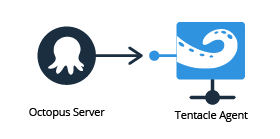
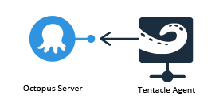

When you deploy software to Windows Servers, you need to install Tentacle, a lightweight agent service, on all of those Window Servers.

Once installed, Tentacles:

- Run as a Windows Service called **OctopusDeploy Tentacle**.
- Wait for tasks from Octopus (deploy a package, run a script, etc).
- Report the progress and results back to the Octopus Server.

Before you install Tentacle, review the the software and hardware requirements:

- [The latest version of Tentacle](/docs/infrastructure/windows-targets/requirements.md).
- [Versions prior to Tentacle 3.1](/docs/infrastructure/windows-targets/requirements.md).

## Download the Tentacle Installer

The latest Octopus Tentacle MSI can always be [downloaded from the Octopus Deploy downloads page](https://octopus.com/downloads).

## Tentacle Communication <!-- move into a separate file?  -->

Octopus and Tentacles can be configured to communicate two different ways depending on your network setup. The mode you are using will change the installation process slightly.

### Listening Tentacles

In **listening** mode, Tentacles *listen* on a TCP port (port **10933** by default). When a package needs to be deployed, Octopus connects to the Tentacle service on that port.

In listening mode Tentacle is the TCP server, and Octopus is the TCP client.

#### Listening Mode is Recommended

When choosing a communication mode, we recommend listening mode when possible. Listening mode uses the least resources (listening on a TCP port is cheaper than actively trying to connect to one). It also gives you the most control (you can use rules in your firewall to limit which IP addresses can connect to the port). [Octopus and Tentacle use SSL when communicating](/docs/administration/security/octopus-tentacle-communication/index.md), and Tentacle will outright reject connections that aren't from an Octopus server that it trusts, identified by an X.509 certificate public key that you provide during setup (see below).

### Polling Tentacles

In **polling** mode, Tentacle will poll the Octopus server periodically to check whether there are any tasks for it to perform. Polling mode is the opposite to **listening mode**.

In polling mode, Octopus is the TCP server, and Tentacle is the TCP client.

The advantage to polling mode is that you don't need to make any firewall changes on the Tentacle side; you only need to allow access to a port on the Octopus server. The disadvantage is that it also uses more resources on the Tentacle side, since Tentacle needs to poll periodically even if there aren't any jobs for it to perform.

Polling mode is good for scenarios that involve Tentacle being behind NAT or a dynamic IP address. A good example might be servers at branch offices or a chain of retail stores, where the IP address of each server running Tentacle may change.

### SSL Offloading is Not Supported

The communication protocol used by Octopus and Tentacle requires intact end-to-end TLS connection for message encryption, tamper-proofing, and authentication. For this reason SSL offloading is not supported.

### Proxy Servers Supported for Tentacle Communications

The communication protocol used by Octopus and Tentacle 3.4 and above supports proxies. Read more about configuring proxy servers for Tentacle communications in [proxy support](/docs/infrastructure/windows-targets/proxy-support.md).

## Installation

1. Start the Tentacle Installer and follow the onscreen prompts.
2. Accept the license agreement, and either accept the default installation location or choose a different location.
3. Click install, and give the app permission to **make changes to your device**.
4. Click finish to exit the installation wizard and launch the setup wizard to configure your tentacle.
5. Click **Get Started** and **Next**.
6. Accept the default *configuration and log* directory and *application* directory or choose different locations.
7. Choose the communication style for the Tentacle. <!-- if comms is moved link to it from here -->

### Configuring a Listening Tentacle (recommended)

To complete the installation we need to setup communication between the Octopus Server and the Tentacle. This is done on both the server where you installed Tentacle and the central Octopus Deploy server. We'll start with the Octopus Server and come back to the Tentacle.

1. In the **Octopus Web Portal**, navigate to the **infrastructure** tab, select **Deployment Targets** and click **ADD DEPLOYMENT TARGET**.
2. Select **Listening Tentacle**.
3. Copy the **Thumbprint** (the long alphanumerical string).
4. Back on the Tentacle server, select **Listening Tentacle** and click **Next**.
2. Accept the default listening port **10933** or provide your own.
5. Paste the **Thumbprint** into the **Octopus Thumbprint** field and click **next**.
6. Click **INSTALL**.
7. Back in the **Octopus Web Portal**, enter the DNS or IP address of the tentacle, i.e., `example.com` or `10.0.1.23`, and click **NEXT**.

**Firewalls**

To allow your Octopus Deploy server to connect to the Tentacle, you'll need to allow access to TCP port **10933** on the Tentacle (or the port you selected during the installation wizard).

**Intermediary Firewalls**

Don't forget to allow access in any intermediary firewalls between the Octopus server and your Tentacle (not just in Windows Firewall). For example, if your Tentacle server is hosted in Amazon EC2, you'll also need to modify the AWS security group firewall to tell EC2 to allow the traffic. Similarly if your Tentacle server is hosted in Microsoft Azure you'll also need to add an Endpoint to tell Azure to allow the traffic.

### Configuring a Polling Tentacle

Port opened on the tentacle server
Firewall (and intermediary firewalls)

## Firewall

## Registering the Tentacle with Octopus

Thumbprint

### Polling

Port opened on the Octopus server (only when listening mode isn't an option)
Authenticate
Roles in the wizard this time? Still true?

## Health Check

Tentacle can be installed and configured directly from the command prompt, which is very useful when you need to install Tentacle on a large number of machines. See more in [automating Tentacle installations](/docs/infrastructure/windows-targets/automating-tentacle-installation.md).

:::warning
**Cloning Tentacle VMs**
In a virtualized environment, it may be desirable to install Tentacle on a base virtual machine image, and clone this image to create multiple machines.

If you choose to do this, please **do not complete the configuration wizard** before taking the snapshot. The configuration wizard generates a unique per-machine cryptographic certificate that should not be duplicated. Instead, use PowerShell to [automate configuration](/docs/infrastructure/windows-targets/automating-tentacle-installation.md) after the clone has been materialized.
:::

:::warning
**Calamari Warning in Health Check**
When you first install a Tentacle it does not have the latest Calamari package installed. So, on the first health check a warning will be written to the log with the following message ***Not running latest version of Calamari. Directory does not exist: C:\<TentacleHomeDirectoryChosenDuringInstallation>\Calamari***, this message can safely be ignored as we will automatically push the latest Calamari package to the Tentacle on the first deployment made to it, or you can manually push the latest Calamari package to the Tentacle from the Environments page.
:::

## Tentacle Manager

The Tentacle MSI installer is very simple: it extracts the core program files on disk, adds an event log source, and that's about it. The actual configuration of your Tentacle is done through a tool called **Tentacle Manager**. When the MSI completes Tentacle Manager will appear, and you can access it any time from your start menu/start screen. Tentacle Manager is a Windows application that:

- Has a setup wizard to configure your Tentacle instance
- Has wizards to configure Tentacle to use a proxy server, or delete the Tentacle instance
- Shows other diagnostic information about Tentacle

## Permissions

By default, the Tentacle Windows Service runs under the Local System context. You can configure Tentacle to run under a different user account by modifying the service properties via the Services MMC snap-in (**services.msc**).

The account that you use requires, at a minimum:

- `Log on as a service` right on the current machine - [learn more](https://technet.microsoft.com/en-us/library/dn221981(v=ws.11).aspx).
- Rights to enumerate the `Local Machine` certificate store.
- Permissions to load the private key of the Tentacle X.509 certificate from the `Local Machine` certificate store.
- Read/Write permissions to the Tentacle "Home directory" that you selected when Tentacle was installed (typically, **C:\Octopus**).
- Rights to manage Windows Services (start/stop) - [learn more](https://social.technet.microsoft.com/wiki/contents/articles/5752.how-to-grant-users-rights-to-manage-services-start-stop-etc.aspx).

Please be aware that to perform automatic Tentacle updates you need an account with [extra permissions](/docs/infrastructure/machine-policies.md#MachinePolicies-TentacleUpdateAccount).

In addition, since you are probably using Tentacle to install software, you'll need to make sure that the service account has permissions to actually install your software. This totally depends on your applications, but it might mean:

- Permissions to modify IIS (C:\Windows\system32\inetsrv).
- Permissions to connect a SQL Server database.

:::problem
If you **Reinstall** a Tentacle using the Tentacle Manager, the Windows Service account will revert to Local System.
:::

### Using a Managed Service Account (MSA)

You can run Tentacle using a Managed Service Account (MSA):

1. Install the Tentacle and make sure it is running correctly using one of the built-in Windows Service accounts or a Custom Account.
2. Reconfigure the `Tentacle` Windows Service to use the MSA, either manually using the Service snap-in, or using `sc.exe config "OctopusDeploy Tentacle" obj= Domain\Username$`.
3. Restart the Tentacle Windows Service.

Learn about [using Managed Service Accounts](https://technet.microsoft.com/en-us/library/dd548356(v=ws.10).aspx).
