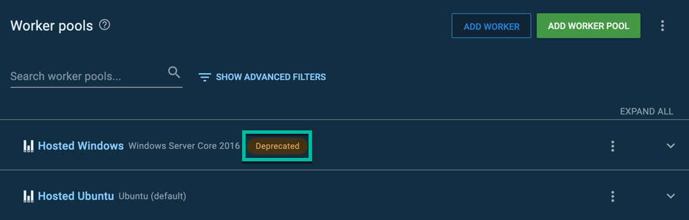

Dynamic Worker Pools are a special type of [worker pool](/docs/infrastructure/workers/worker-pools.md) used by Octopus Cloud.  They use [workers](/docs/infrastructure/workers/index.md) provided by Octopus, and they don't require users to configure any infrastructure.  

## On demand

Dynamic workers are created on demand and leased to an Octopus Cloud instance for a limited time before being destroyed.  

::: info
Octopus Cloud will automatically destroy dynamic workers as soon as one of these conditions is met:

- The worker has been idle for 60 minutes.
- The worker has existed for 72 hours (3 days).

Please reach out to [support@octopus.com](mailto:support@octopus.com) if you need these values to be adjusted for your instance.
:::

## Isolated

Each worker is provisioned exclusively to a specific customer, and is completely isolated from other customers.

## Dynamic Worker Images

Each dynamic worker pool can specify the worker image used. As of August 2020, Windows Server Core 2016 is the default. Windows Server Core 2019 and Ubuntu Server 18.04 worker images are also available.

Editing a dynamic worker pool allows you to modify the image used. 

The available worker images list specific operating system versions (e.g.,`Windows Server Core 2016`, `Windows Server Core 2019`) but also generic "default" options such as `Windows (default)`. Choosing the default option means that your worker will get the latest stable worker image released. This is a good option to choose if you're running a basic script that doesn't have any dependencies on specific tool or operating system versions.

If you're writing a script that relies on a specific version of tooling (e.g., helm), then we recommend choosing a specific worker image, instead of the "default" options, to prevent worker image upgrades from impacting your deployments.

|Type | Pros | Cons |
|-----|------|------|
| Default (eg `Windows (default)`) | Automatically uses the latest image. Deployments will continue to work even when a worker image is marked as deprecated or decommissioned.| The versions of dependencies (e.g., helm) are not fixed. Deployments that rely on specific versions of dependencies or operating system specific features may break during upgrades. |
| Specific (e.g., `Windows Server Core 2019`) | The version of the operating system and dependencies are fixed and can be relied upon. | When a worker image is marked as deprecated, warnings will start to appear in your deployment logs. When a worker image is decommissioned, you will need to take action to update your worker pool or deployments will fail. |

## Deprecation

When an image is marked as deprecated, you will see warnings in the Octopus UI, and in the deployment log. After a suitable deprecation period, deployments will start to fail if they target an image that has hit end-of-life.

When you start getting warnings in your deployments and/or see deprecation warnings in the Octopus portal, please plan to modify your worker pool to use a different image and test your scripts on the new image.

If your Worker Pool is set to use the Operating System default, for example, `Windows (default)`, you don't have to do anything. The default will be swapped over to a new Operating System version and your deployments and runbooks will automatically use the new version. 

### Modifying the worker pool 

If the Worker Pool has been configured to specifically use a deprecated worker type, you will need to update the Worker Image on the Worker Pool.

The Worker Pool with a deprecated Worker Type will show a `Deprecated` label next to the worker pool, available by navigating to **{{ Infrastructure, Worker Pools }}**:

The Worker Type can be modified by editing the Worker Pool and changing the Worker Type to a different option, such as `Windows (default)` or a specific operating system version.

## Available Dynamic Worker Images 

Worker images are rebuilt on a regular basis, so that the operating system is up to date with the latest security patches.

### Windows Server Core 2019

Each `Windows Server Core 2019` worker is provisioned with a baseline of tools including (but not limited to):

- .NET Core (2.1, 3.1)
- .NET Framework 3.5
- .NET Framework 4.8
- AWS IAM Authenticator (0.5.1)
- Chocolatey (latest)
- Docker (19.03.5)
- Helm (2.9.1)
- Kubectl (1.16.10)
- Microsoft Service Fabric (6.1.480.9494)
- Microsoft Service Fabric SDK (3.0.480)
- Nuget CLI (latest)
- Octopus Client (latest)
- Pip (20.1.1)
- Powershell Core (latest)
- Python (3.7.4)
- GCloud CLI (339.0.0)

Windows 2019 workers are capable of running [execution worker containers](/docs/projects/steps/execution-containers-for-workers/index.md). 

:::hint
We recommend execution containers as the preferred option for steps requiring external tools. This allows you to control which version of the tools will be used as your scripts will rely on a specific version that they are compatible with to function correctly.
:::

### Windows Server Core 2016

Each `Windows Server Core 2016` worker is provisioned with a baseline of tools including (but not limited to):

- .NET Core (2.1, 3.1)
- .NET Framework 3.5
- .NET Framework 4.7.2
- AWS IAM Authenticator (0.5.1)
- Chocolatey (latest)
- Helm (2.9.1)
- Kubectl (1.16.10)
- Microsoft Service Fabric (6.1.480.9494)
- Microsoft Service Fabric SDK (3.0.480)
- Nuget CLI (latest)
- Octopus Client (latest)
- Pip (20.1.1)
- Powershell Core (latest)
- Python (3.7.4)
- GCloud CLI (339.0.0)

:::warning
Please note that [execution worker containers](/docs/projects/steps/execution-containers-for-workers/index.md) are not supported on Windows 2016 workers.
:::

### Ubuntu 18.04

Each `Ubuntu Server 18.04` worker is provisioned with a baseline of tools including (but not limited to):

- .NET Core (2.1, 3.1)
- Docker (latest)
- Powershell Core (latest)
- Python 3 (latest)
- GCloud CLI (339.0.0)

:::hint
Ubuntu workers are designed to use [execution worker containers](https://octopus.com/blog/execution-containers) for tooling such as kubectl and helm. This makes it much easier to choose the appropriate runtime environment with the tools you need for your use case.
:::

## kubectl on Windows Images

Windows 2016 and 2019 dynamic worker images come with many versions of `kubectl` available.

A specific version can be used by [specifying a custom kubectl location](/docs/deployments/kubernetes/kubectl/index.md) of `c:\tools\kubectl\{{version}}\kubectl.exe`, where `{{version}}` is one of the following: 

- `1.11.1`
- `1.11.3`
- `1.12.1`
- `1.13.12`
- `1.14.9`
- `1.15.6`
- `1.16.10`
- `1.17.5`
- `1.18.0`
- `1.19.9`
- `1.20.5`

## Installing Software On Dynamic Workers

It is possible to install additional software on dynamic workers.  By default, every worker is destroyed after it has been allocated for over 72 hours.  Because of that, if you choose to install additional software, you are responsible for:

- Ensuring that software is installed at the start of each deployment or runbook run.
- Writing the necessary scripts to download and install that software.
- Verifying the latest version of the software works with the latest security patches of the host OS.

We don't recommend going through that effort except for a POC or a Pilot.  For production workloads, the recommendation is to leverage [execution containers for workers](docs/projects/steps/execution-containers-for-workers/index.md) to manage software dependencies.  We provide execution containers with a lot of software pre-installed.  However, we can't create a container with every possible software combination you might need.  Please see this [blog post](https://octopus.com/blog/tips-building-custom-execution-containers) for more information on how to create custom execution containers.

## Learn more

- [Worker blog posts](https://octopus.com/blog/tag/workers)
