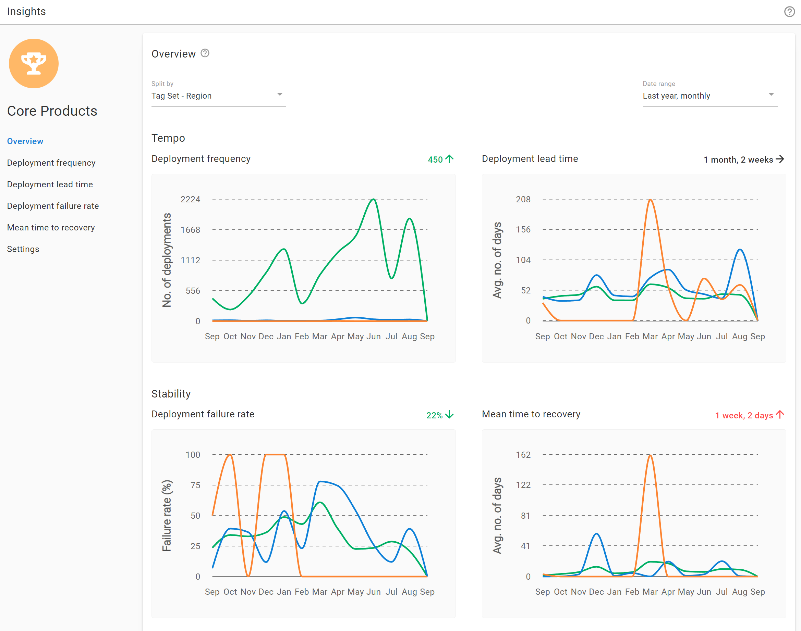
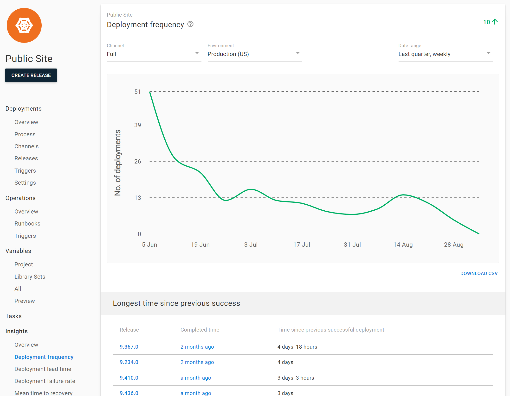

DevOps insights (early access) in Octopus gives you better visibility into your company’s DevOps performance by surfacing the four key DORA metrics, so you can make more informed decisions on where to improve and celebrate your results.

Two levels are available for DevOps Insights:

1. Project level insights, available to all customers.
2. Space level insights, available to customers with an [enterprise subscription](https://octopus.com/enterprise).

## What are DORA metrics?

[DORA](https://www.devops-research.com/) (DevOps Research and Assessment) is the team behind the Accelerate State of DevOps Report 2, a survey of more than 32,000 professionals from around the world. Their research has linked the technical and cultural capabilities that drive software delivery and organizational performance.

DORA recommends an approach to measuring software delivery that relies on five metrics:

_Tempo_

- Lead time for changes (LT)
- Deployment frequency (DF)

_Stability_

- Change failure rate (CFR)
- Mean time to recovery (MTTR)

_Operation_

- Reliability

Throughput metrics measure the health of your deployment pipeline, while the stability indicators help you understand the quality of your software and delivery pipeline. In addition to the four classic DORA metrics that measure software delivery performance, DORA added a new measure in 2021 for operational performance.

## Octopus built-in DORA metrics with DevOps Insights

Octopus **2022.3** adds out-of-the-box support for the following DevOps metrics:

**Deployment Lead Time**

The time between the creation date of the release immediately following the previously successful release and the completion date of the deployment.

**Deployment Failure Rate**

The percentage of deployments that fail to deploy, require guided failure or have their release marked as "Do not promote"

**Deployment Frequency**

How many deployments occur to the target environment.

**Mean Time to Recovery**

How long it takes to recover a failed deployment with a subsequent successful deployment.

:::hint
Some of these metrics differ slightly from the textbook DORA metrics given the data available.
:::

Together these metrics help you qualify the results of your DevOps performance, as well as gain insights into areas for future improvement.

- Get better visibility into the performance of your projects and teams
- Eliminate “gut feel” and enable data-informed decisions to drive improvement and determine if a new process is working
- Review and collect data over time to highlight the path to delivering greater value, faster
- Help introduce change with data and collaboration to make a business case
- Share successes and learn from failures to continuously improve

## Understand performance of your projects with Project level Insights

Project level insights are available as a new tab in every project so you can understand the performance of your projects across Channels, Environments, and Tenants. Each metric can be seen at a summary level, and insights can also be filtered to time frames, including last month, quarter, year, channels, and environments, as well as being exported into CSV.

Project level insights are available to all customers out-of-the-box, meaning you don’t have to buy or subscribe to another tool. If you’re already a user, Octopus has all the data it needs to help you uncover rich insights based on your deployment history.

## Gain insight across projects and teams with the Space level insights

Octopus **2022.3** also includes additional insights capabilities for customers with an [enterprise subscription](https://octopus.com/enterprise). For customers at larger companies, we have built additional capabilities that make it easier to gain insight using DORA metrics in larger multi-team, multi-site and multi-project scenarios.

Space level insights are available via the Insights tab and provide actionable DORA metrics for more complex scenarios across projects, project groups, environments, or tenants. This enables managers and decision-makers to get far more insight into the DevOps performance of their organization in line with their business context, such as team, portfolio, or platform. Space level insights:

- Aggregate data across your space so you can compare and contrast metrics across projects to identify what is working and what isn't
- Inform better decision making: identify problems, track improvements, and celebrate successes
- Help you quantify DevOps performance based on what is actually happening, as shown by data

With the Space level insights, you can build reports with the relevant data that matters to you, choosing only relevant projects, project groups, environments, and tenants. View information at a high level or drill down into project-specific data over time.

This also allows you to easily identify contributors to a performance trend you see at the aggregated level. It provides a breakdown of the highest and lowest performing projects and releases that may significantly impact the overall performance. This enables you to identify where things are improving or declining and take action based on that.

:::hint
Users who have view permissions to Space-level Insights reports will see sanitized data on projects / environments they don’t have access to.
:::

Space level DevOps insights are available to customers with an [enterprise subscription](https://octopus.com/enterprise).
