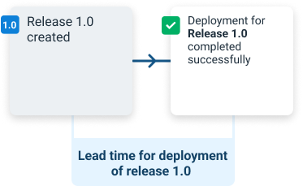
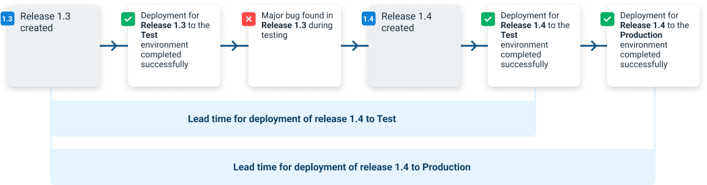
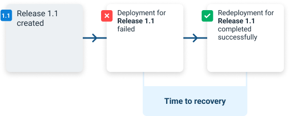
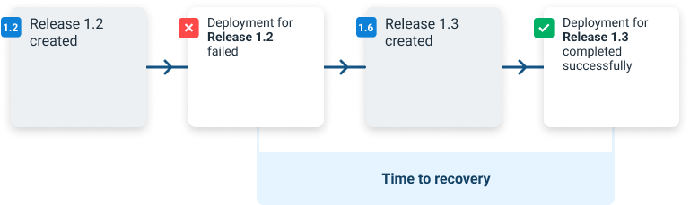
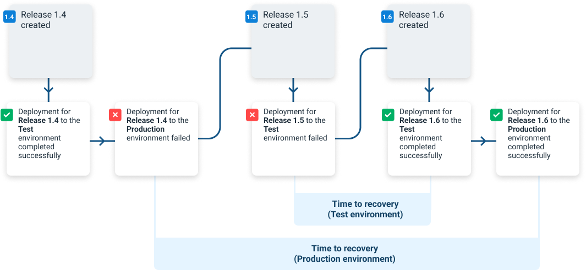

The metrics are calculated in real time based on deployment completions.

Within Insights, a successful deployment has a task status of **Success** and did not have any guided failures.  Conversely, a failed deployment is one that either has a task status of **Failed** or has a status of **Success** but had one or more guided failures.

## Deployment frequency

The deployment frequency is the total number of successful deployments for a given time period.

## Deployment lead time

The lead time for a given deployment is the time from the deployment's completion date, back to the creation date of the earliest release whose changes have not been deployed to the given environment.
Calculating lead time can be straightforward in many scenarios, like the following example:

 

Here, the lead time is the time from Release 1.0’s creation to the completion time of its deployment.

Lead times may also span multiple releases and deployments.  In the following example, Release 1.1 was never deployed, and Release 1.2 had a failed deployment before being successfully redeployed. Here, the lead time is from the creation of Release 1.1 through to the completion time of Release 1.2’s successful redeployment.  Release 1.1 is included in the lead time calculation because its changes were first deployed as part of Release 1.2’s deployment.

Lead times may be calculated across environments.  In the example below, release 1.3 is never deployed to production due to a bug being found in testing. The deployment state is edited to reflect that it is now considered a failure.  Because of this, the lead times for release 1.4 start at the creation time of release 1.3.

## Deployment failure rate

Failure rate is calculated by taking the total number of deployments, and dividing them by the number of failures as a percentage.

## Mean time to recovery

For a given failed deployment, its time to recovery is the time period from its completion time, to the completion time of the next successful deployment within the same scope.

This chart shows the simplest example of the time to recovery, where a failed deployment is successfully redeployed straight afterward.

Time to recovery can span across multiple releases too.  In this scenario, the deployment of release 1.2 failed, but release 1.3 was deployed instead of re-trying 1.2.  The time to recovery is the time from the completion of the failed deployment of 1.2 to the completion of the successful deployment of 1.3.

Scope is taken into consideration when calculating time to recovery.  In the example below, you can see that the time to recovery for the Test environment is shorter than that of the Production environment because the earliest failure was for the Production environment.

## Deployment duration

The deployment duration is the time from when a deployment starts until it completes, including any manual intervention time. Only successful deployments are included. The value shown is the average (mean) of all deployments that completed in the time period that matches the filter.
          
The queue time of a deployment is the calculated from the time the deployment is queued until the time it starts executing. If a deployment is scheduled to execute in the future, that future time is used. The value shown is the average (mean) for all deployments that started in that time period that match the filter.