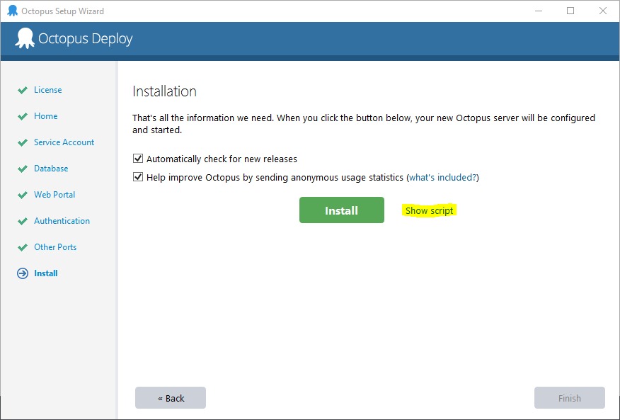

## Octopus installers

Octopus comes in a MSI that can be deployed via group policy or other means.

The latest Octopus MSI can always be [downloaded from the Octopus Deploy downloads page](https://octopus.com/downloads).

Permalinks to always get the latest MSIs are:

- 32-bit: [https://octopus.com/downloads/latest/WindowsX86/OctopusServer](https://octopus.com/downloads/latest/WindowsX86/OctopusServer)
- 64-bit: [https://octopus.com/downloads/latest/WindowsX64/OctopusServer](https://octopus.com/downloads/latest/WindowsX64/OctopusServer)

Automating the installation of Octopus Server is a three step process.

### 1. Install MSI on a temporary machine interactively
In this step we install the MSI on a machine interactively so that we can complete the wizard to add a new instance.
Follow all the steps in the wizard and once you get to the last screen, click on `Show Script` (**do not click Install**).


Copy the script generated onto the clipboard.

Here is an example what the script looks like, **you need to modify this script manually with your settings**:
```bash
"C:\Program Files\Octopus Deploy\MyOctopus\Octopus.Server.exe" create-instance --instance "new instance" --config "C:\Octopus\new instance\OctopusServer-new instance.config"
"C:\Program Files\Octopus Deploy\MyOctopus\Octopus.Server.exe" configure --instance "new instance" --home "C:\Octopus\new instance" --storageConnectionString "Data Source=(local)\SQLEXPRESS;Initial Catalog=foo;Integrated Security=True" --upgradeCheck "True" --upgradeCheckWithStatistics "True" --webAuthenticationMode "UsernamePassword" --webForceSSL "False" --webListenPrefixes "http://localhost:80/" --commsListenPort "10943" --serverNodeName "JOHNSBOX"
"C:\Program Files\Octopus Deploy\MyOctopus\Octopus.Server.exe" database --instance "new instance" --create --grant "NT AUTHORITY\SYSTEM"
"C:\Program Files\Octopus Deploy\MyOctopus\Octopus.Server.exe" service --instance "new instance" --stop
"C:\Program Files\Octopus Deploy\MyOctopus\Octopus.Server.exe" admin --instance "new instance" --username "admin" --email "" --password ""
"C:\Program Files\Octopus Deploy\MyOctopus\Octopus.Server.exe" license --instance "new instance" --licenseBase64 "a very long license string"
"C:\Program Files\Octopus Deploy\MyOctopus\Octopus.Server.exe" service --instance "new instance" --install --reconfigure --start --dependOn "MSSQL$SQLEXPRESS"
```


### 2. Install MSI in central server silently

To install the MSI silently:

```bash
msiexec /i Octopus.<version>.msi /quiet RUNMANAGERONEXIT=no
```

By default, the Octopus files are installed under **%programfiles%**. To change the installation directory, you can specify:

```bash
msiexec /i Octopus.<version>.msi /quiet RUNMANAGERONEXIT=no INSTALLLOCATION="C:\YourDirectory"
```

### 3. Configuration

The MSI installer simply extracts files and adds some shortcuts and event log sources. The actual configuration of Octopus Server is done later, via the script you copied above.

To run the script start an admin shell prompt and paste the script onto it, this should apply all the settings to the new instance.

## Desired State Configuration

Octopus can also be installed via [Desired State Configuration](https://msdn.microsoft.com/en-us/powershell/dsc/overview) (DSC). Using the module from the [OctopusDSC GitHub repository](https://www.powershellgallery.com/packages/OctopusDSC).

The following PowerShell script will install a Octopus server listening on port `80`:

```powershell
Configuration SampleConfig
{
    Import-DscResource -Module OctopusDSC

    Node "localhost"
    {
        cOctopusServer OctopusServer
        {
            Ensure = "Present"
            State = "Started"

            # Server instance name. Leave it as 'OctopusServer' unless you have more than one instance
            Name = "OctopusServer"

            # The url that Octopus will listen on
            WebListenPrefix = "http://localhost:81"

            SqlDbConnectionString = "Server=(local)\SQLEXPRESS;Database=Octopus;Trusted_Connection=True;"

            # The admin user to create
            OctopusAdminUsername = "Admin"
            OctopusAdminPassword = "SuperS3cretPassw0rd"

            # optional parameters
            AllowUpgradeCheck = $true
            AllowCollectionOfAnonymousUsageStatistics = $true
            ForceSSL = $false
            ListenPort = 10943
            DownloadUrl = "https://octopus.com/downloads/latest/WindowsX64/OctopusServer"
        }
    }
}

# Execute the configuration above to create a mof file
SampleConfig

# Run the configuration
Start-DscConfiguration -Path ".\SampleConfig" -Verbose -wait

# Test the configuration ran successfully
Test-DscConfiguration
```

DSC can be applied in various ways, such as [Group Policy](https://sdmsoftware.com/group-policy-blog/desired-state-configuration/desired-state-configuration-and-group-policy-come-together/), a [DSC Pull Server](https://msdn.microsoft.com/en-us/powershell/dsc/pullserver), [Azure Automation](https://msdn.microsoft.com/en-us/powershell/dsc/azuredsc), or even via configuration management tools such as [Chef](https://docs.chef.io/resource_dsc_resource.html) or [Puppet](https://github.com/puppetlabs/puppetlabs-dsc). A good resource to learn more about DSC is the [Microsoft Virtual Academy training course](http://www.microsoftvirtualacademy.com/training-courses/getting-started-with-powershell-desired-state-configuration-dsc-).
