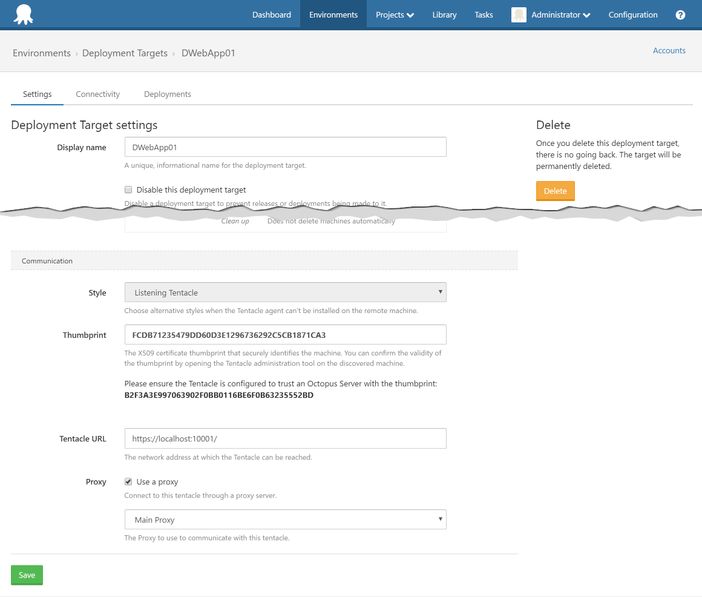

For Listening Tentacles, the Octopus Server can be configured to communicate with the Tentacle via a proxy. Go to {{Infrastructure,Proxies}} to configure proxy servers to use when connecting to Listening Tentacles. Multiple proxies can be setup here depending on the requirements of your network topology.

Once you have created a proxy, Listening Tentacles can be set to use that proxy in the communication part of Deployment Target Settings.

