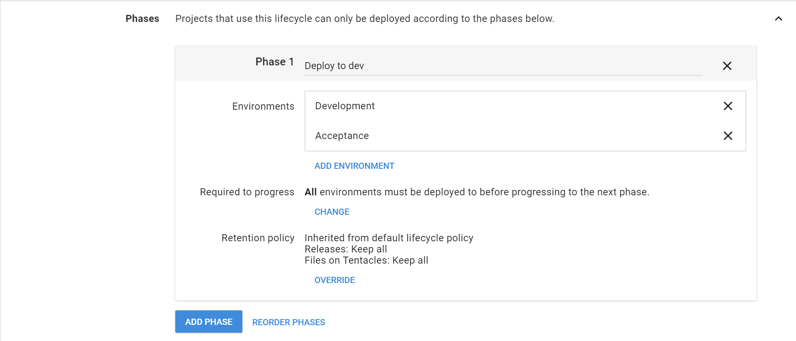
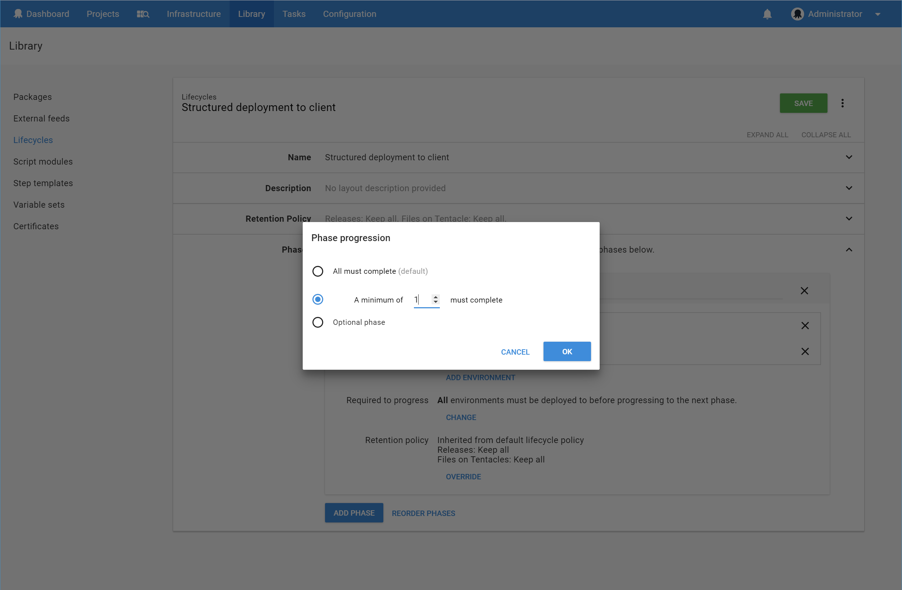
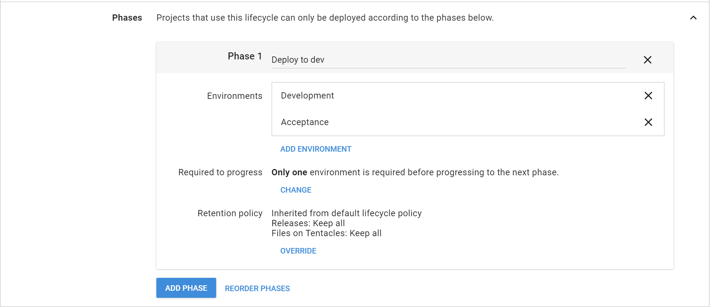

Once you have more than one environment defined in a phase you can gate the phase.

There is a setting for the phase called "Required to progress". This allows you to state how many environments within a phase must be deployed to before the next phase can be activated. If you have 5 environments and set this value to 2, only two environments must be deployed to before the next phase can be actively deployed to. If any environments within the next phase have automatic deployments set, they will trigger.

To configure this, click the **Change** button and select the option you would like to use.

Click **OK** to save your changes

