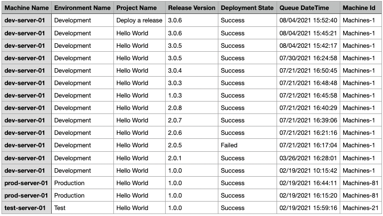

The Octopus Web Portal allows you to see what deployments have gone out to a specific deployment target, but it doesn't provide you with a list of deployments for all the deployment targets in a role.  This script demonstrates how to generate such a report.

**Please note:** The report is generated as a CSV file, formatting was added to the screenshot to make it easier to read.

## Usage

Provide values for the following:

- Octopus URL
- Octopus API Key
- Report Path
- Space Name
- Target Role
- Days to Query

!include <deployments-per-target-role-report>