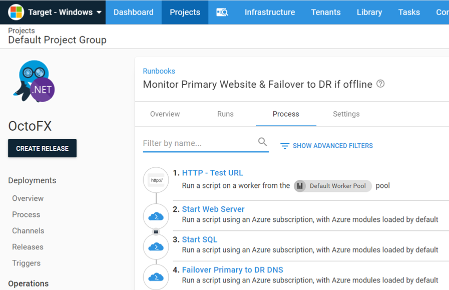

One of the features of runbooks is the ability the execute them on a recurring schedule called a [trigger](https://octopus.com/docs/operations-runbooks/scheduled-runbook-trigger).  Using this feature, you can have a runbook execute periodically to ensure that your application is up and running, then automatically fail over if it is not.

The following example tests the URL of an appication, if the expected code of 200 is not returned, the runbook will automatically start the DR web and SQL server in Azure, then update the DNS to point to the DR site.

## Create the Runbook

1. To create a runbook, navigate to {{Project, Operations, Runbooks, Add Runbook}}.
2. Give the Runbook a name and click **SAVE**.
3. Click **DEFINE YOUR RUNBOOK PROCESS**, then click **ADD STEP**.

Add the following steps
- Community Step Template [HTTP - Test URL](https://library.octopus.com/step-templates/f5cebc0a-cc16-4876-9f72-bfbd513e6fdd/actiontemplate-http-test-url)
- `Run an Azure Script` to start Web server - configured to run only on failure
```PowerShell
$name = $OctopusParameters["OctoFX.Azure.WebApp.Name"]
$resourceGroup = $OctopusParameters["OctoFX.Azure.Resource.Group"]

Write-Highlight "Starting $name"
Start-AzureRmVM -ResourceGroupName $resourceGroup -Name $name
```
- `Run an Azure Script` to start teh Database server - configured to run only on failure and in parallel with the web server step 
```PowerShell
$name = $OctopusParameters["OctoFX.Azure.SQL.Name"]
$resourceGroup = $OctopusParameters["OctoFX.Azure.Resource.Group"]

Start-AzureRmVM -ResourceGroupName $resourceGroup -Name $name
```
- `Run an Azure Script` to update the DNS entry - configured to run only on failure
```PowerShell
$resourceGroup = $OctopusParameters["OctoFX.Azure.Resource.Group"]
$zoneName = $OctopusParameters["OctoFX.DNS.Name"]
$ipAddressDR = $OctopusParameters["OctoFX.DR.IP.Address"]
$ipAddressProd = $OctopusParameters["OctoFX.Production.IP.Address"]

az network dns record-set a add-record --resource-group $resourceGroup --zone-name $zoneName --record-set-name www --ipv4-address $ipAddressProd
az network dns record-set a remove-record --resource-group $resourceGroup --zone-name $zoneName --record-set-name www --ipv4-address $ipAddressDR
```



## Create the trigger
1. To create a trigger, navigate to {{Project, Operations, Triggers, Add Scheduled Trigger}}.
2. Give the Trigger a name and a description
3. Fill in Trigger Action section
   - Runbook - Select the runbook to exectute
   - Target environments - Select the environment(s) this runbook will execute against
4. Fill in Trigger Schedule section
   - Schedule - Daily | Days per month | Cron expression
   :::hint
   The details will change based on the `schedule` selection
   :::
5.  Scheduled Timezone
   - Select timezone - Select the timezone to use when evaluating when to run


## Samples
We have a [Target - Windows](https://g.octopushq.com/TargetWindowsSamplesSpace) Space on our Samples instance of Octopus. You can sign in as `Guest` to take a look at this example and more runbooks in the `OctoFX` project.
