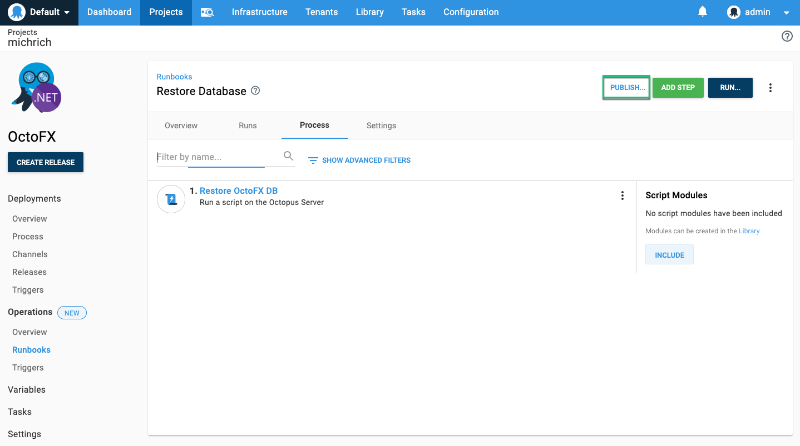

Publishing makes a runbook available to scheduled triggers and consumers (anyone with an appropriately scoped `RunbookRun` permission, but without the `RunbookEdit` permission).  Triggers and consumers will always execute the published snapshot.

The published snapshot contains the process, variables, and packages. This allows editing and testing the runbook without impacting the published version.   

To publish a snapshot, click the publish button on the task page after executing a runbook, or click publish on the runbook's process page.

Publish from completed task:

Publish from process:

When a producer (anyone with an appropriately scoped `RunbookEdit` permission) executes a runbook, they will have the option between executing the published version or the current draft.

Running the current draft allows testing changes before publishing.  The latest version of the process and variables will be used and package versions will be prompted for.

