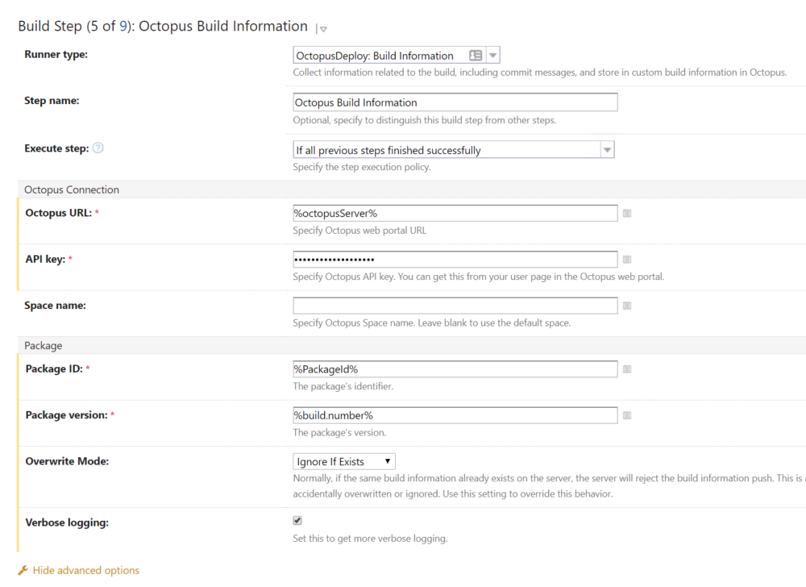

Your continuous integration/build server will package your applications and make them available to Octopus for deployment from a [package repository](/docs/packaging-applications/package-repositories/index.md). The following tools are available to integrate your continuous integration/build server with Octopus Deploy:

 - [AppVeyor](/docs/packaging-applications/build-servers/appveyor/index.md)
 - [Azure DevOps & Team Foundation Server](/docs/packaging-applications/build-servers/tfs-azure-devops/index.md)
 - [Bamboo](/docs/packaging-applications/build-servers/bamboo.md)
 - [BitBucket Pipelines](/docs/packaging-applications/build-servers/bitbucket-pipelines/index.md)
 - [Continua CI](/docs/packaging-applications/build-servers/continua-ci.md)
 - [Github Actions](/docs/packaging-applications/build-servers/github-actions.md)
 - [Jenkins](/docs/packaging-applications/build-servers/jenkins/index.md)
 - [TeamCity](/docs/packaging-applications/build-servers/teamcity.md)

## Build information {#build-information}

It is often useful to have information flow from your build server to be associated with packages, releases, and deployments in Octopus.

The build information is associated with a package and includes:

- Build URL: A link to the build which produced the package.
- Commits: Details of the source commits related to the build.
- Issues: Issue references parsed from the commit messages.

## Passing build information to Octopus {#passing-build-information-to-octopus}

Build information is passed to Octopus as a file using a custom format. The recommended way to supply the build information is to add the _Build Information_ step from the Octopus Deploy plugin to your build server.

:::hint
**Build server support**
The Build Information step is currently available in the official Octopus [TeamCity](/docs/packaging-applications/build-servers/teamcity.md), [Bamboo](/docs/packaging-applications/build-servers/bamboo.md), and [Jenkins](/docs/packaging-applications/build-servers/jenkins.md) plugins.

Check our [downloads page](https://octopus.com/downloads) for our latest build server plugins.
:::

Build information is independent from the packages that it relates to. You can pass build information to Octopus before the packages have been pushed to either the built-in repository or an external feed.

## Build information step {#build-information-step}

The TeamCity version of the _Build Information_ step is shown below.

:::hint

The Verbose logging option can be used to include more detail in the build logs. This includes a complete output of all of the build information being passed to Octopus, which can be useful when troubleshooting.

:::

## Viewing build information

As of `2019.10.0`, the build information for a package can be viewed by navigating to **{{Library,Build Information}}**

The build information for a package can be viewed on any release which contains the package.

For packages pushed to the Octopus built-in repository, the build information can also be viewed in the package version details by navigating to **{{Library, Packages}}** and selecting the package.

:::warning 

Commit messages and deep links may not be shown if an unsupported `VcsType` is passed to Octopus as part of the build information call. Currently we support values of `Git` and `TFVC` (TFS / Azure DevOps). `SVN` (Subversion) is **not supported**.

:::

## Using build information in release notes #{release-notes}

The build information associated with packages is available for use in [release notes](/docs/managing-releases/release-notes.md) (and [release notes templates](/docs/managing-releases/release-notes.md#Release-Notes-Templates)) as Octopus variables.

See the [system variable documentation](/docs/projects/variables/system-variables.md#release-package-build-information) for the available variables.

## Using build information in deployments

Package build information associated with a release will be also [captured in deployments](/docs/managing-releases/deployment-notes.md) of the release.
