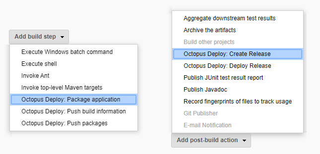

[Jenkins](http://jenkins-ci.org/) is an extendable, open-source continuous integration server that makes build automation easy.

Using Jenkins and Octopus Deploy together, you can:

- Use Jenkins to compile, test, and package your applications.
- Automatically trigger deployments in Octopus from Jenkins whenever a build completes.
- Automatically fail a build in Jenkins if the deployment in Octopus fails.
- Securely deploy your applications with Octopus Deploy across your infrastructure.
- Fully automate your continuous integration and continuous deployment processes.

Octopus Deploy will take those packages and push them to development, test, and production environments.

## Jenkins Installation

If you need guidance installing Jenkins for the first time, see the [Jenkins documentation](https://jenkins.io/doc/book/installing/), or the blog post, [installing Jenkins from Scratch](https://octopus.com/blog/installing-jenkins-from-scratch).

## Installing the Octopus Jenkins Plugin

Plugins are central to Jenkins, and a number of plugins are required to follow the steps on this page. Before you start, you'll need to ensure the following plugins are installed enabled.

If you navigate to Manage Jenkins > Manage Plugins you can add these:

- [Mask Passwords Plugin](https://plugins.jenkins.io/mask-passwords): required to store your Octopus API keys and keep them out of the console.

If you're building a .NET project:
- [MSBuild Plugin](https://plugins.jenkins.io/msbuild): to compile your Visual Studio solution.

If you're building a Java project:
- [Maven Plugin](https://plugins.jenkins.io/maven-plugin): to compile your Java project.

Having at least installed the *Mask Passwords Plugin* you can then search and install the [Octopus Deploy Plugin](https://plugins.jenkins.io/octopusdeploy).

## Configure the Octopus Deploy Plugin

After you have installed the Octopus Deploy plugin. First navigate to {{Manage Jenkins > Global Tool Configuration}} to supply the details for the Octopus CLI.

:::success
**Creating API keys**
Learn [how to create an API key](/docs/octopus-rest-api/how-to-create-an-api-key.md) so the plugin can interact with your Octopus Deploy server.
:::

### Octopus CLI

This is a good time to install the [Octo.exe command line tool](/docs/octopus-rest-api/octo.exe-command-line/index.md).

 The [OctopusDeploy Plugin](https://plugins.jenkins.io/octopusdeploy) is a wrapper for [Octo.exe](/docs/octopus-rest-api/octo.exe-command-line/index.md), the Octopus command line tool for creating and deploying releases, such as `/home/your-user-name/.dotnet/tools/dotnet-octo`.

You can do either of these:
  - Use the `dotnet tool install` command to install it, the [Octo Command Line Global Tool](https://octopus.com/docs/octopus-rest-api/octo.exe-command-line/install-global-tool) this works great on Linux and Windows.
  - [Download Octo.exe](https://octopus.com/downloads) and extract it to a folder on your Jenkins server, such as `C:\Tools\Octo\Octo.exe`.

Then we can let the plugin know where it is installed.

### Configure System

Next, navigate to {{Manage Jenkins > Configure System}}.

#### Octopus Deploy Server Settings

Here you can create the link to your Octopus Deploy server. You can add more than one if your organization uses multiple servers. This is where you supply an API Key, select a Service Account with suitable permission and see [how to create an API key](/docs/octopus-rest-api/how-to-create-an-api-key.md) for it.

After the [Octopus Deploy Plugin](https://plugins.jenkins.io/octopusdeploy) is configured, you can configure a Jenkins Project.

## Build job

During our Jenkins job, we will:

1. Compile the code, and run unit tests.
2. Create NuGet packages with OctoPack.
3. Publish these NuGet packages to the Octopus Deploy server.
4. Create a release in Octopus, ready to be deployed.

Jenkins uses the MSBuild plugin to compile .NET solutions, the Maven Plugin for Java solutions, or a variety of others depending on your tech/language stack.

## Add Build Steps

The Octopus Jenkins plugin comes with these Octopus Build Steps:
  1. **Octopus Deploy: Package Application** Create a NuGet or Zip formatted package.
  1. **Octopus Deploy: Push Build Information** Add information about the build, including work items and commit messages, that is then stored in Octopus Deploy.
  1. **Octopus Deploy: Push Packages** Push packages to the Octopus Deploy built-in repository.
  1. **Octopus Deploy: Create Release** Create a new release in Octopus Deploy, and optionally deploys it to an environment.
  1. **Octopus Deploy: Deploy Release** Deploy an existing release to a new environment.

  You can make use of any combination of these to achieve your deployment objective. They are Build Steps so you can have multiple instances of any of the types, it is a Jenkins limitation to have that with post-build actions.

 

## Creating a Release {#Jenkins-Creatingarelease}

Jenkins is compiling our code and publishing packages to Octopus Deploy. If we wish, we can also have Jenkins automatically create (and optionally, deploy) a release in Octopus along with other supporting actions.

:::success
**Octo.exe further learning**
Learn more about [Octo.exe](/docs/octopus-rest-api/octo.exe-command-line/index.md) and the arguments it accepts.
:::

When this job runs, Jenkins will now not only build and publish packages, it will also create a release in Octopus Deploy.

As an example here, we're relying on the `${BUILD_NUMBER}` value generated by Jenkins to use in the Release Version: `1.1.${BUILD_NUMBER}`.

## Deploying Releases {#Jenkins-Deployingreleases}

You might like to configure Jenkins to not only create a release, but deploy it to a *test environment*. This can be done by ticking the `Deploy this release after it is created?` option.

Alternatively, you can use the `Deploy Release` action if you need to specify more deployment criteria, for example the channel or other required packages.

A successful run looks like this:

## Package application {#Jenkins-Packageapplication}

Octopus supports multiple [package formats](/docs/packaging-applications/index.md#supported-formats) for deploying your software.

You can configure your Jenkins project to [package](/docs/octopus-rest-api/octo.exe-command-line/pack.md) your application or other files on disk, without the need of any specification files, e.g. `.nuspec`.

The two supported formats are `zip` and `nuget`.

To see the full set of additional arguments that can be supplied see the [pack documentation](/docs/octopus-rest-api/octo.exe-command-line/pack.md)

This action works well combined with the next action `Push Packages`.

## Push packages {#Jenkins-Pushpackages}

Octopus can be used as a [NuGet package repository](/docs/packaging-applications/package-repositories/built-in-repository/index.md), using this action you can push packages to Octopus.

This action will push all packages that match the `Package paths` supplied.

:::hint
Note that the package paths defined here should be full paths, not including any wildcards.
:::

## Push build information {#Jenkins-Pushbuildinformation}

Build information is passed to Octopus as a file using a custom format. The Jenkins plugin also supports this feature. For more information see the [Build Information documentation](/docs/packaging-applications/build-servers/index.md#build-information).

The build information is associated with a package and includes:

 - Build URL: A link to the build which produced the package.
 - Commits: Details of the source commits related to the build.
 - Issues: Issue references parsed from the commit messages.

This allows you to capture all related details and create clear traceability between build and deployment.

As an example here is what build information looks like when attached to a release:

:::success
**Contributing to the plugin**

We welcome contributions; issues, bug fixes, enhancements.

If you are starting to work on something more detailed please reach out to support@octopus.com to ensure it aligns with what we have going on, and that we are not doubling up efforts.

Have a look at the [Ocotpus-Jenkins-Plugin repository](https://github.com/OctopusDeploy/octopus-jenkins-plugin) on github. We also have the following [developer focussed guidelines](https://github.com/OctopusDeploy/octopus-jenkins-plugin/blob/master/developer-guide.md) to get you started working on the plugin.
:::
